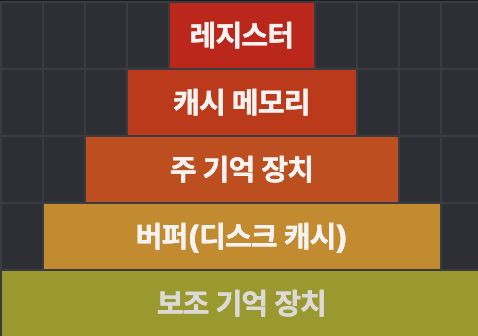

# 컴퓨터의 구성

컴퓨터는 **하드웨어**와 **소프트웨어**로 구성되어 있다.

- **하드웨어**: 컴퓨터를 구성하는 기계적 장치
- **소프트웨어**: 하드웨어의 동작을 지시하고 제어하는 명령어 집합

## 하드웨어

하드웨어는 **중앙처리장치(CPU)**, **기억장치**, **입출력장치**로 구성되어 있다.

### 중앙처리장치(CPU)

인간으로 따지면 **두뇌**에 해당하는 부분이다.  
주기억장치에서 프로그램 명령어와 데이터를 읽어와 처리하고, 명령어의 수행 순서를 제어한다.

CPU는 비교와 연산을 담당하는 산술논리연산장치(ALU)와 명령어의 해석과 실행을 담당하는 제어장치, 속도가 빠른 데이터 기억장소인 레지스터로 구성되어있다. ([자세히보기](./chapter02.md))

### 기억장치

프로그램, 데이터, 연산의 중간 결과를 저장하는 장치이다.

기억장치는 **CPU 레지스터(가장 빠름, 저장 용량 작음) → 캐시 메모리 → 주기억장치(RAM, ROM) → 보조기억장치(SSD, HDD)** 순으로 속도가 느려질수록 용량은 커진다.

### 입출력장치

컴퓨터 내부로 자료를 입력하는 장치(**입력 장치**)와 컴퓨터에서 외부로 표현하는 장치(**출력 장치**)로 나누어진다.

- **입력 장치**
  - 키보드
  - 마우스
- **출력 장치**
  - 프린터
  - 모니터
  - 스피커

## 시스템 버스

컴퓨터 내부에서 CPU, 메모리, 입출력장치 등 주요 구성 요소를 서로 연결해 **데이터와 제어 신호를 전달하는 중심 통로** 역할을 한다.

용도에 따라 **데이터 버스**, **주소 버스**, **제어 버스**로 나누어진다.

### 데이터 버스

컴퓨터 내에서 **실제 데이터**가 오가는 통로로, CPU, 메모리, 저장장치, 입출력장치 등 주요 부품들이 데이터를 주고받을 때 사용된다.

- **양방향 전송**: CPU와 메모리 또는 입출력장치 간에 데이터를 주고받으며, 데이터를 읽거나 쓸 수 있다.
- **버스 폭(bit 수)**: 32비트 데이터 버스라면 한 번에 32비트 데이터를 전송할 수 있다. 64비트 시스템에서는 64비트 전송이 가능하다. → 폭이 넓을수록 한 번에 더 많은 데이터를 처리한다.
- **병렬 전송**: 여러 비트를 동시에 전송해 데이터 이동 효율을 높인다.

### 주소 버스

데이터가 저장된 위치(메모리 주소)를 지정하기 위한 버스이며, 주로 **단방향**(CPU → 기억장치)이다.

- **단방향**: 주로 CPU에서 기억장치, 입출력장치 등으로만 주소를 전달한다.
- **주소 명확화**: 데이터를 어디로부터 읽고 어디에 저장할지를 명확히 지정해 올바른 데이터 이동을 보장한다.

### 제어 버스

읽기/쓰기 등 시스템 동작을 **제어하는 명령 신호**를 전송하며, **양방향**으로 사용된다.

- **읽기(READ), 쓰기(WRITE) 신호**: CPU가 메모리나 I/O 장치에 데이터를 읽거나 쓸 때, 어떤 작업인지 나타내는 제어 신호를 전달한다.
- **클록(Clock), 리셋(Reset), 인터럽트(Interrupt)**: 시스템 타이밍 동기화, 전체 시스템 재시작, 주변장치의 신호 요청 등 다양한 제어 신호를 전송한다.
- **양방향 신호**: CPU뿐만 아니라 입출력장치나 메모리도 신호를 보내거나 받을 수 있어 상호작용이 가능하다.

## 참고

- [[컴퓨터구조] 시스템 버스(System bus)](https://dheldh77.tistory.com/entry/%EC%BB%B4%ED%93%A8%ED%84%B0%EA%B5%AC%EC%A1%B0-%EC%8B%9C%EC%8A%A4%ED%85%9C-%EB%B2%84%EC%8A%A4System-bus)
- [시스템버스](https://young-taek.tistory.com/440)
- [버스 구조(Bus Architecture)](https://itpe.jackerlab.com/entry/%EB%B2%84%EC%8A%A4-%EA%B5%AC%EC%A1%B0Bus-Architecture)
- [컴퓨터 버스(Bus) 구조와 동작 원리](https://nyambu.co.kr/24)
- [컴퓨터 버스](https://burrow.tistory.com/208)
