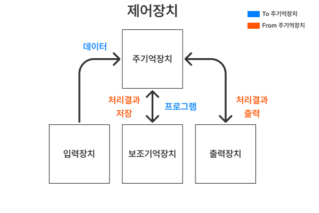

# 중앙처리장치(CPU) 작동 원리

CPU는 컴퓨터에서 가장 핵심적인 역할을 수행하는 부분으로 "인간의 두뇌"에 해당한다.

크게 산술 논리 연산 장치, 제어장치, 레지스터 3가지로 구성된다.

### 산술 논리 연산 장치(ALU)

비교와 연산을 담당하고 있는데, 구성 요소와 주요 기능은 아래와 같다.

- **주요 기능**
  - **산술 연산(Arithmetic)**: 정수의 덧셈, 뺄셈, 곱셈, 나눗셈 등
  - **논리 연산(Logic)**: `AND`, `OR`, `NOT`, `XOR` 등의 논리 게이트 연산
- **구성 요소**
  - **덧셈기/뺄셈기(Adder/Subtractor)**: 기본적인 산술 연산을 수행한다.
  - **논리 연산기(Logical Unit)**: `AND`, `OR`, `NOT` 등의 논리 연산을 수행한다.
  - **멀티플렉서(Multiplexer)**: 제어 신호에 따라 어떤 연산을 수행할지 선택한다.

### 제어장치

컴퓨터에 있는 모든 장치들의 동작을 지시, 제어하는 장치이다. 아래 단계를 따라 실행된다.

1. **인출(Fetch 단계)**  
   메모리에 저장된 명령어를 CPU로 가져온다. 프로그램 카운터(PC)가 현재 실행할 명령어의 주소를 알려주고, 제어장치는 그 주소에서 명령어를 읽어온다.

2. **간접(Indirect 단계, 선택적)**  
   명령어가 직접 데이터 대신 메모리 주소를 가리키고 있을 경우, 그 주소에 가서 실제 데이터를 읽어온다.  
   즉, _간접적으로_ 접근하는 단계이기 때문에 모든 명령어에 필요한 것은 아니고, 주소 참조 방식이 간접일 때만 발생한다.

3. **실행(Execute 단계)**  
   인출해온 명령어의 종류(덧셈, 저장, 분기 등)에 따라 ALU, 레지스터, 메모리, I/O 장치가 실제로 동작한다.

   예) `ADD R1, R2` → R1과 R2를 더해서 R1에 저장.

4. **인터럽트(Interrupt 단계)**  
   프로그램 실행 중 예외 상황이나 외부 요청이 발생하면 CPU가 정상 흐름을 잠시 멈추고 처리한다.

   예) 키보드 입력, 입출력 완료, 에러 발생 등

   인터럽트를 처리한 뒤 다시 원래 실행하던 프로그램으로 복귀한다.

### 레지스터

레지스터는 **CPU 내부의 초고속 기억장치**로 처리할 명령어나 연산의 중간 결과값을 임시로 저장한다.  
메모리 계층 중 가장 속도가 빠르지만 용량은 매우 작으며 새로운 데이터가 기록되면 기존 값은 **덮어쓰기** 된다.  
따라서 레지스터는 **연산 속도 향상**을 위해 사용된다.

레지스터는 용도에 따라 **범용 레지스터**와 **특수목적 레지스터**로 구분된다.

- **범용 레지스터**: 연산에 필요한 데이터나 결과를 임시 저장.

- **특수목적 레지스터**: 특정 기능을 수행하는 레지스터 (예: 프로그램 카운터(PC), 명령어 레지스터, 스택 포인터, 상태 레지스터 등).

## 특수 목적 레지스터 중 중요한 것들

- **MAR (Memory Address Register, 메모리 주소 레지스터)**

  - 읽기/쓰기 연산 시 **주기억장치의 주소**를 저장한다.
  - 명령어와 데이터를 읽거나 쓸 때 반드시 거치는 레지스터로, **주소 버스**를 통해 해당 주소를 메모리에 전달한다.
  - MAR가 가리키는 주소의 데이터는 **MBR** 등을 통해 실제로 전달된다.

- **PC (Program Counter, 프로그램 카운터)**

  - **다음에 실행할 명령어 주소**를 저장한다.
  - CPU가 명령어를 하나씩 처리할 때마다 자동으로 **+1 증가**한다(일반적 명령 실행의 경우).
  - **분기(JUMP)**, **함수 호출(CALL)** 등에서는 해당 명령어의 주소로 값이 바뀌면서 프로그램 흐름이 제어된다.

- **IR (Instruction Register, 명령어 레지스터)**

  - 현재 **실행 중인 명령어**를 임시 저장한다.
  - 메모리에서 읽은 명령어가 IR에 로드되고 **제어장치**(Controller)가 이 명령어를 해석해 다음 동작을 결정한다.
  - 프로세서 사이클 내내 결정적 역할을 한다.

- **MBR (Memory Buffer Register, 메모리 버퍼 레지스터)**

  - 메모리와 데이터를 주고받는 **임시 저장소** 역할.
  - **읽기 연산** 시 원하는 데이터가 메모리에서 MBR로 옮겨져 CPU에 전달된다.
  - **쓰기 연산** 시 CPU에서 전달받은 데이터가 MBR에 담겨 메모리로 전송된다.

- **AC (Accumulator, 누산기)**
  - 연산 결과(덧셈, 뺄셈, 논리연산 등)를 **임시로 저장**하는 레지스터.
  - 산술·논리 연산의 **중간값이나 최종값**을 저장하며, 다음 계산의 입력값으로 곧바로 활용된다.
  - 누적 연산, 반복 계산, 프로그램 제어 등에서 중요하게 쓰인다.

## CPU의 동작 과정

1. **주기억장치**는 **입력장치**에서 입력받은 데이터 또는 **보조기억장치**에 저장된 프로그램을 읽어온다.
2. **CPU**는 프로그램을 실행하기 위해 주기억장치에 저장된 **명령어와 데이터**를 읽어와 처리하고 결과를 다시 주기억장치에 저장한다.
3. **주기억장치**는 처리 결과를 **보조기억장치**에 저장하거나 **출력장치**로 보낸다.
4. **제어장치**는 1~3 과정에서 명령어가 순서대로 실행되도록 각 장치를 제어한다.

> 
>
> **CPU 동작 과정 도식화**

### 명령어 세트

CPU가 실행할 명령어의 집합이며 **연산 코드**(Operation Code)와 **피연산자**(Operand)로 이루어져 있다.

- **연산 코드**

  - 실행할 연산
  - 연산, 제어, 데이터 전달, 입출력 기능

- **피연산자**
  - 필요한 데이터 or 저장 위치
  - 주소, 숫자/문자, 논리 데이터 등을 저장

CPU는 프로그램을 실행하기 위해 주기억장치에서 **명령어를 순차적으로 인출 → 해독 → 실행**하는 과정을 반복한다.  
이때 한번에 하나의 명령어를 인출하여 실행하는데 필요한 일련의 활동을 **명령어 사이클**(Instruction Cycle)이라고 한다.

#### 인출 사이클 (Fetch Cycle)

메모리에서 **명령어를 꺼내오는 과정**

1. **T0 : MAR ← PC**  
   • **프로그램 카운터**(PC)에 저장된 명령어 주소를 **메모리 주소 레지스터**(MAR)로 전달한다.
2. **T1 : MBR ← M[MAR], PC ← PC+1**  
   • **주기억장치**에서 MAR이 가리키는 주소의 명령어를 읽어 **메모리 버퍼 레지스터**(MBR)에 저장한다.  
   • 동시에 PC는 다음 명령어를 가리키도록 **1 증가**시킨다.
3. **T2 : IR ← MBR**  
   • MBR에 있는 명령어를 **명령어 레지스터**(IR)에 저장한다.  
   • 이제 CPU가 실행할 명령어가 준비된 상태가 된다.

---

#### 실행 사이클 (Execute Cycle)

인출된 명령어를 실제로 수행하는 과정

예시: **ADD addr** 명령어

1. **T0 : MAR ← IR(addr)**  
   • IR에서 명령어를 해독해 **주소 부분**(addr)을 꺼내고, 이를 MAR로 전달한다.
2. **T1 : MBR ← M[MAR]**  
   • **주기억장치**에서 해당 주소의 데이터를 읽어 **MBR**에 저장한다.
3. **T2 : AC ← AC + MBR**  
   • **누산기**(AC)의 값에 MBR 값을 더해 결과를 AC에 저장한다.

## 참고

- [ALU(Arithmetic Logic Unit, 산술 논리 연산 장치) - ALU 74181 설계](https://coding-verilog.tistory.com/26)
- [2.[전자계산기] CPU의 구성 (제어장치/연산장치/레지스터)](https://junior-develop112.tistory.com/28)
- [MAR(Memory Adress Register)이 무엇일까?](https://velog.io/@ci___der/MARMemory-Adress-Register%EC%9D%B4-%EB%AC%B4%EC%97%87%EC%9D%BC%EA%B9%8C)
- [12. 중앙 처리 장치, 레지스터](https://whitepro.tistory.com/572)
- [[Chapter 04] CPU의 작동 원리 - 2 레지스터](https://velog.io/@kshjessica/Chapter-04-CPU%EC%9D%98-%EC%9E%91%EB%8F%99-%EC%9B%90%EB%A6%AC-2-%EB%A0%88%EC%A7%80%EC%8A%A4%ED%84%B0)
