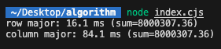

# 캐시 메모리(Cache Memory)

캐시 메모리라고 하면 실제 메모리와 CPU 사이에서 빠르게 전달을 위해서 미리 데이터들을 저장해두는 좀 더 빠른 메모리이다.

캐시는 용량이 작다는 단점이 있지만 속도가 빠르다는 장점이 있다.

## 캐시 종류

### L1

L1 캐시는 보통 8~64KB 정도의 용량으로 CPU가 가장 빠르게 접근하게 되며, 여기서 데이터를 찾지 못하면, L2 캐시 메모리로 넘어간다.

### L2

L2 캐시 메모리는 용도와 역할은 L1 캐시와 비슷하지만 속도는 그보다 느리다. 일반적으로 64KB~4MB 정도가 사용된다. L2 캐시는 CPU 회로판에 별도의 칩으로 내장된다. L2 캐시는 L1 캐시보다 느리지만, 일반 메모리(RAM)보다는 빠르다.

> L3도 있지만 자주 사용되지 않기 때문에 여기에서 다루지 않겠다.

### 디스크 캐시

디스크로부터 읽은 내용을 일부 보존해두는 메모리 영역을 말한다. 나중에 같은 데이터를 읽어야 할 경우가 생기면 실제 디스크에서 읽는 게 아니라 디스크 캐시에서 빠르게 읽어낼 수 있다.

주기억장치(RAM)와 보조기억장치(하드디스크) 사이에 존재한다.

## 캐시 메모리 작동 원리

시간 지역성과 공간 지역성에 대해 알아보기 전에 먼저 참조 지역성의 원리에 대해 알아보겠다.

### 참조 지역성

컴퓨터 프로그램이 실행될 때 특정한 메모리 위치나 인접한 메모리 범위를 짧은 시간 안에 반복적으로 참조하는 경향을 의미한다. 이는 캐시 메모리의 적중률을 높여 CPU의 메모리 접근 횟수를 줄이는 데 이용된다.

### 시간 지역성

for나 while 같은 반복문에 사용하는 조건 변수처럼 한번 참조된 데이터는 잠시후 또 참조될 가능성이 높다.

```js
let arr = [1, 2, 3, 4, 5];
let sum = 0;
for (let i = 0; i < arr.length; i++) {
  sum += arr[i];
}
console.log(sum);
```

위 예시 코드에서 반복문을 돌며 i라는 변수에 다시 참조될 가능성이 있기에 시간 지역성을 충족한다.

### 공간 지역성

A[0], A[1]처럼 어떤 데이터에 접근할 때 그 데이터가 저장된 메모리 근처의 주소도 함께 접근될 확률이 높은 경향을 뜻한다.

```js
// Node.js 18+ 또는 브라우저 콘솔에서 실행 가능
const ROWS = 4000;
const COLS = 4000;

// 2차원 number 배열 초기화
const matrix = Array.from({ length: ROWS }, () =>
  Array.from({ length: COLS }, () => Math.random())
);

// 시간 측정 함수
function timeIt(label, fn) {
  const t0 = performance.now();
  const result = fn();
  const t1 = performance.now();
  console.log(
    `${label}: ${(t1 - t0).toFixed(1)} ms (sum=${result.toFixed(2)})`
  );
}

// 1) 행 우선 접근 (row-major)
timeIt("row major", () => {
  let sum = 0;
  for (let r = 0; r < ROWS; r++) {
    for (let c = 0; c < COLS; c++) {
      sum += matrix[r][c];
    }
  }
  return sum;
});

// 2) 열 우선 접근 (column-major)
timeIt("column major", () => {
  let sum = 0;
  for (let c = 0; c < COLS; c++) {
    for (let r = 0; r < ROWS; r++) {
      sum += matrix[r][c];
    }
  }
  return sum;
});
```

> 실행 결과
>
> 

실행 결과를 보면 row major가 column에 비해 5배 이상 빠른 것을 확인할 수 있는데, 이것이 바로 공간 지역성 원리 덕분이다.

## 캐시 미스 경우 3가지

### Cold miss

해당 메모리 주소를 처음 불러서 참조할 값이 없기 때문에 발생하는 미스이다.

### Conflict miss

캐시 메모리에 A와 B 데이터를 저장해야 하는데, A와 B가 같은 캐시 메모리 주소에 할당되어 있어서 나는 미스이다. (direct mapped cache에서 많이 발생)

- 항상 핸드폰과 열쇠를 오른쪽 주머니에 넣고 다니다가, 친구가 준 물건을 잠깐 받느라 핸드폰을 가방에 넣음.
- 나중에 핸드폰을 찾으려고 오른쪽 주머니를 확인하지만 핸드폰이 없음.
- 즉, 같은 공간을 여러 물건이 번갈아 차지하다 보니 필요한 것을 못 찾는 상황이 바로 Conflict Miss.

### Capacity miss

캐시 메모리의 공간이 부족해서 나는 미스이다. (Conflict는 주소 할당 문제, Capacity는 공간 문제)

캐시 크기를 키워서 문제를 해결하려하면 캐시 접근속도가 느려지고 파워를 많이 먹는 단점이 생긴다.

## 구조 및 작동 방식

### Direct Mapped Cache

- 구조
  - 가장 기본적인 구조로, 여러 DRAM(메인 메모리) 주소가 하나의 캐시 메모리 주소에 매핑되는 다대일 구조이다.
- 동작 방식
  - 예를 들어 메모리 공간이 32개(00000~11111), 캐시 공간이 8개(000~111)라면, 00000, 01000, 10000, 11000 주소 모두 000 캐시 주소에 매핑된다.
- 주소 구성
  - 인덱스 필드: 캐시 내 위치(예시의 000 ~ 111)
  - 태그 필드: 인덱스 외의 앞부분 비트로, 실제 데이터를 구분
  - 데이터 필드: 저장된 데이터
- 장점: 구조가 간단하고 속도가 빠름
- 단점: Conflict Miss가 많이 발생 (같은 색깔 데이터를 동시에 써야 할 때 충돌)

| 메모리 주소(5비트) | 하위 3비트(캐시 인덱스) |
| ------------------ | ----------------------- |
| 00000              | 000                     |
| 01000              | 000                     |
| 10000              | 000                     |
| 11000              | 000                     |

### Fully Associative Cache

- 구조
  - 아무 위치든 비어있으면 데이터 저장 가능 (맘대로 저장)
- 동작 방식
  - 저장은 쉽지만 찾을 때 모든 캐시 블럭을 일일이 검색해야 함
  - **CAM**(Content Addressable Memory)라는 특수 구조 활용 (비쌈)
- 장점: 저장 유연성, Conflict Miss 없음
- 단점: 검색 느림, 구현 비용 높음

### Set Associative Cache

- 구조
  - Direct와 Fully의 장점만 결합한 방식.
  - 예를 들어 캐시를 여러 행(Set)으로 나누고 각 행(Set) 안에 여러 공간(way)이 있음.
- 동작 방식
  - 특정 행을 지정한 뒤 해당 행 안에서 아무 열이든 비어있으면 데이터 저장
  - Direct에 비해 검색 느리지만 저장 빠름, Fully에 비해 저장 느리지만 검색 빠름
- 장점
  - 전반적으로 효율적
  - 위 두 방식보다 나중에 고안된 중간형
- 단점
  - Direct, Fully 대비 해석과 설계가 복잡해짐

## 참고

- [[엔지니어링] CPU와 캐시 (L1/L2/L3 캐시..)](https://12bme.tistory.com/402)
- [디스캐 캐시와 캐시 메모리](https://velog.io/@woga1999/%EB%94%94%EC%8A%A4%EC%BA%90-%EC%BA%90%EC%8B%9C%EC%99%80-%EC%BA%90%EC%8B%9C-%EB%A9%94%EB%AA%A8%EB%A6%AC)
- [지역성: 시간지역성과 공간지역성](https://monicareport.tistory.com/645)
- [참조 지역성의 원리 (Locality of reference)](https://johnycho.dev/docs/cs/cs-locality-of-reference)
