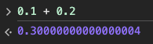

# 고정 소수점 & 부동 소수점

## 고정 소수점(Fixed Point)

소수점이 찍힐 위치를 미리 정해놓고 소수를 표현하는 방식이다. (정수 + 소수)

- 장점: 실수를 정수부와 소수부로 표현하여 단순하다.
- 단점: 표현의 범위가 너무 적어서 활용하기 힘들다. (정수부는 15bit, 소수부는 16bit)

## 부동 소수점(Floating Point)

실수를 가수부 + 지수부로 표현한다.

가수 : 실수의 실제값 표현
지수 : 크기를 표현. 가수의 어디쯤에 소수점이 있는지 나타냄

지수의 값에 따라 소수점이 움직이는 방식을 활용한 실수 표현 방법이다.

즉, 소수점의 위치가 고정되어 있지 않는다.

- 장점: 표현할 수 있는 수의 범위가 넓어진다. (현재 대부분 시스템에서 활용 중)
- 단점: 오차가 발생할 수 있다. (부동소수점으로 표현할 수 있는 방법이 매우 다양함)

### 0.1 + 0.2 === 0.3

0.1 + 0.2 === 0.3의 결과는 충격적이게도 false이다.

이유는 바로 부동 소수점에 있다. 0.1, 0.2, 0.3을 2진수로 변환하는 과정에서 소수점이 딱 떨어지는 것이 아닌, 무한 소수가 되기 때문이다. 따라서 0.1 + 0.2의 결과는 아래와 같아진다.

## 참고

- [자바스크립트에서 0.1 + 0.2 === 0.3이 false인 이유는?](https://01sungeun.tistory.com/entry/%EC%9E%90%EB%B0%94%EC%8A%A4%ED%81%AC%EB%A6%BD%ED%8A%B8%EC%97%90%EC%84%9C-01-02-03%EC%9D%B4-false%EC%9D%B8-%EC%9D%B4%EC%9C%A0%EB%8A%94)
