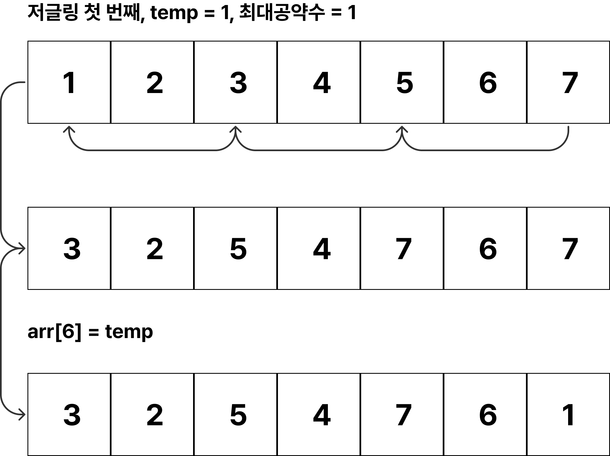

# 배열 (Array)

## 배열 회전

### 기본 회전 알고리즘

```js
//왼쪽으로 한번 회전
function leftRotatebyOne(arr, n) {
  let temp = arr[0],
    i;
  for (i = 0; i < n - 1; i++) {
    arr[i] = arr[i + 1];
  }
  arr[i] = temp;
}

// d만큼 회전
function leftRotate(arr, d, n) {
  for (let i = 0; i < d; i++) leftRotatebyOne(arr, n);
}

const arr = Array.from({ length: 7 }, (_, idx) => idx + 1);
const n = arr.length;

leftRotate(arr, 2, n);

console.log(arr);
```


`leftRotatebyOne` 한 사이클은 위 사진처럼 작동한다. n 개수만큼 회전 시킨다.

### 저글링 알고리즘

```js
function gcd(a, b) {
  if (b === 0) return a;
  return gcd(b, a % b);
}

function leftRotate(arr, d, n) {
  d = d % n; // d가 n보다 큰 경우 보정
  const g = gcd(d, n);

  for (let i = 0; i < g; i++) {
    let temp = arr[i];
    let j = i;

    while (true) {
      let k = j + d;
      if (k >= n) k = k - n;
      if (k === i) break;

      arr[j] = arr[k];
      j = k;
      console.log(i, j, arr);
    }
    arr[j] = temp;
  }
  return arr;
}

const arr = Array.from({ length: 7 }, (_, idx) => idx + 1);
const n = arr.length;

console.log(leftRotate(arr, 2, n));
```



while문 한 사이클은 위 사진처럼 작동한다. n만큼 요소들을 움직인다.

### 역전 알고리즘

```js
function reverseArr(arr, start, end) {
  while (start < end) {
    let temp = arr[start];
    arr[start] = arr[end];
    arr[end] = temp;

    start++;
    end--;
  }
}

// d로 나눠서 역전 알고리즘 수행
function rotateLeft(arr, d, n) {
  reverseArr(arr, 0, d - 1);
  reverseArr(arr, d, n - 1);
  reverseArr(arr, 0, n - 1);
}

const arr = Array.from({ length: 10 }, (_, idx) => idx + 1);
const n = arr.length;
const d = 3;

rotateLeft(arr, d, n);

console.log(arr);
```


d만큼 요소들을 앞에서 자르고, 2개의 배열을 뒤집어서 합친 후 다시 뒤집는다.

## 배열의 특정 최대 합 구하기

```js
function maxVal(arr, n) {
  let arrSum = 0; // arr[i]의 전체 합
  let curSum = 0; // i * arr[i]의 전체 합

  for (let i = 0; i < n; i++) {
    arrSum += arr[i];
    curSum += i * arr[i];
  }

  let maxSum = curSum;

  for (let j = 1; j < n; j++) {
    curSum += arrSum - n * arr[n - j];

    maxSum = Math.max(curSum, maxSum);
  }

  return maxSum;
}

const arr = [1, 20, 2, 10];
const n = arr.length;
console.log(maxVal(arr, n));

/**
 * 1번 회전
 * R0: 0 * arr[0] + 1 * arr[1] + 2 * arr[2] + 3 * arr[3]
 * R1: 0 * arr[3] + 1 * arr[0] + 2 * arr[1] + 3 * arr[2]
 * R1 - R0 = arr[0] + arr[1] + arr[2] - 3 * arr[3]
 * R1 = R0 + arr[0] + arr[1] + arr[2] - 3 * arr[3]
 *
 * 2번 회전
 * R1: 0 * arr[3] + 1 * arr[0] + 2 * arr[1] + 3 * arr[2]
 * R2: 0 * arr[2] + 1 * arr[3] + 2 * arr[0] + 3 * arr[1]
 * R2 - R1 = arr[3] + arr[0] + arr[1] - 3 * arr[2]
 * R2 = R1 + arr[3] + arr[0] + arr[1] - 3 * arr[2]
 *
 * 3번 회전
 * R2: 0 * arr[2] + 1 * arr[3] + 2 * arr[0] + 3 * arr[1]
 * R3: 0 * arr[1] + 1 * arr[2] + 2 * arr[3] + 3 * arr[0]
 * R3 - R2 = arr[2] + arr[3] + arr[0] - 3 * arr[1]
 * R3 = R2 + arr[2] + arr[3] + arr[0] - 3 * arr[1]
 */
```

| 점화식: `Rj - Rj-1 = arrSum - n * arr[n-j]`

n만큼 곱하는 이유는 `arrSum`이 0부터 n-1까지 요소들의 합이기 때문에 이를 통해 자신을 제거한다.

## 특정 배열을 arr[i] = i로 재배열 하기

```js
function fix(A, len) {
  for (let i = 0; i < len; i++) {
    if (A[i] !== -1 && A[i] !== i) {
      // A[i]가 -1이 아니고, i도 아닐 때
      let x = A[i]; // 해당 값을 x에 저장

      while (A[x] !== -1 && A[x] !== x) {
        // A[x]가 -1이 아니고, x도 아닐 때
        let y = A[x]; // 해당 값을 y에 저장
        A[x] = x;
        x = y;
      }

      A[x] = x;

      if (A[i] !== i) {
        A[i] = -1;
      }
    }
  }
}

const A = [-1, -1, 6, 1, 9, 3, 2, -1, 4, -1];
const len = A.length;

fix(A, len);

console.log(A);
```

주어진 배열에서 arr[i] = i이 가능한 것만 재배열 시키기 코드이다.

접근 방법은 아래와 같다.

1. arr[i]가 -1이 아니고, arr[i]이 i가 아닐 때가 우선 조건

2. 해당 arr[i] 값을 저장(x)해두고, 이 값이 x일 때 arr[x]를 탐색

3. arr[x] 값을 저장(y)해두고, arr[x]가 -1이 아니면서 arr[x]가 x가 아닌 동안을 탐색

4. arr[x]를 x값으로 저장해주고, 기존의 x를 y로 수정
