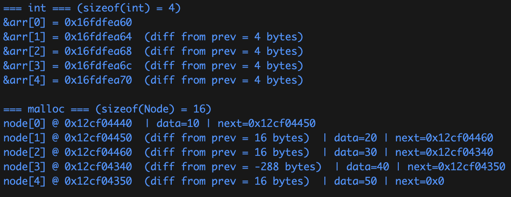

# 연결 리스트 (Linked List)

연속적인 메모리 위치에 저장되지 않는 선형 데이터 구조이다. 각 노드는 데이터 필드와 다음 노드에 대한 참조를 포함하는 노드로 구성된다.

## 왜 Linked List를 사용하나?

배열은 비슷한 유형의 선형 데이터를 저장하는데 사용할 수 있지만 제한 사항이 있다.

1. 배열의 크기가 고정되어 있어 미리 요소의 수에 대해 할당을 받아야 함

2. 새로운 요소를 삽입하는 것은 비용이 많이 듬 (공간을 만들고, 기존 요소 전부 이동)

### 장점

1. 동적 크기

2. 삽입/삭제 용이

### 단점

1. 임의로 액세스를 허용할 수 없음. 즉, 첫 번째 노드부터 순차적으로 요소에 액세스 해야함 (이진 검색 수행 불가능)

2. 포인터의 여분의 메모리 공간이 목록의 각 요소에 필요

## 추가 자료

- [🧱 자바 LinkedList 구조 & 사용법 - 정복하기](https://inpa.tistory.com/entry/JAVA-%E2%98%95-LinkedList-%EA%B5%AC%EC%A1%B0-%EC%82%AC%EC%9A%A9%EB%B2%95-%EC%99%84%EB%B2%BD-%EC%A0%95%EB%B3%B5%ED%95%98%EA%B8%B0)
