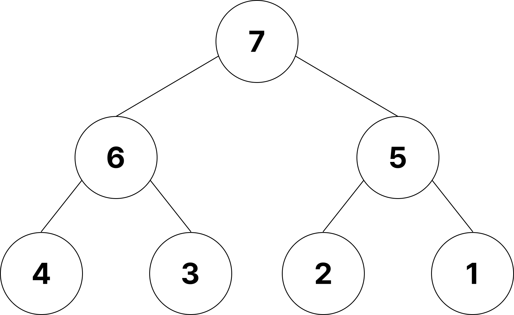
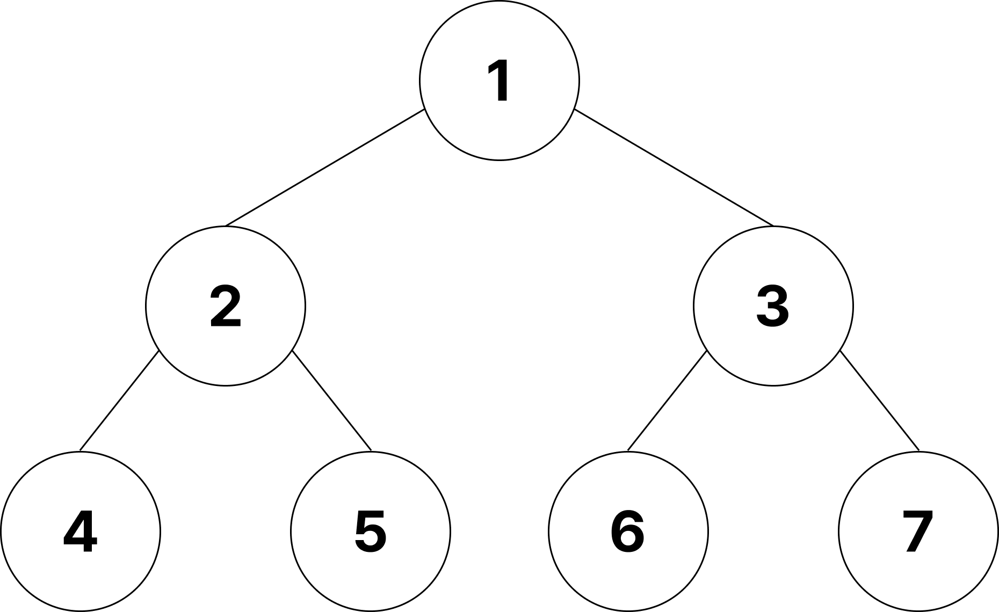

# 힙(Heap)

완전 이진 트리의 일종이며 여러 값 중, **최대값과 최소값을 빠르게 찾아내도록** 만들어진 자료구조이다.

- **반정렬 상태** : 부모-자식 간의 크기 관계만 유지될 뿐, 형제 노드 간의 대소 관계는 보장하지 않음
- **힙 트리는 중복된 값 허용** (이진 탐색 트리는 중복값 허용 X)
- 일반적으로 **우선순위 큐**(Priority Queue)를 구현하는 데 사용된다.

## 힙 종류

### 최대 힙 (Max Heap)

부모 노드의 키 값이 자식 노드의 키 값보다 **크거나 같은** 완전 이진 트리.  
즉, 루트 노드에는 항상 **최대값**이 위치한다.

- 최대값 탐색 : **O(1)** (루트 확인)
- 삽입/삭제 : **O(log n)** (트리 높이만큼 재정렬 필요)

### 최소 힙 (Min Heap)

부모 노드의 키 값이 자식 노드의 키 값보다 **작거나 같은** 완전 이진 트리.  
즉, 루트 노드에는 항상 **최소값**이 위치한다.

- 최소값 탐색 : **O(1)**
- 삽입/삭제 : **O(log n)**

## 힙의 활용 (자바스크립트 관점)

- **타이머 관리 (`setTimeout`, `setInterval`)**

  - 브라우저와 Node.js 런타임은 등록된 타이머들을 내부적으로 **최소 힙**(Min Heap)으로 관리한다.
  - 가장 빨리 만료될 타이머가 루트에 위치하므로, 이벤트 루프는 루트만 확인해서 실행 시점을 결정할 수 있다.

- **React Fiber**

  - React는 Fiber 아키텍처에서 **우선순위 기반 스케줄링**을 수행한다.
  - 작업을 효율적으로 처리하기 위해 **우선순위 큐**(힙 자료구조)가 사용된다.
