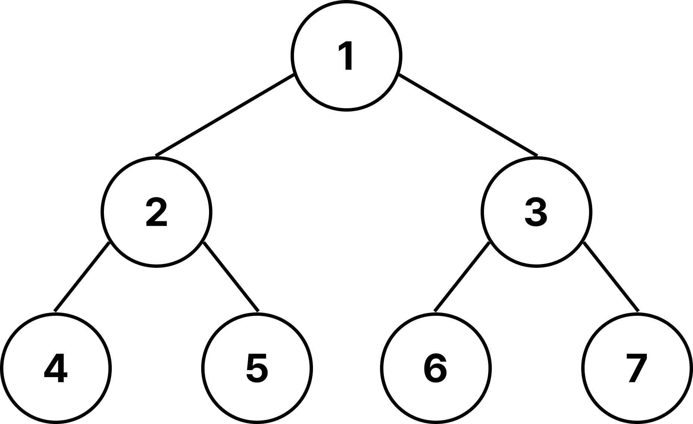

# 트리(Tree)



정점(Node)와 간선(Edge)로 이루어진 자료구조이다.

- **정점:** 데이터를 담는 기본 단위. 예를 들어 사람, 도시, 웹페이지 등이 될 수 있다.
- **간선:** 두 정점을 연결하는 선. 관계나 경로를 의미한다.

트리의 특징은 아래와 같다.

- 사이클 없음: 트리에는 **순환 구조가 존재할 수 없다.** (사이클이 생기면 그래프가 됨)
- 유일한 경로: **루트(Root)에서 특정 노드**로 가는 **경로는 단 하나**뿐이다.
- 간선 수: **노드가 N**개라면, **간선은 항상 N-1**개이다.
- 자료형 표현 가능: **모든 노드는 자료형으로 표현**할 수 있다.

## 트리 순회 방식

트리를 탐색하는 방법에는 여러 가지가 있다.

### 전위 순회 (Pre-order)

루트 → 왼쪽 하위 트리 → 오른쪽 하위 트리 순으로 방문

```plaintext
1 → 2 → 4 → 5 → 3 → 6 → 7
```

### 중위 순회 (In-order)

왼쪽 하위 트리 → 루트 → 오른쪽 하위 트리 순으로 방문

```plaintext
4 → 2 → 5 → 1 → 6 → 3 → 7
```

### 후위 순회 (Post-order)

왼쪽 하위 트리 → 오른쪽 하위 트리 → 루트 순으로 방문

```plaintext
4 → 5 → 2 → 6 → 7 → 3 → 1
```

### 레벨 순회 (Level-order)

루트부터 시작해 같은 깊이(레벨)의 노드를 차례로 방문

```plaintext
1 → 2 → 3 → 4 → 5 → 6 → 7
```
