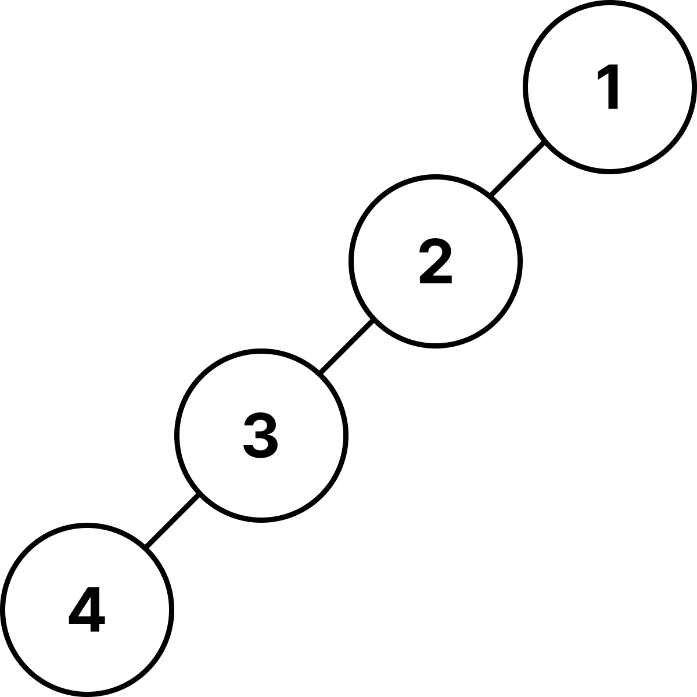
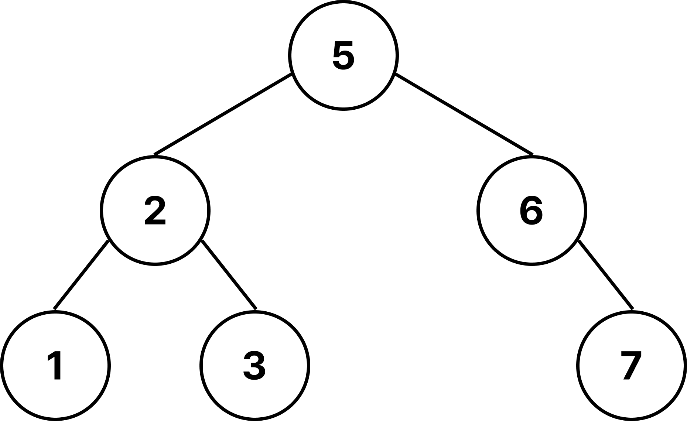
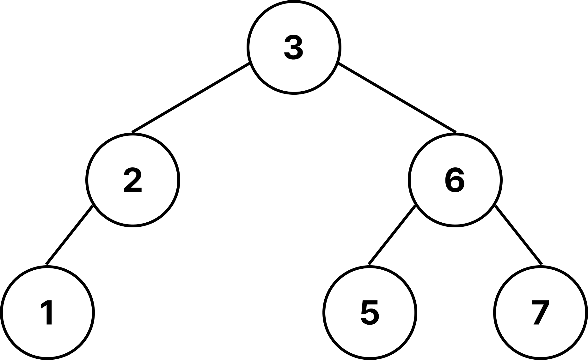

# 이진 탐색 트리(Binary Search Tree)

- 이진 탐색 (Binary Search, 배열 기반)

  탐색 시간 복잡도 → O(log N)
  하지만 삽입/삭제는 비효율적 (O(N)) → 사실상 사용하지 않음

- 연결 리스트 (Linked List)

  삽입/삭제 시간 복잡도 → O(1)
  하지만 탐색은 O(N)

이 두 가지의 장점을 모두 얻고자 나온 것이 바로 이진 탐색 트리 (BST)
즉, 탐색은 빠르게(O(log N)), 삽입·삭제도 가능하도록 고안된 자료구조이다.

즉, 효율적인 탐색 능력을 가지고, 자료의 삽입 삭제도 가능하게 만들기 위해 나왔다.

## 특징

- 각 노드의 자식이 2개 이하
- 각 노드의 왼쪽 자식은 부모보다 작고, 오른쪽 자식은 부모보다 큼
- 중복된 노드가 없어야 함

중복된 노드가 있다면 트리를 이용한 검색 속도가 느리기 때문에 없어야한다.

중위순회 방식을 통해 정렬된 순서를 읽는다.

## BST 핵심연산

- 검색
- 삽입
- 삭제
- 트리 생성
- 트리 삭제

## 시간 복잡도

- 균등 트리 : 노드 개수가 N개일 때 O(logN)
- 
- 편향 트리 : 노드 개수가 N개일 때 O(N)
- 

삽입, 검색, 삭제 시간 복잡도는 트리의 Depth에 비레한다.

## 삭제의 3가지 Case

1. 자식이 없는 leaf 노드일 때 → 그냥 삭제
2. 자식이 1개인 노드일 때 → 지워진 노드에 자식을 올리기
3. 자식이 2개인 노드일 때 → 오른쪽 자식 노드에서 가장 작은 값 or 왼쪽 자식 노드에서 가장 큰 값 올리기

   **오른쪽 가장 작은 값 올린 경우**
   
   **왼쪽 가장 큰 값 올린 경우**
   

## 한계

삽입 순서에 따라 **편향 트리(Skewed Tree)**가 될 수 있음 → 최악의 경우 O(N)

### 해결책

- AVL 트리: 높이 균형을 엄격히 유지
- Red-Black 트리: 느슨한 균형 유지, 삽입/삭제가 많을 때 효율적
- B-트리 / B+트리: 데이터베이스, 파일 시스템에서 사용되는 다분기 균형 트리
