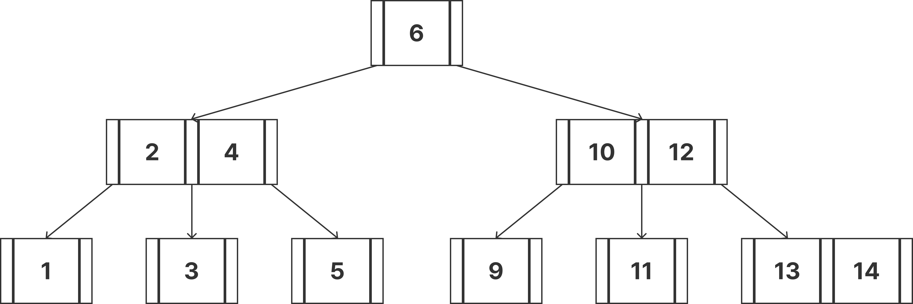
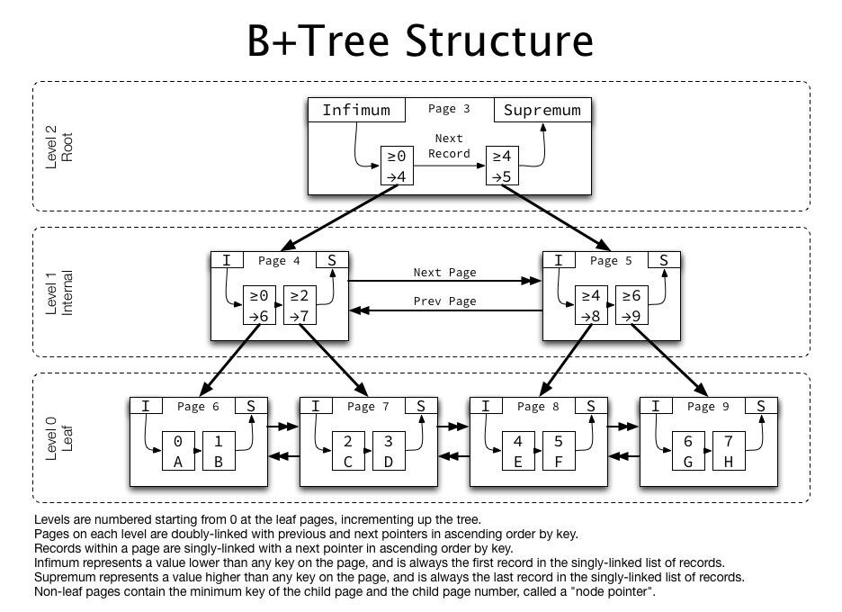

# B Tree & B+ Tree

데이터베이스나 파일 시스템과 같이 대규모 데이터를 다루는 시스템에서는 **빠른 검색 속도**와 **효율적인 디스크 접근**이 무엇보다 중요하다.  
이를 위해 고안된 대표적인 자료구조가 바로 **B Tree**와 **B+ Tree**다.

두 자료구조 모두 **다진 검색 트리**(Multi-way Search Tree)의 일종으로, 트리의 **균형을 유지**하면서 **디스크 접근 횟수를 최소화**하도록 설계되었다.  
하지만 세부적인 구조와 동작 방식에는 차이가 있으며, 사용 목적에 따라 선택이 달라진다.

## B Tree (B-Tree)

B Tree는 **균형 다진 검색 트리**(Balanced Multi-way Search Tree)의 한 형태다.  
각 노드는 **최소 차수**(`t`)라는 값을 기준으로 아래와 같은 규칙을 따른다.

### 최소 차수 규칙

- **루트를 제외한 내부 노드**
  - 최소 `t-1`개의 키를 가져야 한다.
  - 최대 `2t-1`개의 키를 가질 수 있다.
- **자식 노드 수**
  - 내부 노드가 `k`개의 키를 가지고 있다면, 자식 수는 항상 `k+1`.
  - 따라서 한 노드의 자식 수는 최소 `t`, 최대 `2t`.
- **루트 노드**
  - 최소 **1개의 키**를 가져야 한다 (비어 있을 수 없음).
  - 자식이 있을 경우, 최소 2개 이상을 가져야 한다.
- **리프 노드**
  - 다른 리프와 항상 **같은 깊이**에 존재해야 한다. (→ **높이 균형 유지**)

### 특징

- 각 노드는 **여러 개의 키**와 **자식 포인터**를 가질 수 있다.
- 검색, 삽입, 삭제 모두 **O(log n)** 시간 복잡도를 가진다.
- 삽입과 삭제 과정에서 **노드 분할**과 **병합**이 발생할 수 있다.
- 디스크 접근 횟수를 줄이기 위해 한 노드에 여러 키를 담아 **블록 단위로 관리**한다.
  - 예: 디스크 블록이 `1024 바이트`라면, `2바이트`를 읽든 `1024바이트`를 읽든 입출력 비용은 동일하다.
  - 따라서 하나의 노드를 **1024바이트에 맞춰 꽉 채우도록 설계**하면, I/O 효율을 극대화할 수 있다.

#### 활용 예시

- 전통적인 파일 시스템 (FAT, NTFS 일부 버전)의 디렉토리 인덱스 관리에 사용된다.

## B+ Tree

B+ Tree는 B Tree에서 파생된 구조로, **데이터베이스 시스템에서 더 많이 활용**된다.

- 모든 실제 데이터는 **리프 노드**에만 저장된다.
- **같은 레벨의 리프 노드들**은 **양방향 연결 리스트**로 연결되어 있다.
- **상위 레벨에서 하위 레벨 노드로**는 일반적인 트리 구조(단방향)로 연결된다.
- 내부 노드는 **검색을 돕는 인덱스 역할만** 수행한다.
- 리프 노드들은 **Linked List 형태로 연결**되어 있어 순차 접근(범위 검색)에 매우 유리하다.

### 특징

- **내부 노드**: 디스크 접근을 줄이기 위한 **인덱스 계층** 역할.
- **리프 노드**: 실제 **데이터 레코드**를 저장하며, 서로 연결되어 있어 **범위 쿼리**에 최적화.
- 탐색은 항상 **리프 노드에서 종료**되므로, **검색 속도가 일정**하다.

#### 활용 예시

- MySQL(InnoDB), Oracle, PostgreSQL 등 대부분의 RDBMS에서 **클러스터드 인덱스** 구조로 사용된다.
- **범위 검색**, **정렬된 데이터 접근**에 최적화되어 있다.

## 추가 자료

- [검색 기능 개선 실험하기](https://youtu.be/N6j8uwleHk0?si=CbQlIezsuMJl8902)

## 참고

- [B-tree와 B+tree](https://zorbathegeek.tistory.com/23)
