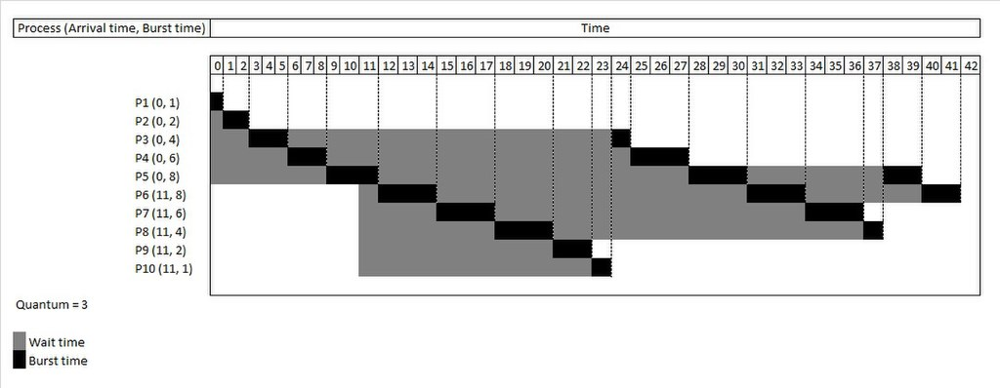
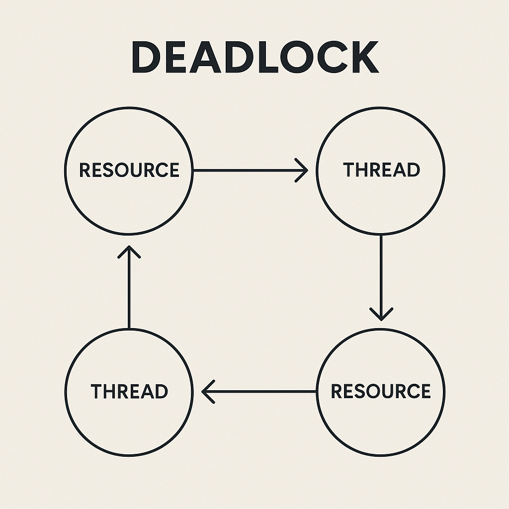

# 프로세스(Process) & 스레드(Thread)

- **프로세스**: 프로그램을 **메모리 상에서 실행 중인 작업 단위**
- **스레드**: 프로세스 안에서 실행되는 **흐름의 단위**

각 프로세스는 **최소 1개의 스레드**(메인 스레드)를 가진다.

## 메모리 구조 비교

### 프로세스

- 각각 **독립적인 주소 공간**을 가진다.
  - **Code 영역**: 프로그램 명령어
  - **Data 영역**
    - 초기화된 전역/정적 변수 → `data`
    - 초기화되지 않은 전역/정적 변수 → `bss`
  - **Heap 영역**: 동적 할당(`malloc`, `new`), Object(Javascript에서)
  - **Stack 영역**: 지역변수, 매개변수, 함수 리턴값

### 스레드

- 프로세스 내에서 **Stack만 개별 할당**
- **Code, Data, Heap 영역은 공유**

## 멀티프로세스

**여러 프로세스**가 병렬적으로 작업 수행

- **장점**:
  - 안정성 ↑ (OS가 메모리 침범 방지)
- **단점**:
  - 독립적 메모리 사용으로 **오버헤드** 발생
  - **Context Switching** 시 성능 저하
    - 프로세스 상태(레지스터, 메모리 등)를 저장/복원하는 과정
    - 캐시 초기화 등 무거운 작업 → 성능 저하

## 멀티스레드

**하나의 프로세스 안에서 여러 스레드**를 실행하여 작업 분담

- **장점**:
  - 공유 메모리를 통한 빠른 자원 접근
  - 전역/정적 변수 활용 가능 → **자원 효율성 ↑**
- **단점**:
  - 안전성 ↓ (공유 메모리 손상 시 전체 스레드에 영향)
  - 동기화 필요 → **Critical Section** 문제 발생 가능

### 주요 문제

#### 경쟁 상태 (Race Condition)

둘 이상의 스레드가 공유 자원에 동시에 접근하면서, 실행 순서에 따라 결과가 달라지는 상황

> 예) 은행 계좌에서 여러 스레드가 동시에 출금/입금을 처리할 때, 동기화 없이 접근하면 잔액이 잘못 계산됨

- 원인: 공유 메모리 접근 시 동기화 미흡
- 해결 방법
  - 임계 구역(Critical Section) 설정
  - **뮤텍스**(Mutex), **세마포어**(Semaphore), **모니터**(Monitor)와 같은 동기화 기법 활용

#### 기아 상태 (Starvation)

특정 스레드가 자원 할당 우선순위에서 계속 밀려서, 무기한 대기하는 상황

> 예) 우선순위 스케줄링에서 낮은 우선순위 스레드가 CPU를 거의 얻지 못하는 경우

- 원인: 자원 스케줄링 정책의 불균형
- 해결 방법
  - **우선순위 상속**: 낮은 우선순위 스레드가 높은 우선순위 작업에 필요한 자원을 점유하면, 일시적으로 우선순위를 상향
  - **에이징**: 오래 기다린 스레드의 우선순위를 점차 높여줌
  - **라운드 로빈** : 각 프로세스에 **동일한 시간 할당량**을 주고 순환하면서 CPU를 배정
    
    출처: [wikipedia - 라운드 로빈 스케줄링](https://ko.wikipedia.org/wiki/%EB%9D%BC%EC%9A%B4%EB%93%9C_%EB%A1%9C%EB%B9%88_%EC%8A%A4%EC%BC%80%EC%A4%84%EB%A7%81)

#### 교착 상태 (Deadlock)

두 개 이상의 스레드가 서로가 점유한 자원을 기다리며 무한 대기하는 상태

> 예) 스레드 A는 프린터를, 스레드 B는 스캐너를 점유한 상태에서 서로 상대 자원을 기다리며 멈춰버림

- 원인: 다음 4가지 조건이 모두 충족될 때 발생
  1. **상호 배제 (Mutual Exclusion)** – 자원은 한 번에 한 스레드만 사용 가능
  2. **점유 대기 (Hold and Wait)** – 자원을 보유한 상태에서 다른 자원 요청 가능
  3. **비선점 (No Preemption)** – 자원을 강제로 뺏을 수 없음
  4. **순환 대기 (Circular Wait)** – 스레드 간 자원 대기가 원형으로 연결
- 해결 방법
  - **자원 할당 순서 정하기** (Circular Wait 방지)
  - **교착 상태 회피 알고리즘** (예: Banker’s Algorithm)
  - **Deadlock Detection & Recovery** 기법 적용

#### 라이브락 (Livelock)

스레드들이 교착 상태를 피하려고 계속 상태를 바꾸지만, 실제 작업은 진행되지 않는 상태

> 비유: 좁은 복도에서 두 사람이 서로 양보하다가 계속 같은 쪽으로 비켜서 진전이 없는 상황

- 원인: 교착 상태를 회피하려는 과정에서 양보가 반복됨
- 해결 방법
  - **무작위 대기 (Random Backoff)** 기법 도입
  - **공정한 스케줄링 알고리즘** 적용
