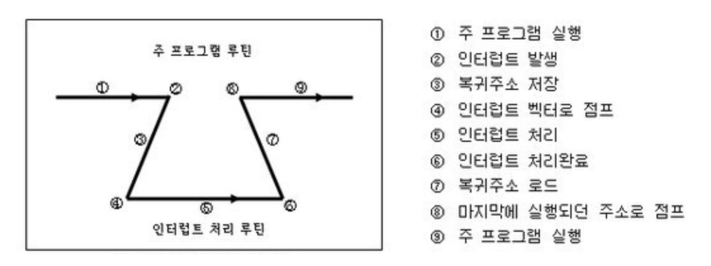

# 인터럽트(Interrupt)

**인터럽트**란 프로그램 실행 도중 **예기치 않은 상황**이 발생했을 때, 현재 실행 중인 작업을 즉시 중단하고 CPU에게 해당 상황을 **우선 처리해야 함을 알리는 것**을 말한다.

즉, 지금 수행 중인 일보다 더 중요한 일이 발생하면 (예: **입출력 요청, 우선순위 연산 등**) 먼저 그 일을 처리한 후, 다시 원래 작업으로 복귀한다.

## 인터럽트의 종류

### 1. 외부 인터럽트

- CPU 외부의 요인에 의해 발생
- 예: **입출력 장치, 타이밍 장치, 전원 이상, 기계 착오, 외부 신호 등**

### 2. 내부 인터럽트

- **Trap**이라고도 하며, CPU 내부의 잘못된 동작으로 발생
- 예: **0으로 나누기, 오버플로우, 잘못된 명령어 사용**

### 3. 소프트웨어 인터럽트

- 프로그램 실행 중 **명령어 요청**에 의해 발생
- 예: **사용자가 프로그램 실행 시 자원 요청, 시분할 처리에서 다른 프로세스 실행 필요 시**

## 인터럽트 처리 과정

출처: [인터럽트(Interrupt)란?](https://velog.io/@pppp0722/%EC%9D%B8%ED%84%B0%EB%9F%BD%ED%8A%B8Interrupt%EB%9E%80)

1. 주 프로그램 실행 중 **인터럽트 발생**
2. CPU는 현재 상태(레지스터, PC 등)를 **스택에 저장**하는데 이는 나중에 원래 프로그램으로 복귀하기 위함
3. **인터럽트 서비스 루틴** 실행
4. 서비스 루틴 종료 후, 저장했던 상태를 복원하여 **원래 프로그램 실행 재개**

## 폴링(Polling) vs 인터럽트 방식

### 폴링(Polling)

- CPU가 **주기적으로 장치를 직접 확인**하여 상태를 체크
- **장점:** 하드웨어 지원 불필요
- **단점:** 불필요한 자원 낭비, 실시간 대응 어려움

### 인터럽트 방식

- 하드웨어가 **변화를 감지**하여 필요할 때만 CPU에 요청
- 우선순위 판별 방법
  - **데이지 체인(Daisy Chain)**
  - **병렬 우선순위 부여**
- **장점:** 신속하고 효율적, 실시간 대응 가능
- **단점:** 하드웨어 지원 필요
