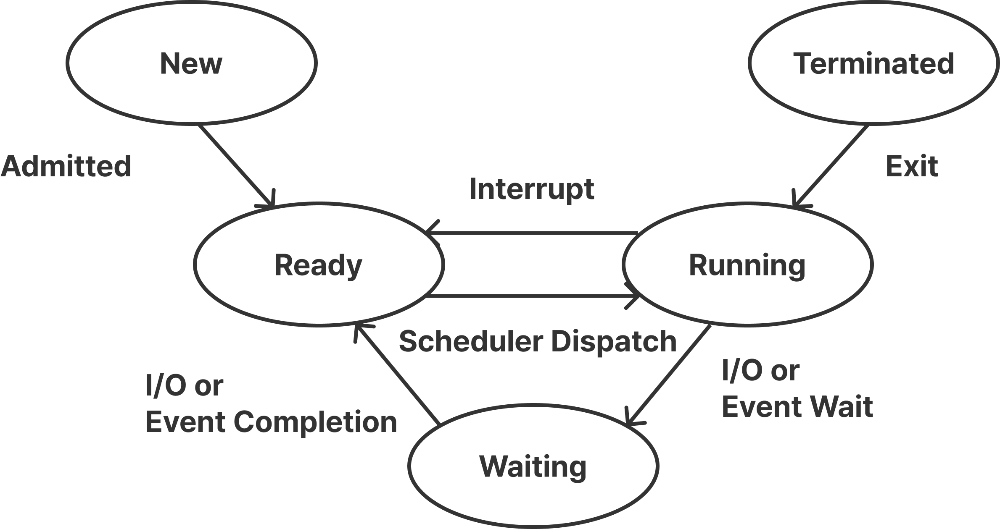

# CPU Scheduling

## 스케줄링

CPU를 여러 프로세스가 효율적으로 나누어 쓰도록 관리하는 기법이다.

운영체제는 한정된 CPU 자원을 효율적으로 배분하기 위해 어떤 프로세스를 언제, 얼마나 실행할지 결정한다.

스케줄링 시 아래 조건들이 고려되어야 한다.

### 스케줄링 조건

- **오버헤드 ↓**
  - 프로세스 전환 시 불필요한 시간이 최소화되어야 함
  - 스케줄링이 너무 잦으면 오히려 시스템이 느려짐
- **CPU 사용률 ↑**
  - CPU가 가능한 한 놀지 않고 계속 일하게 만들어야 함
  - **CPU idle time**(작업이 없는 시간)을 최소화해야 함
- **기아현상 ↓**
  - 특정 프로세스가 계속 뒤로 밀려 실행되지 못하는 문제를 줄여야 함

### 시스템별 스케줄링 목표

| 시스템 유형                            | 주요 목표         | 설명                                                             |
| -------------------------------------- | ----------------- | ---------------------------------------------------------------- |
| **Batch System (일괄 처리 시스템)**    | **처리량 극대화** | 사용자 상호작용이 거의 없으며, 가능한 한 많은 작업을 빠르게 처리 |
| **Interactive System (대화형 시스템)** | **응답시간 단축** | 사용자의 입력에 빠르게 반응해야 함                               |
| **Real-time System (실시간 시스템)**   | **기한 준수**     | 특정 작업은 반드시 정해진 시간 안에 완료되어야 함                |

## 선점 / 비선점 스케줄링

CPU 스케줄링은  
현재 실행 중인 프로세스를 **중간에 빼앗을 수 있느냐**에 따라 **선점형** 과 **비선점형** 으로 나뉜다.

### 선점 스케줄링

운영체제가 **CPU를 강제로 회수할 수 있는 방식**이다.  
현재 실행 중인 프로세스가 있더라도,  
더 높은 우선순위를 가진 프로세스가 오면 **CPU를 빼앗아 배정할 수 있다.**

#### 장점

- **응답 시간이 짧음** → 인터랙티브 시스템에 적합
- **CPU를 효율적으로 사용 가능** (즉시 중요한 작업 처리 가능)

#### 단점

- **Context Switching**이 잦아 **오버헤드 증가**
- **동기화 문제** 발생 가능 → 프로세스 간 자원 경쟁

### 비선점 스케줄링

한 번 CPU를 배정받은 프로세스는  
**자발적으로 CPU를 반납할 때까지** 계속 CPU를 점유한다.

#### 장점

- **Context Switching이 적어 오버헤드가 낮음**
- 프로세스 실행이 단순하고 안정적

#### 단점

- **긴 프로세스가 CPU를 독점할 수 있음** → 대기 시간이 길어짐
- **기아현상** 발생 가능

## 프로세스 상태

프로세스는 실행 중에 여러 상태를 오가며,  
선점형과 비선점형 스케줄링에서 상태 변화 방식이 다르다.

### 상태 전이 요약

- **선점 스케줄링 (Preemptive Scheduling)**

  - `Interrupt`
  - `I/O or Event Completion`
  - `I/O or Event Wait`
  - `Exit`

- **비선점 스케줄링 (Non-preemptive Scheduling)**
  - `I/O or Event Wait`
  - `Exit`

### 상태별 설명

- **승인 (Admitted)**  
  프로세스 생성이 가능하여 **시스템에 의해 승인된 상태**이다. 프로세스가 **Ready Queue**에 들어갈 수 있게 된다.

- **스케줄러 디스패치 (Scheduler Dispatch)**  
  준비 상태에 있는 여러 프로세스 중 하나를 선택하여 **CPU를 할당하고 실행시키는 과정**이다. 즉, **Ready → Running**으로 전환되는 시점이다.

- **인터럽트 (Interrupt)**  
  예외, 입출력, 이벤트 등 **외부 요인으로 인해 현재 실행 중인 프로세스가 중단**되는 상황이다. CPU 제어권이 운영체제로 넘어가고 프로세스는 다시 **Ready 상태로 이동**한다.

- **입출력 또는 이벤트 대기 (I/O or Event Wait)**  
  실행 중인 프로세스가 **입출력 작업이나 특정 이벤트의 완료를 기다려야 하는 경우** 프로세스를 **Waiting 상태**로 전환시킨다. 이 상태에서는 **CPU를 점유하지 않는다.**

- **입출력 또는 이벤트 완료 (I/O or Event Completion)**  
  입출력이나 이벤트가 완료되면 프로세스가 **Waiting → Ready**로 이동하여  
  다시 **스케줄러의 선택 대상**이 된다.

- **종료 (Exit)**  
  프로세스의 작업이 완전히 끝나면 시스템은 이를 종료시키고 **자원(메모리, 파일 핸들 등)을 회수**한다. 이때 프로세스는 **Terminated 상태**로 전환된다.

## CPU 스케줄링의 종류

### 비선점 스케줄링

#### 1. FCFS (First Come, First Served)

- **도착 순서대로 CPU를 할당**하는 방식.
- 구현이 단순하지만 **실행 시간이 긴 프로세스가 먼저 오면** 뒤의 짧은 작업들이 오래 기다리게 됨.
- 결과적으로 **평균 대기 시간**이 길어질 수 있다.

#### 2. SJF (Shortest Job First)

- **실행 시간이 가장 짧은 작업부터 수행**하는 방식.
- FCFS보다 **평균 대기 시간이 짧아짐**.
- 하지만 **작업의 실행 시간을 미리 알아야 하는 단점**이 있다.
- 짧은 작업에 유리하지만, 긴 작업은 **기아현상** 발생 가능.

#### 3. HRN (Highest Response-ratio Next)

- SJF의 **단점을 보완한 방식**.
- **우선순위 계산식**을 이용해 점유 불평등을 완화한다.
- 대기 시간이 길수록 우선순위가 높아지므로 **기아현상 방지** 효과가 있다.
- 매번 우선순위를 재계산해야 하므로 약간의 계산 오버헤드 존재.

### 선점 스케줄링

#### 1. Priority Scheduling

- 각 프로세스에 **정적** 혹은 **동적** 우선순위를 부여하여 **우선순위가 높은 프로세스부터 실행**한다.
- **Starvation(기아현상)** 발생 가능 → 낮은 우선순위 프로세스가 계속 대기.
- **Aging 기법**을 사용하여 오랫동안 대기한 프로세스의 우선순위를 점차 높임.

#### 2. Round Robin

- **FCFS + Time Quantum** 개념을 결합한 방식.
- 각 프로세스는 동일한 시간만큼 CPU를 할당받고 시간이 끝나면 다음 프로세스에게 CPU를 넘긴다.
- **Time Quantum**: 프로세스가 한 번에 실행될 수 있는 **최소 단위 시간**.
- 특징
  - **Time Quantum이 크면 → FCFS와 유사**, 응답 지연 증가.
  - **Time Quantum이 작으면 → Context Switching 증가**, 오버헤드 커짐.
  - **공정성**이 높고, 응답성이 좋아 **대화형 시스템에 적합**.

#### 3. Multilevel Queue (다단계 큐)

- **프로세스 성격에 따라 여러 개의 큐로 분류하여 관리**하는 방식. (예: 시스템 프로세스, 대화형 프로세스, 배치 작업 등)
- 각 큐마다 **고정된 우선순위와 Time Quantum**을 갖는다.
- **우선순위가 높은 큐 → 짧은 Time Quantum**
- **우선순위가 낮은 큐 → 긴 Time Quantum**
- **단점**
  - 큐 간 이동이 불가능하므로, 하위 큐 프로세스가 **기아현상**을 겪을 수 있음.

#### 4. Multilevel Feedback Queue (다단계 피드백 큐)

- **Multilevel Queue의 단점을 개선한 방식**.
- **큐 간 이동이 가능**하며, 프로세스의 실행 특성에 따라 상하 이동이 이루어진다.
- 자신의 Time Quantum을 **다 채운 프로세스 → 아래 큐로 이동** (CPU Burst 작업)
- Time Quantum을 **다 채우지 않은 프로세스 → 현재 큐 유지**
- 짧은 작업이나 **I/O 중심 작업(Interrupt가 잦은)** 프로세스는  
  **상위 큐에서 빠르게 처리**되어 응답성이 좋아진다.
- 결과적으로 **짧은 작업에 유리하고 평균 Turnaround Time 감소**.

## CPU 스케줄링 척도

- **Response Time**: 작업이 **처음 실행되기까지 걸린 시간**
- **Turnaround Time**: **실행 시간과 대기 시간을 모두 합한 시간**으로 작업이 완료될 때 까지 걸린 시간
