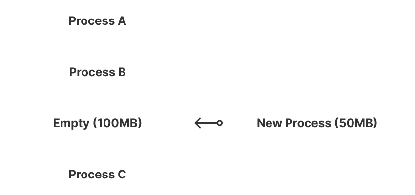
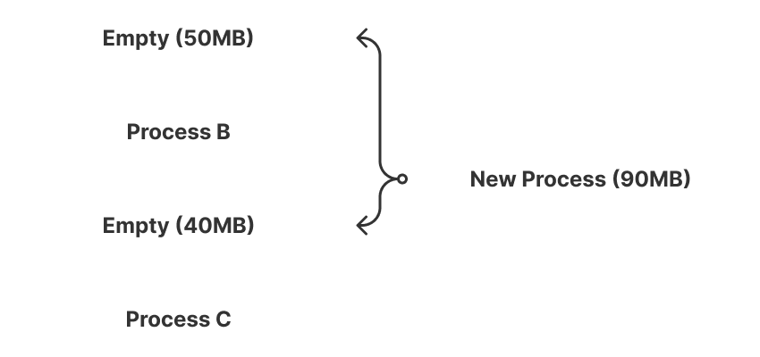

# 페이징(Paging)과 세그먼테이션(Segmentation)

운영체제는 **다중 프로그래밍 환경에서 여러 프로세스를 동시에 메모리에 적재**해야 한다.  
이를 위해 주기억장치를 **동적으로 분할하고 효율적으로 관리**하는 메모리 관리 기법이 필요하다.

## 메모리 관리 방식

### 연속 메모리 관리

프로세스 전체가 **하나의 연속된 공간에 할당**되어야 하는 방식이다.

| 기법          | 설명                                                            | 단편화 유형          |
| ------------- | --------------------------------------------------------------- | -------------------- |
| **고정 분할** | 주기억장치를 고정된 크기의 파티션으로 나누어 각 프로세스에 할당 | **내부 단편화 발생** |
| **동적 분할** | 필요한 크기만큼 파티션을 동적으로 생성하여 할당                 | **외부 단편화 발생** |

#### 단편화란?

메모리 공간이 연속적으로 사용되지 못하고 **조각나 비효율적으로 낭비되는 현상**을 말한다.

- **내부 단편화**: 할당된 블록 내부에 사용되지 않는 여유 공간이 생김
  - 
  - 50MB의 여유 공간 발생
- **외부 단편화**: 전체 빈 공간의 합은 충분하지만 **연속된 큰 공간이 없어 새로운 프로세스를 적재할 수 없는 상황**
  - 
  - 90MB가 들어갈 수 있지만 연속적이지 않아서 적재할 수 없음

### 불연속 메모리 관리

프로그램이 **서로 다른 주소 공간에 나누어 저장될 수 있는 방식**이다.

- **페이지**: 고정 크기의 프로세스 조각
- **프레임**: 페이지와 동일한 크기의 물리 메모리 블록
- **세그먼트**: 의미 단위별로 나뉜 **가변 크기**의 논리적 블록
- **단편화**: 기억 장치의 빈 공간 혹은 자료가 여러 조각으로 나뉘는 현상

## 페이징

> **고정 크기 단위**로 메모리를 분할하여 관리하는 기법  
> 외부 단편화를 제거하는 대신 **일부 내부 단편화가 발생**한다.

### 단순 페이징

- 프로세스는 **고정된 크기의 페이지** 단위로 나뉘며 각 페이지는 **동일 크기의 프레임**에 매핑된다.
- 모든 페이지가 메모리에 동시에 적재된다.

#### 특징

- 외부 단편화 없음
- 일부 내부 단편화 존재
- 주소 변환이 단순 (페이지 테이블 이용)

### 가상 메모리 페이징

- 프로세스의 **일부 페이지만 실제 메모리에 적재**
- 필요할 때마다 **페이지 폴트** 발생 시 디스크에서 불러옴

#### 특징

- 외부 단편화 없음
- 일부 내부 단편화 존재
- 필요한 부분만 로드하므로 **효율적인 메모리 사용 가능**
- 단점: **페이지 테이블 관리 및 교체 오버헤드** 발생

페이지를 나눌 때 너무 크거나 작으면 각각 아래와 같은 일이 생길 수 있다.

**1. 페이지 크기가 너무 작은 경우**

- **페이지 수 증가** → 페이지 테이블이 커지고 **주소 변환 오버헤드** 증가
- **메모리 접근 속도 저하** → TLB Miss Rate 상승
- **디스크 I/O 증가** → 페이지 교체 시 많은 작은 단위로 입출력이 발생
- **관리 복잡성 증가** → 페이지 테이블 관리 비용 및 메모리 공간 낭비 발생

**2. 페이지 크기가 너무 큰 경우**

- **내부 단편화 증가** → 실제 필요한 메모리보다 큰 페이지가 할당되어 낭비 발생
- **메모리 낭비 심화** → 작은 프로세스나 데이터에도 전체 페이지 단위로 할당
- **페이지 교체 효율 저하** → 필요하지 않은 데이터까지 함께 메모리에 적재

## 세그먼테이션

> 논리적 단위(코드, 데이터, 스택 등)를 기반으로  
> **가변 크기 단위로 메모리를 분할**하는 기법

외부단편화가 발생할 수 있다는 점이 너무 큰 단점이라 잘 사용하지 않는다고 한다.

### 단순 세그먼테이션

- 프로그램을 여러 개의 **의미 단위 세그먼트**로 나눔
- 각 세그먼트는 **연속적인 주소 공간**에 배치된다.

#### 특징

- 내부 단편화 없음
- 외부 단편화 존재
- 논리 구조를 반영해 **프로그램 관리 효율 높음**

### 가상 메모리 세그먼테이션

- 필요한 세그먼트만 실제 메모리에 적재
- 필요 시 디스크에서 자동으로 로드

#### 특징

- 내부 단편화 없음
- 일부 외부 단편화 가능
- **세그먼트 단위의 동적 적재**로 메모리 사용 효율 향상
- 단점: **복잡한 주소 변환 및 관리 오버헤드**

앞서 외부 단편화가 내부 단편화에 비해 좋지 않다고 했는데 이유는 아래와 같다.

1. **재사용이 어렵다**

   - 외부 단편화는 메모리의 빈 공간이 **여러 곳에 흩어져 있어**  
     실제로 사용할 수 있는 **연속된 큰 공간이 부족**하다.
   - 반면 내부 단편화는 이미 할당된 블록 내부의 낭비이므로  
     전체적으로는 **연속된 공간이 유지**된다.

2. **메모리 관리 복잡성 증가**

   - 외부 단편화가 발생하면 운영체제가 **빈 공간을 탐색하고 병합하는 과정**(압축)을 수행해야 한다.
   - 이 과정은 **CPU 오버헤드**를 증가시키고 **시스템 성능을 저하시킨다.**

3. **큰 프로세스 적재 불가능**

   - 외부 단편화에서는 **전체 빈 공간의 합은 충분해도**  
     **하나의 연속된 공간이 없으면** 큰 프로세스를 적재할 수 없다.
   - 내부 단편화의 경우 이미 확보된 공간 내에서만 낭비가 일어날 뿐 새 프로세스 적재에는 영향을 주지 않는다.

4. **예측 불가능성**
   - 외부 단편화는 메모리 할당, 해제 패턴에 따라  
     **언제 어디서 얼마나 생길지 예측하기 어렵다.**
   - 내부 단편화는 블록 크기에 따라 낭비량이 **예측 가능**하다.

## 참고

- [가상 메모리(Virtual Memory), 페이징(Paging)](https://hojunking.tistory.com/110)
- [Segmentation(세그멘테이션)](https://hojunking.tistory.com/111)
