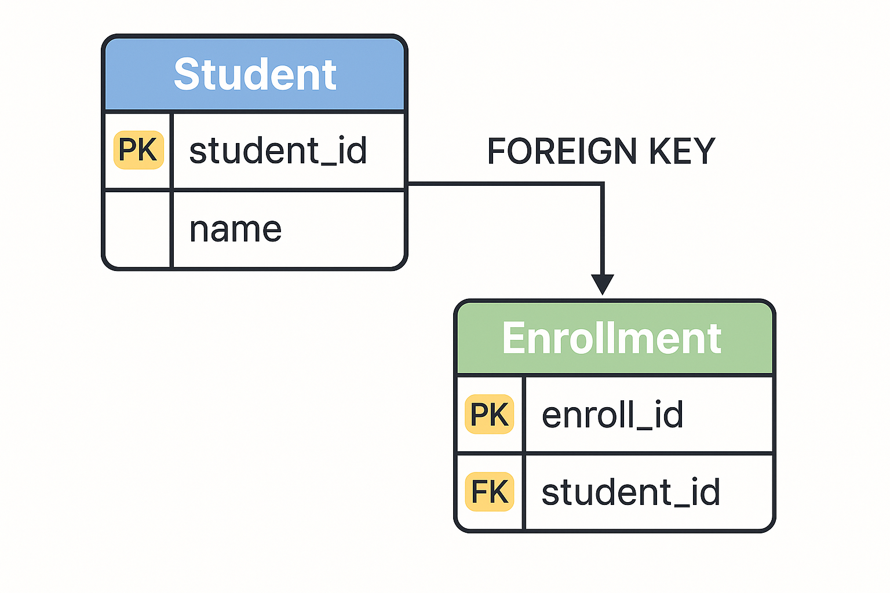

# 키(Key)

## Primary Key (기본키)

> **후보키 중 대표로 선택된 키**

- **특징**

  - **NULL 불가** → 데이터의 무결성을 보장
  - **중복 불가** → 튜플의 고유 식별자 역할
  - **자동 인덱스 생성** → 검색 성능 향상

### Snowflake 알고리즘

> **분산 환경에서 충돌 없이 고유한 Primary Key를 생성하는 방식**

- **트위터** 에서 개발
- 중앙 서버나 DB의 `AUTO_INCREMENT` 없이도 **전역 유일 ID** 생성
- **대규모 트래픽**과 **분산 서버 환경**에서 사용

| 구성  | 설명                                         |
| ----- | -------------------------------------------- |
| 1bit  | 부호 비트 (항상 0)                           |
| 41bit | 타임스탬프 (기준 시점부터의 밀리초)          |
| 10bit | 서버/머신 ID (어느 서버에서 생성됐는지 구분) |
| 12bit | 시퀀스 번호 (같은 밀리초 내 중복 방지)       |

> 더 알아보기: [고유 ID 생성 알고리즘 (SNOWFLAKE)](https://subo0521.tistory.com/241)

## Candidate Key (후보키)

> **기본키로 선택될 수 있는 모든 키**

- **정의**: 각 튜플을 유일하게 식별할 수 있는 속성들의 **부분 집합**
- **조건**
  - **유일성**: 각 튜플이 키 값으로 유일하게 식별되어야 함
  - **최소성**: 키에서 불필요한 속성이 제거되어야 함  
    → 키의 일부만으로는 튜플을 식별할 수 없어야 함
- 예시
  | 학번 | 이름 | 주민번호 |
  | ---- | ------ | -------------- |
  | 101 | 홍길동 | 900101-1234567 |
  | 102 | 이몽룡 | 920202-3456789 |
  - 후보키: `{학번}`, `{주민번호}`

## Alternate Key (대체키)

> **기본키로 선택되지 않은 후보키**

- **역할**: 기본키가 아닌 다른 유일한 키로 여전히 유일성 보장
- **예시**
  - 후보키: `{학번}`, `{주민번호}`
  - 기본키: `{학번}`
  - → 대체키: `{주민번호}`

## Super Key (슈퍼키)

> **유일성만 만족하는 키 (최소성은 만족하지 않음)**

- **정의**: 하나의 튜플을 유일하게 식별할 수 있는 속성들의 집합
- **예시**
  - `{학번}` : 후보키 → 슈퍼키
  - `{학번, 이름}` : 최소성 위배 → 슈퍼키 (하지만 후보키 아님)

## Foreign Key (외래키)

> **다른 릴레이션의 기본키를 참조하는 속성**

- **역할**: 테이블 간 **관계** 를 정의하고  
  **참조 무결성** 을 보장
- **구조**
  - 부모 테이블: **기본키를 가진 테이블**
  - 자식 테이블: **그 키를 참조하는 테이블**

