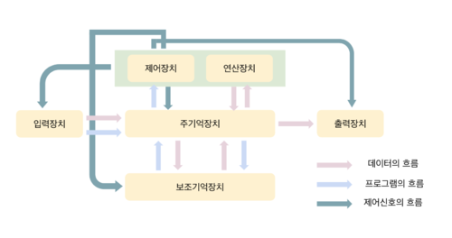

# 컴퓨터의 구성

**<목차>**

---

# 컴퓨터의 구성

컴퓨터의 구성 요소

- **하드웨어(Hardware)** : 컴퓨터를 구성하는 기계적 장치
  - 중앙처리장치(CPU)
  - 기억장치 : RAM, HDD
  - 입출력 장치 : 마우스, 프린터
- **소프트웨어(Software)** : 하드웨어의 동작을 지시하고 제어하는 명령어 집합
  - 시스템 소프트웨어 : 운영체제, 컴파일러
  - 응용 소프트웨어 : 워드프로세서, 스프레드시트

## **하드웨어(Hardware)**

컴퓨터의 모든 물리적인 부품

하드웨어를 구성하는 요소인 중앙처리장치(CPU), 기억장치, 입출력장치 모두 “시스템 버스(System Bus)”를 통해 연결되어 있음

시스템 버스(System Bus)

: 데이터와 명령 제어 신호를 각 장치로 전달하는 통로

### 중앙처리장치(CPU, Central Processing Unit)

: 주기억장치에서 프로그램 명령어와 데이터를 읽어와 처리하고 명령어의 수행 순서를 제어하는 부분

- 컴퓨터의 중앙에서 모든 데이터를 처리하는 핵심적인 장치 (= 두뇌)
- 사용자가 명령을 보내면, 명령어 해석 / 자료 처리(연산)를 통해 결과를 출력장치에게 전달

CPU의 구성

- **산술논리연산장치 (ALU - Arithmetic Logic Unit)**
  - 비교와 연산을 담당
  - 산술 연산(+, −, ×, ÷), 논리 연산(AND, OR, NOT), 비교 연산(>, <, =) 등을 처리
- **제어장치 (CU - Control Unit)**
  - 명령어의 해석과 실행을 담당
  - 컴퓨터에 있는 모든 장치들의 동작을 지시하고 제어 (언제 어떤 동작을 하라고 신호 전달…)
  - 명령 수행 = 산술연산, 논리연산, 관계연산, 이동(Shift) 등을 통하여 수행
- **레지스터 (Register)**
  - CPU 내부에서 처리할 명령어, 연산 결과, 주소 등을 일시적으로 담아두는 임시 기적장소
  - 속도가 빠른 데이터 기억장소
    → 메모리 중 가장 빠르고, 연산을 더 빠르게 향상하기 위해서 사용됨
  - 새 데이터가 전송되면 기존의 내용은 지워지는 방식 (덮어쓰기)

### 기억 장치(Memory / Storage)

: 프로그램, 데이터, 정보, 연산의 중간 결과를 저장하는 장치 (= 저장장치)

기억 장치의 구성

- **주기억장치(Main Memory)**
  - RAM (Random Access Memory)
  - ROM (Read Only Memory)
- **보조기억장치(Secondary Storage)**
  - HDD (Hard Disk Drive)
    - 물리적인 디스크를 고속으로 회전시켜 데이터를 저장하는 장치
      (물리적 → 충격에 약하고 소음⬆️)
    - CPU, RAM에 비해 속도⬇️
  - SSD (Solid State Drive)
    - 실물이 있는 반도체 기반의 저장장치
    - 그러나 전기적 방식으로 데이터를 저장 (물리적X)
      (속도⬆️, 소음⬇️, HDD에 비해 비용⬆️)

### 입출력 장치(I/O Devices)

: 사용자가 명령을 넘기거나(입력), 사용자에게 결과값을 보여주는 장치(출력)

입출력 장치의 구성

- **입력 장치**
  - 컴퓨터 내부로 자료를 입력하는 장치 (키보드, 마우스 등)
- **출력 장치**
  - 컴퓨터에서 외부로 출력하는 장치 (프린터, 모니터, 스피커 등)

## 시스템 버스(System Bus)

> 하드웨어 구성 요소를 물리적으로 연결하는 선
>
> → 각 구성요소가 다른 구성요소로 데이터를 보낼 수 있도록 해주는 통로

### 데이터 버스(Data Bus)

: 중앙처리장치와 기타 장치 사이에서 데이터를 전달하는 통로

데이터 버스의 특징

- **양방향** (읽기/쓰기 모두 가능)
  - 기억장치 & 입출력장치의 명령어 → 중앙처리장치(CPU)로 전달
  - 중앙처리장치(CPU)의 결과값 → 기억장치 & 입출력장치로 전달
- 선의 개수 = CPU가 수용할 수 있는 데이터의 크기 (한번에 이동할 수 있는 **bits**의 크기)
  - 32, 64, 128 ~

### 주소 버스(Address Bus)

: 중앙처리장치가 주기억장치나 입출력장치로 기억장치 주소를 전달하는 통로

주소 버스의 특징

- **단방향** (CPU → 메모리/장치)
- 주소버스의 폭 = 메모리의 용량
  ex) 32개의 주소 버스를 지닌 시스템은 2^32개의 메모리 위치를 할당 가능

### 제어 버스(Control Bus)

: 중앙처리장치(CPU)가 기억장치나 입출력장치에 제어 신호를 전달하는 통로

→ CPU가 Memory를 Read할지, Write할지에 대한 정보를 전달

사용 이유

= 주소 버스와 데이터 버스는 모든 장치에 공유되기 때문에 이를 제어할 수단이 필요

제어 버스의 특징

- **양방향** (읽기/쓰기 모두 가능)
- 제어 신호 종류 : 기억장치 읽기 및 쓰기, 버스 요청 및 승인, 인터럽트 요청 및 승인, 클락, 리셋 등

## 컴퓨터의 기본 처리 과정

<aside>
💡

컴퓨터의 기본 과정?

→ **읽고 처리한 뒤 저장 (READ → PROCESS → WRITE)**

</aside>

해당 과정을 처리하면서 끊임없이 주기억장치(RAM)와 소통…

ex) 운영체제가 64bit = CPU는 RAM으로부터 데이터를 한번에 64비트씩 읽어옴
