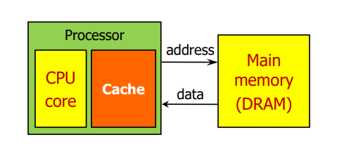

# 캐시 메모리 (Cache Memory)

[캐시 메모리(Cache Memory) | 👨🏻‍💻 Tech Interview](https://gyoogle.dev/blog/computer-science/computer-architecture/%EC%BA%90%EC%8B%9C%20%EB%A9%94%EB%AA%A8%EB%A6%AC.html)

**<목차>**

---

# **캐시 메모리 (Cache Memory)**

: CPU와 메인 메모리(RAM) 간의 데이터 속도 향상을 위한 중간 버퍼 역할을 하는 메모리

= CPU와 RAM 사이의 속도 차이 완화 (속도 병목 현상 ⬇️)



<aside>
💡

**원리**

주기억장치의 데이터를 읽어올 때, 자주 사용하는 데이터를 캐시 메모리에 저장 후 다음에는 주기억장치가 아닌 캐시 메모리에서 해당 데이터를 가져옴 → **속도 향상**

</aside>

ex1) CPU 코어와 메모리 사이의 병목 현상 완화

ex2) 웹 브라우저 캐시 파일은, 하드디스크와 웹페이지 사이의 병목 현상을 완화

캐시 메모리의 장/단점

- 장점
  - 빠른 속도 (속도 병목 현상 완화)
- 단점
  - 적은 용량, 비싼 비용

CPU에서는 캐시 메모리가 2~3개 정도 사용되며, 각각을 level로 분류

CPU가 사용하는 캐시 메모리 = L1 ~ L3 캐시 메모리

→ 속도와 크기에 따라 분류…L1 캐시부터 먼저 사용함

**듀얼 코어 프로세서의 캐시 메모리**

: 각 코어마다 독립된 L1 캐시 메모리를 가지고, 두 코어가 공유하는 L2 캐시 메모리가 내장됨

- **L1** : CPU 내부에 존재
- **L2** : CPU와 RAM 사이에 존재
- **L3** : 보통 메인보드에 존재한다고 함


캐시 메모리 크기가 작은 이유? SRAM 가격이 매우 비쌈

**디스크 캐시** : 주기억장치(RAM)와 보조기억장치(하드디스크) 사이에 존재하는 캐시

# 캐시 메모리 관련 용어

- **Block** 또는 **Cache line** : 캐시 메모리와 메인 메모리 사이 주고받는 데이터의 단위 (기본 64byte)

- **Hit** : CPU가 읽어오려고 하는 데이터가 캐시에 있는 경우

  - Hit rate : CPU가 요청한 데이터 중 캐시에 저장된 비율
  - Hit time : 캐시에서 데이터를 읽어오는 데 필요한 시간

- **Miss** : CPU가 읽어오려고 하는 데이터가 캐시에 없는 경우
  - Miss rate : CPU가 요청한 데이터 중 캐시에 저장되지 않은 비율 (= 1에서 Hit rate를 뺀 값)
  - Miss penalty : miss가 발생해 데이터를 block만큼 메인 메모리에서 캐시 메모리로 가져오는 데 필요한 시간

# 캐시 메모리 작동 원리

## 참조 지역성

### 시간 지역성

: for, while 등의 반복문에 사용하는 조건 변수처럼, 한번 참조된 데이터는 잠시후 또 참조될 가능성이 높음

(= **최근에 사용된 데이터/명령어는 곧 다시 사용될 가능성이 높다**)

### 공간 지역성

: A[0], A[1]과 같은 연속 접근 시, 참조된 데이터 근처에 있는 데이터가 잠시후 또 사용될 가능성이 높음

(= **현재 접근한 주소 근처의 데이터가 곧 사용될 가능성이 높다**)

<aside>
💡

**캐시에 데이터를 저장할 때…**

해당 데이터뿐만 아니라, 옆 주소의 데이터도 같이 가져와 미래에 쓰일 것을 대비

→ 참조 지역성(공간)을 최대한 활용!

</aside>

CPU가 특정 데이터를 요청함…

- 캐시 히트(Cache Hit) : CPU가 요청한 데이터가 캐시에 있는 경우
- 캐시 미스(Cache Miss) : 없어서 DRAM에서 가져와 캐시에 저장 후 전달하는 경우

## 캐시 미스(Cache Miss)

### 1. **Cold miss**

: 해당 메모리 주소를 처음 불러서 miss가 발생하는 경우

### 2. **Conflict miss**

: 캐시 메모리에 A 데이터와 B 데이터를 저장해야 하는데, A와 B가 같은 캐시 메모리 주소에 할당되어 miss가

발생하는 경우 (direct mapped cache에서 많이 발생)

ex) A 데이터 저장 → B 데이터를 같은 주소에 저장 → A 데이터를 읽으려고 하면 해당 미스가 발생

### **3. Capacity miss**

: 캐시 메모리에 공간이 부족해서 miss가 발생하는 경우

→ 크기를 키워서 해당 미스를 해결…? **캐시 접근속도가 느려지고 파워를 많이 먹게 되는 단점 발생**

# **구조 및 작동 방식**

## **Direct Mapped Cache**

: DRAM의 여러 주소가 캐시 메모리의 한 주소에 대응되는 다대일 방식 (가장 기본적인 구조)

= 각 memory block이 cache의 정확히 한 block에만 대응


memory block이 저장될 cache block의 주소

```
(memory block 주소) % (cache의 block 수)
```

ex) memory의 00001에 위치한 block은 cache memory의 001에만 저장될 수 있음

→ hit인지 miss인지 판단하기 위해 한 개의 cache block만 확인해도 됨


메모리는 캐시보다 큼 → 여러 개의 memory block은 하나의 cache block을 공유함

ex) 위 이미지의 회색 부분(**001**)에 저장된 데이터가 메모리의 4부분(00**001**, 01**001**, 10**001**, 11**001**) 중 어디에서 왔는지 어떻게 알 수 있을까? → tag가 해당 정보를 제공

캐시 메모리의 구성

- **valid** : 최초에는 0으로 세팅, 실제로 의미있는 데이터 들어오는 순간부터 1로 기록
- **tag** : 어떤 memory block이 cache에 저장된 것인지에 대한 정보 저장된 부분
  - memory block 주소를 cache block 수로 나눈 몫이며, memory block 주소의 상위 두 자리로 표현
- **data** : 실제 데이터가 저장되는 부분

단점 : Conflict Miss가 발생함

주소 관점 (CPU 입장)으로는 캐시 메모리의 구성이 `인덱스 필드 + 태그 필드 + 데이터 필드`

캐시 안에 실제로 저장되는 건 `vaild, tag, data`

## **Fully Associative Cache**

: 비어있는 캐시 메모리가 있으면, 마음대로 주소를 저장하는 방식


단점 : 저장은 매우 간단하지만, 해당 데이터를 찾기 위해서는 hit인지 miss인지 판단하기 위해 특정 캐시 Set

안에 있는 모든 block을 확인해야 함

(CAM이라는 특수한 메모리 구조를 사용? 가격 매우 비쌈…)

## **Set Associative Cache**

: 위 두 방식의 중간쯤 되는 방식 (Direct + Fully 방식)

캐시 메모리를 n개의 block(way)를 가진 set 단위로 나누고, memory block을 하나의 set에서 비어있는 블록에 저장하는 것


Direct에 비해 검색 속도는 느리지만 저장이 빠르고, Fully에 비해 저장이 느린 대신 검색이 빠름

하나의 set에서 2개의 block 중 하나에 저장될 수 있음

→ hit인지 miss인지 판단하기 위해서는 block 2개를 모두 확인해야 함!

어느 set을 확인해야 할까…

```
(memory block 주소) % (캐시의 set 수)
```
