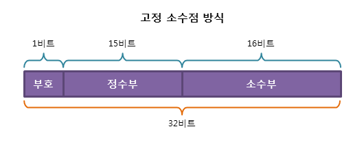

# 고정 소수점 & 부동 소수점

[고정 소수점 & 부동 소수점 | 👨🏻‍💻 Tech Interview](https://gyoogle.dev/blog/computer-science/computer-architecture/%EA%B3%A0%EC%A0%95%20%EC%86%8C%EC%88%98%EC%A0%90%20&%20%EB%B6%80%EB%8F%99%20%EC%86%8C%EC%88%98%EC%A0%90.html)

**<목차>**

---

# **실수 표현 방식**

**실수(real number)**

: 양 또는 음의 값을 갖는 모든 정수, 0, 유리수, 무리수를 통틀어 일컫는 말

컴퓨터는 숫자를 2진수로 저장 → 우리가 쓰는 10진수를 2진수로 바꿔서 표현해야 함!

컴퓨터에서 실수를 표현하는 방법 : 고정 소수점, 부동 소수점

## **실수를 2진수로 변환하기**

ex) 10진수인 35를 2진수로 변환하기

```markdown
35 / 2 = 17 ... 1
17 / 2 = 8 ... 1
8 / 2 = 4 ... 0
4 / 2 = 2 ... 0
2 / 2 = 1 ... 0
```

방법)

10진수를 나머지가 1이 될 때까지 2로 계속 나눈 후, 구한 나머지들을 맨 아래에서부터 읽기

→ 위 예시에선 마지막 나머지 1부터 거꾸로 0 0 0 1 1…

= 10진수인 35는 2진수로 “100011”

# 고**정 소수점 (Fixed Point)**

: 실수에서 소수부의 자릿수를 미리 정해 고정된 자릿수만큼의 소수를 표현하는 방식 (정수 + 소수)

→ 부호, 정수부, 소수부 세 가지 요소 필요



32bit 고정 소수점 방식

맨 앞의 1비트 = 부호를 나타내는 sign bit

- 0 = 양수
- 1 = 음수

**장점** : 실수를 정수부와 소수부로 표현하여 단순하다.

**단점** : 표현의 범위가 너무 적어서 활용하기 힘들다. (정수부는 15bit, 소수부는 16bit)

# **부동 소수점 (Floating Point)**

: 실수를 정수부와 소수부로 나누는 것이 아니라, 가수부와 지수부로 나누어 표현하는 방식

→ **지수의 값에 따라 소수점이 움직이는 방식**을 활용한 실수 표현 방법 (현재는 대부분 IEEE 754 표준)

- 가수부 : 실수의 실제값 표현
- 지수부 : 크기를 표현함. 가수의 어디쯤에 소수점이 있는지 나타냄

부동 소수점 표현 방식은 **정규화** 필요!

2진수에서의 정규화 = 정수부에 1만 존재하도록 실수를 표현하는 것


32비트의 float형 실수를 IEEE 부동 소수점 방식으로 표현


64비트의 double형 실수를 IEEE 부동 소수점 방식으로 표현

(소수점의 위치가 고정되어 있지 않음)

**장점** : 표현할 수 있는 수의 범위가 넓어진다. (현재 대부분 시스템에서 활용 중)

**단점** : 오차가 발생할 수 있다. (부동소수점으로 표현할 수 있는 방법이 매우 다양함)
