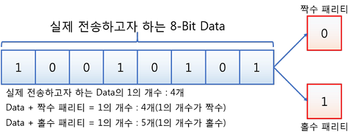

# 패리티 비트 & 해밍 코드

[패리티 비트 & 해밍 코드 | 👨🏻‍💻 Tech Interview](https://gyoogle.dev/blog/computer-science/computer-architecture/%ED%8C%A8%EB%A6%AC%ED%8B%B0%20%EB%B9%84%ED%8A%B8%20&%20%ED%95%B4%EB%B0%8D%20%EC%BD%94%EB%93%9C.html)

**<목차>**

---

# **패리티 비트 (Parity bit)**

> 정보 전달 과정에서 오류가 생겼는지 검사하기 위해 데이터에 추가하는 1비트
>
> → 전송하고자 하는 데이터의 각 문자에 1비트를 더하여 전송

1바이트 구조(8 비트)에서 7비트 크기인 ASCII 코드를 제외한 나머지 1비트

패리티 비트의 종류

- 패리티 비트를 포함한 데이터에서 1의 개수가 짝수 = 짝수 패리티
- 패리티 비트를 포함한 데이터에서 1의 개수가 홀수 = 홀수 패리티

즉, 전체 비트에서 1의 개수가 짝수 or 홀수에 맞도록 비트를 정하는 것…

데이터를 전송할 때, **데이터 비트 + 패리티 비트**를 함께 전송!

_ex1)_



위와 같은 8 bit 데이터를 전송할 때 맨 끝에 패리티 비트를 추가하여 전송하는 경우…

- **짝수**로 전송 → 기존 비트의 1의 개수가 4이니 이를 유지하려면 100101010
- **홀수**로 전송 → 기존 비트의 1의 개수가 4이니, 홀수로 만들기 위해선 100101011

_ex2) 짝수 패리티일 때 7비트 데이터가 1010001라면?_

1이 총 3개 → 1의 개수를 짝수로 맞추려면 1을 더해야 함

답 : 11010001 (맨 앞의 1이 패리티비트)

만약 홀수라면, 반대로 앞에 0을 더해서 1의 개수를 홀수로 유지 = 01010001

# **해밍 코드 (Hamming code)**

> 데이터 전송 시 1비트의 에러를 정정할 수 있는 자기 오류정정 코드
>
> → 오류정정부호(ECC - Error Correction Code)의 일종

패리티비트를 보고, 1비트에 대한 오류를 정정할 곳을 찾아 수정할 수 있는 기능

why? 패리티 비트는 오류를 검출하기만 할 뿐 수정하지는 않기 때문… 해밍 코드를 활용하여 이를 해결

**데이터의 비트 수에 따라 필요한 패리티 비트의 개수**

$$
2^p \geq d + p + 1
$$

(p : 패리티 비트 수, d : 데이터 비트 수, +1 : 오류 없음을 표현)

패리티 비트의 위치 = 2의 제곱수 위치(1, 2, 4, 8, …)

## 해밍 코드 예제

_짝수 패리티의 해밍 코드가 0011011일때 오류가 수정된 코드는?_

**풀이1) 비트 위치 확인**

7비트 해밍 코드 → 패리티 비트는 1, 2, 4번 자리

```
위치: 1 2 3 4 5 6 7
값  : 0 0 1 1 0 1 1
```

**풀이2) 각 패리티 비트 검사**

기준 : 짝수 패리티 (= 1의 개수가 짝수여야 함)

1. 1, 3, 5, 7번째 비트 확인 : 0101로 짝수이므로 '0'

   ```
   비트: 0 1 0 1 → 1의 개수 = 2 (짝수)
   	=> 정상... 결과 0
   ```

2. 2, 3, 6, 7번째 비트 확인 : 0111로 홀수이므로 '1'

   ```
   비트: 0 1 1 1 → 1의 개수 = 3 (홀수)
   	=> 오류... 결과 1
   ```

3. 4, 5, 6, 7번째 비트 확인 : 1011로 홀수이므로 '1'

   ```
   비트: 1 0 1 1 → 1의 개수 = 3 (홀수)
   	=> 오류... 결과 1
   ```

**풀이3) 오류 위치 찾기**

검사 결과를 역으로 확인하면 1 1 0이며, 이 숫자는 2진수이니 이를 10진수로 바꾸면 6

→ 6번째 비트에서 오류가 발생하는 중

```
위치: 1 2 3 4 5 6 7    (비트 숫자는 앞에서부터 순서대로 1, 2, 3, …)
비트: 0 0 1 1 0 1 1
```

0 0 1 1 0 1 1에서 6번째 비트인 1을 0으로 바꾸자 (1 → 0)

답 : **00110'0'1**

## +) 2진수 → 10진수 변형

2진수의 숫자? 오른쪽부터 2^0, 2^1, 2^2, …

```
2진수 110 = (1 × 2^2) + (1 × 2^1) + (0 × 2^0)
```

위 수식을 계산하면 4 + 2 + 0 = 6,

→ 즉 2진수 110을 10진수로 변환하면 6
