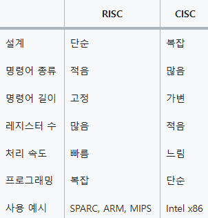

# ARM 프로세서

[ARM 프로세서 | 👨🏻‍💻 Tech Interview](https://gyoogle.dev/blog/computer-science/computer-architecture/ARM%20%ED%94%84%EB%A1%9C%EC%84%B8%EC%84%9C.html)

**<목차>**

---

# ARM 프로세서란?

_프로세서란?_

> 메모리에 저장된 명령어들을 실행하는 유한 상태 오토마톤

**ARM 프로세서**

: Advanced RISC Machine의 약자로, 진보된 RISC 기기를 의미 (핵심 = RISC)

RISC : Reduced Instruction Set Computing (감소된 명령 집합 컴퓨팅)

효율성…?

단순한 명령 집합을 가진 프로세서 > 복잡한 명령 집합을 가진 프로세서

## **RISC와 CISC 비교**

RISC (Reduced Instruction Set Computing)의 특징

- 명령어가 4 byte의 고정 길이 = 단순하며 빠른 처리의 속도
- 명령어의 종류가 적음 = 복잡한 기능을 수행하려면 여러 개의 명령어 필요

CISC (Complex Instruction Set Computer)의 특징

- 명령어의 길이가 가변적 = 복잡하며 느린 처리의 속도
- 명령어의 종류가 많음 = 명령어 하나로 원하는 기능 수행 가능

RISC와 CISC 비교 1

RISC와 CISC 비교 1

# **ARM 구조**

ARM 칩은 물리적 설계는 같아도, 명령 집합이 모두 다르게 만들어질 수 있음

명령어가 많고 복잡해질수록 실제 물리적인 칩 구조도 크고 복잡해짐

**ARM 기반 프로세서**

코어를 중심으로 하여 여러 주변 회로로 구성된 독립적인 시스템

- **캐시**: 명령어와 데이터를 빠르게 처리하기 위한 고속 메모리 (주로 코어와 메모리 사이의 병목을 줄임)
- **MMU**: 가상 주소를 물리 주소로 변환하여 다양한 응용 프로그램을 지원
- **AMBA**: 고성능 마이크로컨트롤러 간의 효율적인 통신을 위한 버스 아키텍처

  = 작고 효율적이며 상대적으로 속도가 느리지만, 명령어 집합이 단순하여 트랜지스터가 적게 필요함

(명령어가 많고 복잡해질수록 실제 물리적인 칩 구조도 크고 복잡해짐)

**ARM 코어**

: ARM 아키텍처의 핵심으로, 프로세서의 기본 원리에 따라 구현된 구성 요소, 내부에서 정보를 처리하고 교환

- **명령어 해석기**: 입력된 명령어를 해석하여 실행을 준비하는 장치
- **제어 장치**: 제어 신호를 내부 및 외부로 전달하여 프로세서의 동작을 조율
- **ALU(Arithmetic Logic Unit)**: 32비트 산술 및 논리 연산을 처리하는 핵심 장치, 레지스터 뱅크에서 입력된 데이터를 처리한 후, 그 결과를 다시 레지스터 뱅크 및 주소 레지스터에 저장

ARM 코어는 ARM 프로세서의 안에 있으며, 중심부 역할

전체 구조

# **ARM의 장점**

ARM을 위해 개발된 프로세서 → 오직 ARM 프로세서가 탑재된 기기에서만 실행 가능

ex) x86 CPU 프로세서 기반 프로그램은 ARM 프로세서 기반 기기에서 실행 X

→ 만약 사용하려면 해당 프로그램에 수정이 필요

그러나 하나의 ARM 기기에서 작동하는 OS → 다른 ARM 기반 기기에서도 잘 작동됨

= ARM 기기끼리는 OS 호환성이 좋음(범용 OS 확산 ⬆️, 애플 제외…)

- **전력 소모를 줄이고 성능을 높이는 방향**으로 개선 중 (저전력, 고성능)
