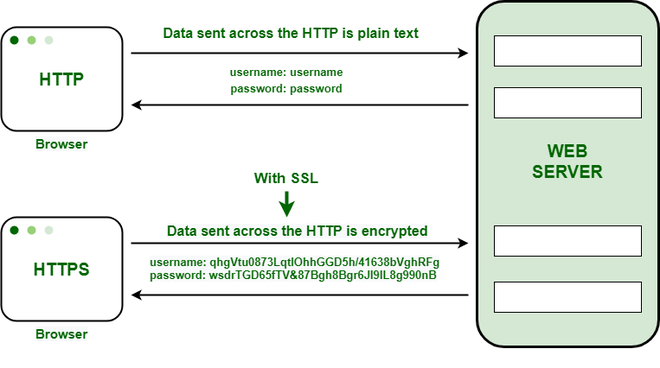

# HTTP & HTTPS

[HTTP & HTTPS | 👨🏻‍💻 Tech Interview](https://gyoogle.dev/blog/computer-science/network/HTTP%20&%20HTTPS.html)

**<목차>**

---

# HTTP와 HTTPS의 개념

## **HTTP (HyperText Transfer Protocol)**

<aside>
💡

인터넷 상에서 클라이언트와 서버가 자원을 주고 받을 때 쓰는 통신 규약 (암호화X)

</aside>

HTTP의 특징

- 사용자가 웹 사이트를 방문 → 사용자가 웹 서버에 **HTTP 요청**을 전송하고 웹 서버는 **HTTP 응답**으로 대응
  = 네트워크 통신을 작동하게 하는 기본 기술
- HTTP는 일반 텍스트 교환 (암호화X)
  = 누군가 네트워크에서 신호를 가로채면 내용이 노출되는 **보안 이슈**가 존재

## **HTTPS (HyperText Transfer Protocol Secure)**

<aside>
💡

인터넷 상에서 정보를 암호화하는 SSL 프로토콜을 사용해 클라이언트와 서버가 자원을 주고 받을 때 쓰는 통신 규약 (HTTP에서 보안 레이어가 추가된 프로토콜)

</aside>

HTTPS의 특징

- 공개키 암호화 방식으로 텍스트를 암호화 = 보안 ⬆️
- 브라우저와 서버가 데이터를 전송하기 전에 암호화된 연결을 사용

# **HTTP의 동작 방식**

**1. 클라이언트 요청**

- 클라이언트(웹 브라우저 등)가 웹 서버에게 요청 전송 (보통 웹 주소를 통해 전송)
- 요청은 HTTP 메서드(GET, POST, PUT, DELETE 등)와 함께 요청 헤더, 요청 본문 등의 데이터를 포함할 수 있음

**2. 서버 응답**

- 웹 서버는 클라이언트의 요청을 받은 후 해당 요청에 대한 응답 생성
- 응답은 HTTP 상태 코드(200 OK, 404 Not Found, 500 Internal Server Error 등)와 함께 응답 헤더, 응답 본문 등의 데이터를 포함할 수 있음
- _응답 ex)_
  - `200` - OK(정상)
  - `400` - Bad request(잘못된 요청)
  - `404` - Resource not found(리소스를 찾을 수 없음)

**3. 데이터 전송**

- 클라이언트와 서버 간에는 요청과 응답을 주고받는 과정에서 데이터가 전송됨
- 주로 텍스트, HTML 문서, 이미지, 동영상 등의 형태를 가진 데이터

**4. 연결 종료**

- 요청과 응답이 완료되면, 클라이언트와 서버 간의 연결이 종료될 수 있음
- 그러나 HTTP/1.1에서는 기본적으로 지속적인 연결을 유지하며, 여러 요청과 응답을 하나의 TCP 연결을 통해서 처리 가능

# **HTTPS의 동작 방식**

ex)

1. A라는 서버를 만드는 기업이 HTTPS를 적용하기 위해 공개키와 개인키를 제작

2. 신뢰할 수 있는 **CA 기업**에 공개키 관리를 부탁하며 계약을 맺음

_CA란? Certificate Authority로, 공개키를 저장해주는 신뢰성이 검증된 민간기업_

3. 계약 후 CA 기업은 A 서버의 공개키, 해당 기업의 이름, 공개키 암호화 방법을 담은 인증서를 제작

4. 해당 인증서를 CA 기업의 개인키로 암호화해서 A 서버에게 제공

5. A 서버는 직접적인 공개키가 아닌 **암호화된 인증서**를 보유하게 됨

→ 암호화된 HTTPS 요청이 아닌 요청이 오면, 이 암호화된 인증서를 클라이언트에게 전달

6. 클라이언트가 통신 요청을 보내면 **SSL/TLS Handshake 과정**을 수행하여 연결 수립

7. 클라이언트와 A 서버의 통신 시작

# HTTP vs HTTPS 비교

**사용 프로토콜 비교**

- HTTP : HTTP/1과 HTTP/2는 TCP/IP를, HTTP/3은 QUIC 프로토콜 사용
- HTTPS : SSL/TLS와 함께 HTTP/2 사용 → HTTP 요청 및 응답을 추가로 암호화

**장점 비교**

- HTTP : 인터넷을 통한 통신 지원
- HTTPS : 웹 사이트에 대한 권위, 신뢰성 및 검색 엔진 순위 개선

**보안 비교**

- HTTP : 데이터를 암호화하지 않고 전송
  (= 데이터가 네트워크를 통해 전송되는 동안 제3자가 데이터를 엿보거나 조작 가능성 ⬆️)
- HTTPS : SSL 또는 TLS 프로토콜을 사용하여 데이터를 암호화

**통신 방법 비교**

- HTTP : 평문으로 데이터 전송
- HTTPS : SSL 또는 TLS를 사용하여 데이터를 암호화하고 인증

**포트 번호 비교**

- HTTP : 기본 포트 번호 80
- HTTPS : 기본 포트 번호 443

**인증 비교**

- HTTP : 보안 인증 X
- HTTPS : SSL 또는 TLS 인증서를 통해 서버의 신원 확인 가능

---

_참고 자료_

[HTTP와 HTTPS 비교 - 전송 프로토콜 간의 차이점 - AWS](https://aws.amazon.com/ko/compare/the-difference-between-https-and-http/)

[[CS] HTTP와 HTTPS란 무엇이고 어떤 차이가 있을까? — 주독야독](https://hulrud.tistory.com/94)

[[Network] HTTPS의 동작방식](https://inuplace.tistory.com/1086)
