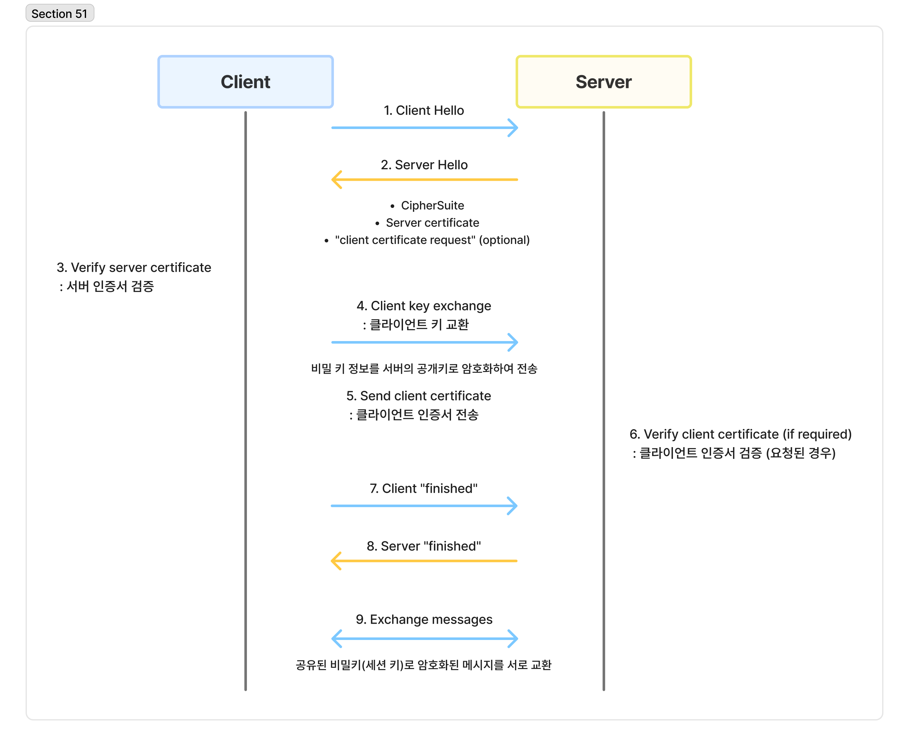

# TLS/SSL HandShake

[TLS/SSL HandShake | 👨🏻‍💻 Tech Interview](https://gyoogle.dev/blog/computer-science/network/TLS%20HandShake.html)

**<목차>**

---

# TLS/SSL HandShake 개념

<aside>
💡

HTTPS에서 클라이언트와 서버가 통신을 시작하기 전에, SSL 인증서를 통해 서버의 **신뢰성**을 확인하고 **암호화된 보안 연결을 설정**하는 과정

→ 클라이언트와 서버가 안전하게 통신하기 위한 암호화 설정 절차

</aside>

# TLS/SSL HandShake 과정

**1. 클라이언트 → 서버 방향으로 `"Client Hello"` 메시지를 담아 전송**

- 이때 암호화된 정보를 함께 담아서 전송 *ex) 버전, 암호 알고리즘, 압축 방식 등*

**2. 서버 → 클라이언트 방향으로 `“Server Hello”` 메시지를 담아 응답**

- 이때 *세션 ID*와 *CA 공개 인증서*를 함께 담아서 전송

**3. 클라이언트 측은 서버에서 보낸 CA 인증서의 유효성 검증**

- CA 인증서의 신뢰성 확보

**4. 클라이언트는 난수 바이트를 생성하여 서버의 공개키로 암호화**

- 해당 *난수 바이트*가 사용되는 경우
  - 대칭키의 결정
  - 메시지 통신 시 암호화

**5. 서버가 클라이언트 인증서를 함께 요구한 경우?**

→ 클라이언트의 인증서와 클라이언트의 개인키로 암호화된 임의의 바이트 문자열을 함께 전달

**6. 클라이언트 인증서 확인 후, 난수 바이트를 자신의 개인키로 복호화 후 대칭 마스터 키 생성에 활용**

**7. 클라이언트 → 서버 방향으로 handshake 과정이 완료되었다는 `”finished"` 메시지 전송**

- 지금까지 보낸 교환 내역들을 해싱 후 그 값을 대칭키로 암호화하여 함께 담아서 전송

**8. 서버도 동일하게 교환 내용들을 해싱한 후, 클라이언트에서 보내준 값과 일치하는지 확인**

- 일치한다면? 서버도 마찬가지로 **`”finished"`** 메시지를 이번에 만든 대칭키로 암호화하여 전송

**9. 클라이언트는 해당 메시지를 대칭키로 복호화하여, 서로 통신이 가능한 신뢰받은 사용자란 걸 확인**

→ 클라이언트와 서버는 해당 대칭키로 데이터를 주고받을 수 있게 됨

---

_참고 자료_

[[Protocol] TLS Handshake](https://dunchi.tistory.com/67)
