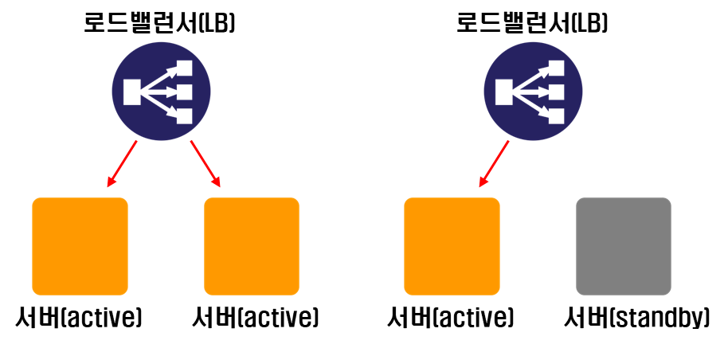

# 로드 밸런싱 (Load Balancing)

**<목차>**

---

# 로드 밸런싱

<aside>
💡

분산식 웹 서비스로, 여러 서버에 부하(Load)를 나누어주는 역할 (= 부하 트래픽 감소)

</aside>

트래픽 과부하 대응 방안

- **Scale-up**: 서버 자체의 성능을 높이는 방식
- **Scale-out**: 여러 대의 서버가 함께 일하도록 분산하는 방식 → 효과적

로드 밸런싱의 장점

- 특정 서버에 부하가 몰리지 않도록 조절
- 서버가 늘어나도 자연스럽게 트래픽을 나눠서 전달
- 안정적인 서비스 운영을 가능하게 함

# **로드 밸런서의 서버 선택 방식 (알고리즘)**

## 1. 라운드 로빈(Round Robin)

- 서버로 들어온 요청을 **순서대로 돌아가며 배정**하는 방식
- 클라이언트의 요청을 순서대로 분배하기 때문에 **서버들이 동일한 스펙**을 갖고 있고, 서버와의 **연결(세션)이 오래 지속되지 않는 경우**에 활용하기 적합

## 2. Least Connections

- Request가 들어온 시점에 **가장 적은 연결(세션) 상태를 보이는 서버에 우선적으로** 트래픽을 할당
- **자주 세션이 길어지거나, 서버에 분배된 트래픽들이 일정하지 않은 경우**에 적합

## 3. Source

- 클라이언트의 **IP 주소를 특정 서버로 매핑**하여 요청을 처리하는 방식
- 사용자의 IP를 **해싱(Hashing)** 하여 부하를 분산 → **사용자가 항상 동일한 서버로 연결**되는 것 보장
- **경로가 보장되며**, 접속자 수가 많을수록 **분산 및 효율 ⬆️**

# **로드 밸런서의 장애**

로드 밸런서가 다운되면? 서버에 대한 요청 분배가 중단…

= 전체 서비스에 장애 발생

서비스 중단을 대비하기 위해 자원을 **"이중화”**

> **이중화?**
> 자원을 2개씩 구성하여 하나의 자원에 문제가 생기더라도 다른 하나의 자원으로 중단없이 계속해서 서비스가 이루어지도록 하는 것

## Active 방식 (”**active-active”**)

> 2개의 자원이 동시에 서비스(active) 되는 것

로드밸런서 장비가 앞단에서 트래픽을 받으면 그 트래픽을 2개의 서버에 균일하게 나누어주고,

2개의 서버가 전달받은 요청들을 처리

## Passive 방식 (”**active-standby”**)

> 하나의 서버가 대기(standby) 상태에 있는 것

아키텍쳐 상 로드밸런서와 2개의 서버로 구성되는 것은 "active-active"와 동일하지만,

하나의 서버는 서비스 되지 않고 대기하며 하나의 서버로만 트래픽을 처리

---

_참고 자료_

[로드 밸런싱이란 무엇인가요? - 로드 밸런싱 알고리즘 설명 - AWS](https://aws.amazon.com/ko/what-is/load-balancing/)

[로드 밸런싱이란? | IBM](https://www.ibm.com/kr-ko/think/topics/load-balancing)

[active-standby(active-passive)](https://velog.io/@yglee8048/active-standbyactive-passive)

[https://twojun-space.tistory.com/158](https://twojun-space.tistory.com/158)
