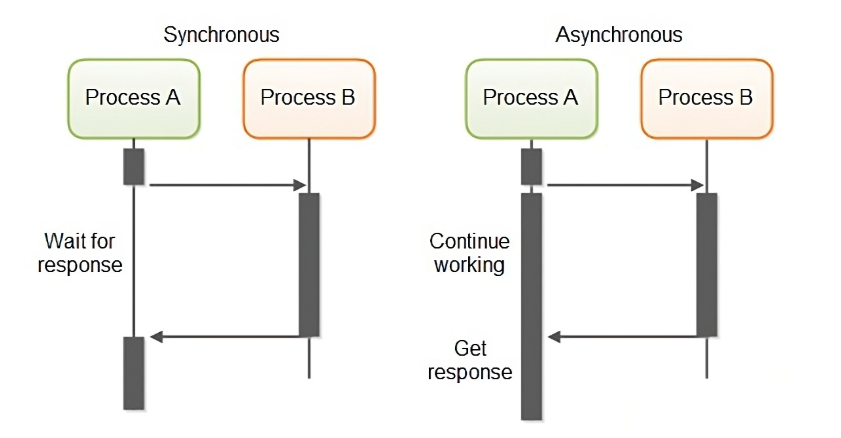

# Blocking/Non-blocking & Synchronous/Asynchronous

[[Network] Blocking/Non-blocking & Synchronous/Asynchronous | 👨🏻‍💻 Tech Interview](https://gyoogle.dev/blog/computer-science/network/Blocking,Non-blocking%20&%20Synchronous,Asynchronous.html)

**<목차>**

---

# 동기(Synchronous) / 비동기(Asynchronous)

## 동기 & 비동기 개념 정리

일을 수행 중인 **동시성**의 차이

**동기(Synchronous)**

> 요청이 들어온 순서에 맞게 하나씩 처리하는 것 (완료 여부를 따짐)

**비동기(Asynchronous)**

> 하나의 요청이 끝나기도 전에, 다른 요청을 동시에 처리할 수 있는 것 (완료 여부 상관 X)

## 동기 & 비동기 처리 순서 비교

→ 동기 작업은 요청한 작업에 대해 순서가 지켜지는데, 비동기 작업은 순서가 지켜지지 않을 수 있음

_ex) A, B, C 라는 3 개의 작업(Task)이 있다고 가정한다면?_

_동기 작업 : A → B → C 순서_

_비동기 작업 : A → B → C 또는 A → C → B 또는 C → A → B 등… (무작위)_

## 비동기의 이점

_ex) 웹 애플리케이션에서 데이터베이스 쿼리를 수행하는 작업 중일 때_

동기적 수행 시, 데이터베이스에서 응답이 올 때까지 기다려야 함…

→ 웹 애플리케이션은 다른 요청을 처리하지 못함

→ 대규모 트래픽이 발생할 경우 웹 애플리케이션의 성능 저하

**비동기적 수행** 시, 데이터베이스에서 응답이 올 때까지 기다리는 동안에도 다른 요청을 '동시 처리’ 가능!

= 안정적인 웹 애플리케이션 개발 가능

➕ **비동기**는 호출시 Callback()을 전달하여 작업의 완료 여부를 호출한 함수에게 전달

(Callback이 오기 전까지 호출한 함수는 신경쓰지 않고 다른 작업 가능)

# Blocking / Non-Blocking

## Blocking / Non-Blocking 개념 정리

호출된 함수가 호출한 함수에게 **제어권**을 건네주는 유무의 차이

**Blocking**

> 자신의 작업을 진행하다가 다른 주체의 작업이 시작되면, 다른 작업이 끝날 때까지 기다렸다가 자신의 작업을 시작하는 것

**Non-Blocking**

> 다른 주체의 작업에 관련 없이 자신의 작업을 하는 것

## 제어권 유무

제어권 : 함수의 코드나 프로세스의 실행 흐름을 제어할 수 있는 권리

Blocking과 Non-Blocking은,

호출된 함수(callee)가 호출한 함수(caller)에게 **제어권을 바로 주느냐 안주느냐**로 구분!

(제어권이 넘어감 → 블로킹 상태)

# 처리 방식 분류

## **1. Sync & Blocking (동기 + 블로킹)**

- 다른 작업이 진행되는 동안 자신의 작업을 멈추고 대기 (Blocking)
- 다른 작업의 완료 여부를 바로 받아 순차적으로 처리 (Sync)

호출한 함수는 함수를 호출한 후, 리턴을 받기 전까지 다른 일을 하지 않고 대기

(다른 작업의 결과가 자신의 작업에 영향을 줄 때 사용)

## 2. Async & Blocking (비동기 + 블로킹)

- 다른 작업이 진행되는 동안 자신의 작업을 멈추고 대기 (Blocking)
- 다른 작업의 결과를 바로 처리하지 않아 순서대로 작업을 수행하지 않음 (Async)

**실무에서 거의 사용 X**

## 3. Sync & Non-Blocking (동기 + 논블로킹)

- 다른 작업이 진행되는 동안에도 자신의 작업을 처리 (Non Blocking)
- 다른 작업의 완료 여부를 바로 받아 순차적으로 처리 (Sync)

## 4. Async & Non-Blocking (비동기 + 논블로킹)

- 다른 작업이 진행되는 동안에도 자신의 작업을 처리 (Non Blocking)
- 다른 작업의 결과를 바로 처리하지 않아 순서대로 작업을 수행하지 않음 (Async)

다른 작업의 결과가 자신의 작업에 영향을 주지 않을 때 사용

---

_참고 자료_

[👩‍💻 완벽히 이해하는 동기/비동기 & 블로킹/논블로킹](https://inpa.tistory.com/entry/%F0%9F%91%A9%E2%80%8D%F0%9F%92%BB-%EB%8F%99%EA%B8%B0%EB%B9%84%EB%8F%99%EA%B8%B0-%EB%B8%94%EB%A1%9C%ED%82%B9%EB%85%BC%EB%B8%94%EB%A1%9C%ED%82%B9-%EA%B0%9C%EB%85%90-%EC%A0%95%EB%A6%AC)

[https://steady-coding.tistory.com/531](https://steady-coding.tistory.com/531)
