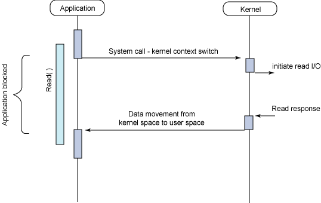

# Blocking I/O & Non-Blocking I/O

[Blocking I/O & Non-Blocking I/O | 👨🏻‍💻 Tech Interview](https://gyoogle.dev/blog/computer-science/network/Blocking%20&%20Non-Blocking.html)

**<목차>**

---

# **Blocking I/O**

<aside>
💡

IO 프로세스가 시작한 작업이 진행되는 동안, 다른 작업은 중단한 상태로 진행 중인 IO 작업이 끝날 때까지 대기하는 방식

</aside>

Blocking I/O 형태의 작업 순서

1. Process(Thread)가 Kernel에게 I/O를 요청하는 함수 호출
2. Kernel이 I/O 작업을 완료하면 결과를 반환 → 그때서야 Process가 다시 실행

I/O Blocking 형태의 작업 특징

- I/O 작업 동안 **User Process가 자신의 작업을 중단한 채 대기**
- I/O 작업은 CPU를 거의 사용하지 않는데도 Thread가 계속 묶여 있어 비효율적

여러 Client를 동시에 처리하는 서버를 Blocking 방식으로 구현한다면?

→ 하나의 작업 때문에 **다른 클라이언트 작업이 중단**될 수 있음

→ 클라이언트마다 별도의 Thread를 생성해야 함 = **Thread 증가 = Context Switching 비용 증가**

매우 비효율적…

# **Non-Blocking I/O**

<aside>
💡

한 프로세스가 IO 작업을 호출했을 때 IO 작업이 완료될 때까지 작업을 중단하지 않고 IO 호출에 대해 즉시 리턴한 뒤, 해당 프로세스가 이어서 다른 IO 작업을 수행할 수 있도록 하는 방식

</aside>

I/O 완료 여부와 상관없이 프로세스가 Block되지 않음

Non - Blocking I/O 형태의 작업 순서

1. User Process가 `recvfrom` 함수 호출

   (커널에게 해당 Socket으로부터 data를 받고 싶다고 요청함)

2. Kernel은 요청 즉시 확인 → 버퍼에 데이터가 없으면 곧바로 `EWOULDBLOCK`을 반환

   (= 기다리면서 Block되지 않음)

3. locking 방식과 달리, User Process는 다른 작업을 진행 가능
4. recvBuffer에 user가 받을 수 있는 데이터가 도착 → Buffer로부터 데이터를 복사하여 받음
5. `recvfrom` 함수는 Memory 복사 후, 사용 가능한 데이터와 길이를 반환

Non - Blocking I/O 형태의 작업 특징

- User Process는 I/O 대기 없이 계속 실행 가능
- 데이터를 받을 준비가 되어 있을 때만 복사 작업 on
- ernel Buffer → User Buffer 복사는 Memory copy (= 매우 빠름)
- Blocking보다 훨씬 효율적인 CPU 사용

---

_참고 자료_

[[OS] Blocking IO vs Non-Blokcing IO](https://jtm0609.tistory.com/161)
