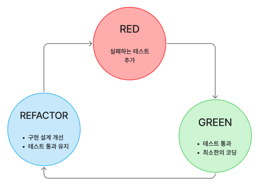

# TDD (Test Driven Development)

[TDD(Test Driven Development) | 👨🏻‍💻 Tech Interview](https://gyoogle.dev/blog/computer-science/software-engineering/TDD.html)

**<목차>**

---

# **TDD (Test Driven Development)란?**

## TDD의 개념 정리

<aside>
💡

**TDD : 테스트 주도 개발**

반복 테스트를 이용한 소프트웨어 방법론으로,
작은 단위의 테스트 케이스를 작성하고 이를 통과하는 코드를 추가하는 단계를 반복하여 구현

</aside>

**짧은 개발 주기의 반복**에 의존하는 개발 프로세스

보통의 개발은 설계(디자인)를 한 이후 코드 개발과 테스트 과정을 거치지만,

TDD는 이러한 방식과는 다르게 테스트케이스를 먼저 작성한 후 실제 코드를 개발하는 리팩토링 절차를 가짐

## TDD 개발 주기

- **Red 단계**에서는 실패하는 테스트 코드를 먼저 작성
- **Green 단계**에서는 테스트 코드를 성공시키기 위한 실제 코드를 작성
- **Blue 단계**에서는 중복 코드 제거, 일반화 등의 리팩토링을 수행

**<중요>**

실패하는 테스트 코드를 작성할 때까지 실제 코드를 작성하지 않는 것

- 실패하는 테스트를 통과할 정도의 최소 실제 코드를 작성해야 하는 것

불필요한 설계를 피하며, 정확한 요구 사항에 집중 가능!

## **일반 개발 방식 vs TDD 개발 방식**

### **일반적인 개발**

**`'요구사항 분석 -> 설계 -> 개발 -> 테스트 -> 배포'`** 형태의 개발 주기

그러나, 위 방식은 소프트웨어 **개발을 느리게 하는 잠재적 위험**이 존재…

Why?

- 소비자의 요구사항이 처음부터 명확하지 않을 수 있음 → 처음부터 완벽한 설계는 어려움
- 자체 버그 검출 능력 저하 또는 소스코드의 품질이 저하 가능성 ⬆️
- 자체 테스트 비용이 증가할 가능성 ⬆️

### **TDD 개발**

TDD는 **테스트 코드를 작성한 뒤에 실제 코드를 작성**

(= 일반 개발 방식과의 차이점)

필요 요소

- 디자인(설계) 단계에서 프로그래밍 **목적**을 반드시 미리 정의해야 함
- **무엇**을 테스트해야 할지 미리 정의(테스트 케이스 작성)해야 함

개발 방법

- 테스트 코드를 작성 중에 발생하는 예외 사항(버그, 수정사항)들은 테스트 케이스에 추가 후 설계 개선
- 이후 테스트가 통과된 코드만을 코드 개발 단계에서 실제 코드로 작성

## TDD의 장/단점

### TDD의 장점

**1. 디버깅 시간 단축**

- TDD는 자동화 된 유닛테스팅을 전재하므로 특정 버그를 손 쉽게 찾아낼 수 있음
  (= 유닛 테스팅의 이점)

**2. 신속한 코드 피드백 받기 가능**

인수 테스트?

: 클라이언트가 의뢰한 소프트웨어가 사용자 관점에서 사용할 수 있는 수준인지 체크하는 과정

- 일반적인 개발 방식으로 만들어진 코드는 거의 다 완성된 상태이기 때문에, 문제를 찾아도 어디가 원인인지 정확한 판단이 어려움
- TDD는 기능 단위로 테스트를 진행 → 코드가 모두 완성되어 빠른 피드백을 받는 것이 가능

**3. 코드의 불안정성을 개선하여 생산성을 높일 수 있음**

- 사용자에게 코드가 가기 전에 진단을 먼저 하여 문제점을 미리 발견 가능
- 코드가 지닌 불안정성과 불확실성을 지속적으로 해소

**4. 재설계 시간 단축**

- 테스트 시나리오를 작성하면서 다양한 예외사항에 대해 대비 가능
- 개발 진행 중 소프트웨어의 전반적인 설계가 변경되는 일을 방지

**5. 추가 구현의 용이함**

- 자동화된 유닛 테스팅을 전제하므로 테스트 기간을 획기적으로 단축 가능

### TDD의 단점

**1. 생산성 저하**

- 기존 개발 프로세스에 테스트케이스 설계가 추가 → 생산 비용 증가
- 테스트의 방향성, 프로젝트 성격에 따른 테스트 프레임워크 선택 등 추가로 고려할 부분 증가
- 처음부터 테스트용, 실전용 2개의 코드를 짜고 중간중간 계속 테스트 필수
- 일반적인 개발 방식에 비해 10% ~ 30% 정도 개발 시간이 연장

**2. 테스트 구조에 얽매일 수 있음**

- TDD의 테스트 절차를 고수하느라 실제 코드의 개발이 늦어질 수 있음

---

_참고 자료_

[🧪 TDD 방법론 (테스트 주도 개발) - 알기 쉽게 정리](https://inpa.tistory.com/entry/QA-%F0%9F%93%9A-TDD-%EB%B0%A9%EB%B2%95%EB%A1%A0-%ED%85%8C%EC%8A%A4%ED%8A%B8-%EC%A3%BC%EB%8F%84-%EA%B0%9C%EB%B0%9C)
