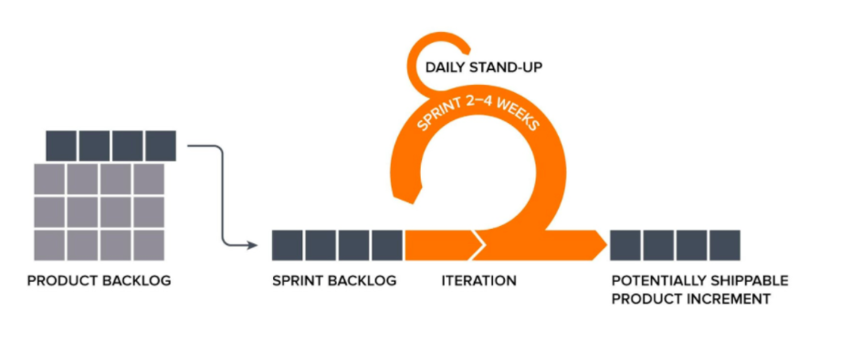

# 애자일 (Agile)

[애자일(Agile) | 👨🏻‍💻 Tech Interview](https://gyoogle.dev/blog/computer-science/software-engineering/Agile.html)

**<목차>**

---

# **애자일(Agile)이란?**

<aside>
💡

**'협력'**과 **'피드백'**을 더 자주하고, 일찍하고, 잘하는 것

= 개발을 진행하면서 **피드백**을 통해 주도적으로 개발하는 것

</aside>



애자일의 핵심 = **‘협력’**과 **‘피드백’**

## 애자일의 핵심 요소

### 핵심 요소1 - 협력

> 소프트웨어를 개발한 사람들 안에서의 협력 (직무 역할을 넘어선 협력)

```
ex) 좋은 일은 x2가 된다.

어떤 사람이 2배의 속도로 개발할 수 있는 방법을 발견...

**협력이 약하면?**
 → 혼자만 좋은 보상과 칭찬을 받음
	 하지만 그 사람 코드와 다른 사람의 코드의 이질감이 생겨서 시스템 문제 발생 가능성 상승

**협력이 강하면?**
 → 다른 사람과 공유해서 모두 같이 빠르게 개발하고 더 나은 발전점을 찾기에 용이함
	 팀 전체 개선이 일어나는 긍정적 효과 발생
```

```
ex) 안 좋은 일은 /2가 된다.

문제가 발생하는 부분을 찾기 쉬워짐
예상치 못한 문제를 협력으로 막을 수 있음

실수를 했는데 어딘지 찾기 힘들거나 개선점이 생각나지 않을 때,
서로 다른 사람들과 협력하면 새로운 방안이 탄생할 수도 있음
```

### 핵심 요소2 - 피드백

> 내가 어떻게 했는지 확인하면서 학습을 진행하는 것 (학습의 가장 큰 전제조건)
>
> → 소프트웨어의 불확실성이 높을수록 학습의 중요도 상승

**피드백 진행 방법**

```
**내부적**으로는 내가 만든 것이 어떻게 됐는지 확인...
**외부적**으로는 내가 만든 것을 고객이나 다른 부서가 사용해보고 나온 산출물을 통해,
또 다른 것을 배워나가는 것!
```

ex)

- 내부적 피드백
  : 내가 만든 것이 어떻게 됐는지 확인해보는 것
- 외부적 피드백
  : 내가 만든 것을 고객이나 다른 부서가 사용해보고 나온 산출물을 통해 또 다른 것을 배워나가는 것

## 애자일이 될 조건

애자일이 되기 위해 필요한 4가지 조건

1. Individuals and interactions over Process and tools (프로세스나 도구보다 개인과 상호 작용)

2. Working software over Comprehensive documentation (포괄적인 문서보다 작동 소프트웨어)

3. Customer collaboration over Contract negotiation (계약 협상보다 고객과의 협력)

4. Responding to change over Following a plan (계획 고수보다 변화에 대응)

4 가지 모두 뛰어넘어야 하는 대상을 명시하고 있음…

여기서 비교 대상은 기존의 개발 방법론에서 거쳤던 과정

애자일 방법론은, **기존의 다른 프로젝트 개발 방법론의 문제점을 극복하기 위해 탄생**한 것!

## **애자일의 불확실성**

애자일을 사용할 땐, **소프트웨어 개발의 불확실성**이 중요하게 작용

🚫 불확실성이 높다 = 우리가 생각한 것과 다르다

```
**[전통적 방법론]**
: '그때 계획 세울 때 좀 더 잘 세워둘껄..
이런 리스크도 생각했어야 했는데ㅠ 일단 계속 진행하자'

**[애자일 방법론]**
: '이건 생각 못했네. 어쩔 수 없지. 다시 빨리 수정해보자'
```

ex)

전통적 방법 중 하나인 '폭포수 모델'?

: 요구분석단계에서 한번에 모든 요구사항을 정확하게 전달하는 것이 원칙…

= 요즘같이 변화가 많은 프로젝트에서는 현실적으로 불가능

위와 같은 문제점을 **애자일**은?

**개발 과정에 있어서 시스템 변경사항을 유연하게 or 기민하게 대응할 수 있도록 방법론을 제공**

## **애자일의 진행 방법**

1. 개발자와 고객 사이의 지속적 커뮤니케이션을 통해 변화하는 요구사항 수용
2. 고객이 결정한 사항을 가장 우선적 시행 + 개발자 개인의 가치보다 팀의 목표를 우선으로 결정
3. 팀원들과 주기적인 미팅을 통해 프로젝트를 점검
4. 주기적인 제품 시현 + 고객으로부터 피드백 수용
5. 프로그램 품질 향상에 신경쓰며, 간단한 내부 구조 형성을 통한 비용절감을 목표로 고정

## 애자일의 종류 - 스크럼 (Scrum)

> 자기 조직화와 "스프린트"라고 불리는 반복적인 개발 주기를 강조하는 애자일 방법론의 구체적인 구현 방법
>
> → 소프트웨어 측면에서 `팀이라는 단어가 주는 의미를 적용시키고, **효율적인 성과**를 얻기 위한 것`


### 스크럼 진행 과정

**1. 제품 기능 목록 작성**

개발할 제품에 대한 요구사항 목록 작성 (= 우선순위가 매겨진, 사용자의 요구사항 목록)

개발 중에 수정이 가능하기는 하지만, **일반적으로 한 주기가 끝날 때까지는 제품 기능 목록을 수정하지 않는 것이 원칙**

**2. 스프린트 Backlog**

스프린트 각각의 목표에 도달하기 위해 필요한 작업 목록

- 세부적으로 어떤 것을 구현해야 하는지
- 작업자
- 예상 작업 시간

최종적으로 개발이 어떻게 진행되고 있는지 상황 파악 가능

**3. 스프린트**

`작은 단위의 개발 업무를 단기간 내에 개발`

한달동안의 큰 계획을 **3~5일 단위로 반복 주기**를 정했다면? → 이것이 스크럼에서 스프린트에 해당

- 주기가 회의를 통해 결정되면 (보통 2주 ~ 4주) 목표와 내용이 개발 도중에 바뀌지 않아야 하고, 팀원들 동의 없이 바꿀 수 없음

**4. 일일 스크럼 회의**

규칙

- 모든 팀원이 참석하여 매일, 짧게(15분), 진행 상황 점검
- 한사람씩 어제 한 일, 오늘 할 일, 문제점 및 어려운 점을 공유
- 완료된 세부 작업 항목을 스프린트 현황판에서 업데이트

**5. 제품완성 및 스프린트 검토 회의**

모든 스프린트 주기가 끝나면, 제품 기능 목록에서 작성한 제품이 완성

최종 제품이 나오면 고객들 앞에서 시연을 통한 스프린트 검토 회의 진행

- 고객의 요구사항에 얼마나 부합했는가?
- 개선점 및 피드백

**6. 스프린트 회고**

스프린트에서 수행한 활동과 개발한 것을 되돌아보며 개선점이나 규칙 및 표준을 잘 준수했는지 검토…

→ `팀의 단점보다는 강점과 장점을 찾아 더 극대화하는데 초점을 둔다`

### 스크럼의 장점

- 스프린트마다 생산되는 실행 가능한 제품을 통해 사용자와 의견을 나눌 수 있음
- 회의를 통해 팀원들간 신속한 협조와 조율이 가능
- 자신의 일정을 직접 발표함으로써 업무 집중 환경 조성
- 프로젝트 진행 현황을 통해 신속하게 목표와 결과 추정이 가능하며 변화 시도가 용이

### 스크럼의 단점

- 추가 작업 시간이 필요 (스프린트마다 테스트 제품을 만들어야 함)
- 15분이라는 회의 시간을 지키기 어려움 ( 시간이 초과되면 그만큼 작업 시간이 감소)
- 스크럼은 프로젝트 관리에 무게중심을 둠 → 프로세스 품질 평가에는 미약

---

_참고 자료_

[애자일 (Agile)](https://velog.io/@octo__/%EC%95%A0%EC%9E%90%EC%9D%BC-Agile)
