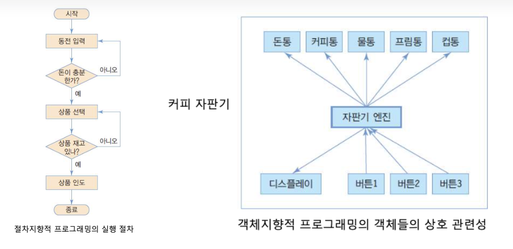

# 객체 지향 프로그래밍

[객체지향 프로그래밍 | 👨🏻‍💻 Tech Interview](https://gyoogle.dev/blog/computer-science/software-engineering/Object-Oriented%20Programming.html)

**<목차>**

---

# 객체 지향 이전 패러다임…

## **순차적 프로그래밍 (Sequential Programming) - 비구조**

> 정의한 기능의 흐름에 따라 **순서대로 동작을 추가하며 프로그램을 완성**하는 방식

흐름이 눈으로 보이기 때문에 매우 **직관적**이지만, 프로그램 규모가 조금이라도 커지면 복잡해짐

_ex) A → B → C 라는 동작을 구현 중, C에서 A로 돌아가야 할 상황이라면? ⇒ `goto`를 활용해야 함_

_직관성을 잃어버리고 복잡해짐…_

## **절차적 프로그래밍 (Procedural Programming) 적**

> **반복되는 동작을 함수 및 프로시저 형태로 모듈화하여 사용**하는 방식 (절차 = 함수)
>
> → 반복될 가능성이 있는 모듈을 **재사용 가능한 프로시저** 단위(함수 단위)로 나눈 프로그래밍

_프로시저란? 반환값(리턴)이 따로 존재하지 않는 함수_

_ex) printf()…반환보단 출력 용도_

반복 동작을 모듈화하여 코드를 많이 줄일 수 있지만, 프로시저가 매우 **추상적**이라는 단점이 있음

```sql
ex) 도서 관리 프로그램 개발
 - '책'이라는 자료형을 구현해야 함
 - 책에 대한 함수를 구현해야 함

 구조적 프로그래밍에서는 각각 따로 개발해야 함
 -> 논리적으로 묶여있을 수 없는 구조이기 때문에 동작이 추상적
```

# 객체 지향 프로그래밍

## 객체 지향 프로그래밍이란?

<aside>
💡

- 많은 **객체(Objcet)**들이 모여 상호 협력하면서 데이터를 처리하는 방식의 프로그래밍 설계 방법
- 프로그램을 **묶음 단위**로 잘게 쪼개서, 추후에 가져다 쓰기 편하게 만들어 놓은 프로그래밍 방식
  → 객체 내부에 자료형(필드)와 함수(메소드)가 같이 존재

</aside>

_ex) JAVA, Ruby, Python, C++, C#, Kotlin 등…_

**절차 지향 vs 객체 지향 구조 차이**



## 객체 지향 프로그래밍의 특징

### 1. 추상화 (Abstraction)

> 객체들이 **공통적으로 필요로 하는 속성이나 동작을 하나로 추출**하는 작업

- 실제로 존재하는 객체들을 프로그램으로 만들기 위해 **공통적인 특성**을 파악한 후, 필요 없는 특성을 제거해 **하나의 묶음**으로 만들어내는 과정
- 객체 지향 관점에서는 **클래스를 정의**하는 것
  (= 세부적인 사물들의 공통적인 특징을 파악한 후 하나의 집합으로 만들어내는 것)

### 2. 캡슐화 (Encapsulation)

> 클래스 내의 **연관된 속성(property)이나 함수(method)를 하나의 캡슐로 묶어** 외부로부터 클래스로의 접근을 최소화하는 작업

- 한 곳에서 변화가 일어나도 다른 곳에 미치는 영향을 최소화
- 외부에서 객체를 손상시키는 일을 방지할 수 있도록, 객체 내부의 세부적인 동작에 대한 구현을 숨김
  (= private로 접근 제한)
- **높은 응집도**와 **낮은 결합도**를 유지 (한 곳에서 변화가 일어나도 다른곳에 미치는 영향을 최소화)
  - _결합도란? 특정 기능을 실행할 때 다른 클래스나 모듈에 의존적인 척도_
  - _응집도란? 한 모듈 내의 구성 요소 간의 밀접한 정도_
    (한 모듈이 하나의 기능 = 응집도 ⬆️, 한 모듈이 여러 기능 = 응집도 ⬇️)

### 3. 상속 (Inheritance)

> 기존 클래스(부모 클래스 또는 슈퍼 클래스)의 속성과 메서드를 새로운 클래스(자식 클래스 또는 서브 클래스)가 **물려받아 사용**하는 작업

- 기존 코드를 **재활용**해서 사용함으로써 코드의 **생산성**을 높임
- _ex) 이미 작성된 클래스를 받아서 조금만 수정해 새로운 클래스를 생성하는 것_

### 4. 다형성 (Polymorphism)

> 여러 클래스가 **동일한 메서드를 다른 방식으로 구현**할 수 있는 능력

- 동일한 명령을 **각자 연결된 객체에 의존**해서 해석하는 것
- 오버라이딩(Overriding)과 오버로딩(Overloading)
  - _오버라이딩(Overriding) : 부모 클래스의 메소드와 **같은 이름**을 사용하며 매개변수도 같되, 내부 소스를 재정의하는 것_
  - _오버로딩(Overloading) : 같은 이름의 함수를 여러 개 정의한 후 **매개변수를 다르게** 하여 같은 이름을 경우에 따라 호출하여 사용하는 것_

## 객체 지향 설계 과정

1. 제공해야 할 기능을 찾고 세분화 → 그 기능을 알맞은 객체에 할당
2. 기능을 구현하는데 필요한 데이터를 **객체에 추가**
3. 그 데이터를 이용하는 **기능 추가**
4. 기능은 최대한 **캡슐화**하여 구현
5. 객체 간에 어떻게 메서드 요청을 주고받을지 결정

## 객체 지향 설계 원칙 - SOLID

**SOLID란?**

: 객체지향 설계에서 지켜줘야 할 5개의 소프트웨어 개발 원칙(SRP, OCP, LSP, ISP, DIP)을 뜻함

### 1. SRP (Single Responsibility) - 단일 책임 원칙

> 단일 책임 원칙은 클래스(객체)는 단 하나의 책임만 가져야 한다는 원칙 (책임 = 기능 담당)


- **하나의 클래스가 하나의 기능을 담당**하여 하나의 책임을 수행하는데 집중되도록 클래스를 따로따로 여러개 설계해야 함
- 하나의 클래스에 여러 기능이 있다면? 기능 변경(수정)이 일어났을 때 수정해야할 코드 증가
  (= 클래스를 변경해야 하는 이유는 한 개여야 함)
- 프로그램의 유지보수성을 높이기 위한 원칙

### 2. OCP (Open-Closed) - 개방-폐쇄 원칙

> 클래스는 '확장에 열려있어야 하며, 수정에는 닫혀있어야 한다’는 원칙


- 기능 추가 요청이 오면 **클래스를 확장**을 통해 손쉽게 구현하고, **확장에 따른 클래스 수정은 최소화**하도록 프로그램을 작성
  - **`[ 확장에 열려있다 ]`** - 새로운 변경 사항이 발생했을 때, 유연하게 코드를 추가하여 큰 힘을 들이지 않고 애플리케이션의 기능 확장 가능
  - **`[ 변경에 닫혀있다 ]`** - 새로운 변경 사항이 발생했을 때, 객체의 직접적인 수정을 제한
- **추상화 사용**을 통한 관계 구축을 권장 (= **다형성과 확장**을 가능케 하는 객체 지향의 장점 극대화)

### 3. LSP (Liskov Substitution) - 리스코프 치환 원칙

> 서브 타입은 언제나 기반(부모) 타입으로 교체할 수 있어야 한다는 원칙


- 상위 타입의 객체를 하위 타입의 객체로 치환한 경우에도, 상위 타입을 사용하는 프로그램은 정상적으로 동작해야 함
  = 프로그램 객체는 프로그램의 정확성을 깨뜨리지 않으면서 하위 타입의 인스턴스로 바꿀 수 있어야 함
- 상속 관계가 아닌 클래스들을 상속 관계로 설정하면, 이 원칙이 위배됨

### 4. ISP (Interface Segregation) - 인터페이스 분리 원칙

> 인터페이스를 각각 사용에 맞게 끔 잘게 분리해야한다는 설계 원칙


- 인터페이스는 그 인터페이스를 사용하는 **클라이언트를 기준으로 분리**해야 함
  = 특정 클라이언트를 위한 인터페이스 여러 개가 범용 인터페이스 하나보다 좋음
- 각 클라이언트가 필요로 하는 인터페이스들을 분리
  = 각 클라이언트가 사용하지 않는 인터페이스에 변경이 발생하더라도 영향을 받지 않도록 제작

### 5. DIP (Dependency Inversion) - 의존 역전 원칙

> 어떤 Class를 참조해서 사용해야하는 상황이 생긴다면, 그 Class를 직접 참조하는 것이 아니라 그 대상의 상위 요소(추상 클래스 or 인터페이스)로 참조하라는 원칙


- 구현 클래스에 의존하지 말고, 인터페이스에 의존하기
- 고수준 모듈은 저수준 모듈의 구현에 의존하면 안됨
- 저수준 모듈이 고수준 모듈에서 정의한 추상 타입에 의존해야 함
- 저수준 모듈이 변경돼도 고수준 모듈은 변경할 필요가 없음

## 객체 지향 설계의 장/단점

### 객체 지향 장점

**1. 코드의 재사용성 ⬆️**

모듈화된 객체와 상속 등을 통해 코드의 재사용 가능

**2. 생산성 ⬆️**

독립적인 객체 사용 → 개발의 생산성 향상

(이미 생성된 클래스를 상속, 객체 재사용, 부분 수정 등 적은 노력으로 높은 효율성…)

**3. 자연적인 모델링 가능**

현실세계에서 사용하는 개념을 대입하여, 생각한 것을 그대로 구현 가능

**4. 유지보수 용이**

로그램 수정, 추가시에도 캡슐화 덕분에 주변 코드에 영향 적음 → 유지보수 편리

### 객체 지향 단점

**1. 실행속도 느림**

객체지향 언어(C++, Java, ruby)는 컴퓨터의 처리 구조와 비슷한 절차지향 언어(C언어)보다 상대적으로 실행속도가 느린 편

**2. 프로그램 용량이 커질 수 있음**

객체단위로 프로그램을 많이 제작하면, 불필요한 정보들이 들어갈 가능성 ⬆️ = 용량 증가

**3. 설계에 많은 시간 소요**

초기에 클래스별, 객체별, 상속 등의 구조 등을 모두 설계 → 소요 시간 증가

---

_참고 자료_

[객체 지향 프로그래밍(OOP)의 개념과 4가지 특징 — 짜이한](https://jja2han.tistory.com/330)

[[CS 지식] 객체 지향 프로그래밍(OOP) 개념 및 예제](https://mengu.tistory.com/92)

[객체지향 프로그래밍 (OOP) 이란?](https://velog.io/@khy226/%EA%B0%9D%EC%B2%B4%EC%A7%80%ED%96%A5-%ED%94%84%EB%A1%9C%EA%B7%B8%EB%9E%98%EB%B0%8D-OOP-%EC%9D%B4%EB%9E%80)

[객체지향 프로그래밍 제대로 이해하기](https://velog.io/@haero_kim/%EA%B0%9D%EC%B2%B4%EC%A7%80%ED%96%A5-%ED%94%84%EB%A1%9C%EA%B7%B8%EB%9E%98%EB%B0%8D-%EC%9D%B4%ED%95%B4%ED%95%98%EA%B8%B0)

[💠 객체 지향 설계의 5가지 원칙 - S.O.L.I.D](https://inpa.tistory.com/entry/OOP-%F0%9F%92%A0-%EA%B0%9D%EC%B2%B4-%EC%A7%80%ED%96%A5-%EC%84%A4%EA%B3%84%EC%9D%98-5%EA%B0%80%EC%A7%80-%EC%9B%90%EC%B9%99-SOLID)
