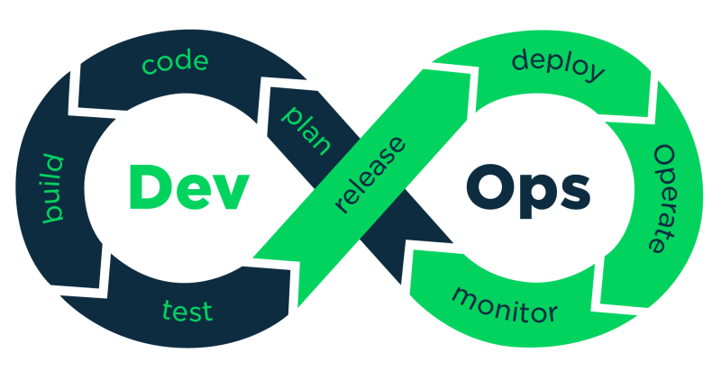

# 데브옵스 (DevOps)

[데브옵스(DevOps) | 👨🏻‍💻 Tech Interview](https://gyoogle.dev/blog/computer-science/software-engineering/DevOps.html)

**<목차>**

---

# **데브옵스 (DevOps)**

## 데브옵스의 개념

<aside>
💡

"개발(Development)"과 "운영(Operations)"을 합친 개념으로, **소프트웨어를 빠르고 안정적으로 개발하고 배포하기 위한 팀 협업 방식**

→ 소프트웨어 개발자와 정보기술 전문가 간의 소통, 협업 및 통합을 강조하는 개발 환경이나 문화

</aside>

**목적** : 소프트웨어 제품과 서비스를 빠른 시간에 개발 및 배포하는 것

## 데브옵스의 특징

> **1. 더 빠른 문제 해결 및 배포**

- DevOps를 통해 신속한 반복, 테스트, 문제 해결을 수행
- 고품질 빌드를 일관되고 더 효율적으로 제공 가능

> **2. 비즈니스 내의 민첩성 창출**

- DevOps 라이프 사이클에서 제공하는 즉각적인 피드백
  → 팀이 더 빠르게 작업할 수 있으며, 외부 문제로부터 팀 보호 가능

> **3. 협업 및 신뢰 육성**

DevOps의 가장 중요한 혁신은 Dev, Ops, QA, 보안, 데이터 분석가, 예술 및 디자인 팀 등 별도의 부서 간에 **`사일로(장벽)`**를 무너뜨리는 기능

→ 다양한 기술 세트와 공유 목표를 가진 다기능 팀을 구성함으로써 달성됨

> **4. 비용 대폭 절감**

- DevOps 프로세스는 네트워크 중단 시간을 최소화하여 비용을 절감
- `CI(지속적인 통합)`,`CD(지속적인 배포)` 및 자동화된 테스트 실행…
  = 개발 팀은 프로세스 초기에 버그를 식별하고 수정하므로 더 나은 성능의 코드를 생성

### **데브옵스의 라이프 사이클**

**1단계 : 지속적인 개발 및 제공**

데브옵스 과정 전반에 걸쳐 피드백을 활용해 문제를 파악하고 지속적으로 개발함

→ 소프트웨어의 품질을 개선

**2단계 : 지속적인 통합**

`CI(지속적 통합)` = 개발자가 하루에 여러 번 공유 레포지토리에 코드를 통합하는 개발 관행

위 방법을 통해 소스 코드 변경으로 빌드가 중단되거나 다른 문제가 생기는 것을 방지함

**3단계 : 지속적인 테스트**

개발자가 코드가 제대로 작동하고 실제 조건에서 계획대로 작동하는지 확인할 수 있는 절차

→ 버그나 문제를 빠르게 발견하고 대처함으로써 더 많은 시간과 리소스가 낭비되는 것을 방지

**4단계 : 지속적인 배포**

자동화 주기를 완료 후 배포 프로세스에서 사람의 개입을 최소화 or 제거하여

지속적인 통합과 함께 작동

**5단계 : 지속적인 모니터링**

개발자는 데이터를 수집하고 각 기능을 모니터링하며 다양한 오류를 발견하고 해결

**6단계 : 지속적인 피드백**

소프트웨어는 최종 사용자가 경험하는 성능과 문제에 대한 정보를 자동으로 전송

**7단계 : 지속적인 운영**

다운타임을 최소화하고 사용자의 불편한 서비스 중단을 방지하는 것에 유용

→ 제품의 안정성과 성능을 위해 애플리케이션과 환경을 최적화

## 데브옵스 엔지니어의 역할

<aside>
💡

**데브옵스 엔지니어**

: 운영과 개발 사이에서 지속적 전달과 지속적 통합을 진행하도록 데브옵스 환경을 조성하는 사람

</aside>

**코드 관리**

- 협업과 버전 관리
- 주요 도구 : `Git`, `GitHub`, `GitLab`

**자동화 및 CI/CD 구축**

- 테스트, 빌드, 배포를 자동화
- 주요 도구 : `Jenkins`, `GitLab CI/CD`, `CircleCI`

**서버 및 인프라 관리**

- 클라우드 인프라 설정 및 효율적 관리
- 주요 도구 : `AWS`, `Azure`, `Google Cloud`, `Terraform`, `Ansible`

**모니터링 및 문제 해결**

- 서버 상태를 실시간 모니터링하고 오류 해결
- 주요 도구 : `Prometheus`, `Grafana`, `AWS CloudWatch`

**보안 강화**

- 데이터 및 애플리케이션의 안전을 보장
- 주요 도구: `SonarQube`, `HashiCorp Vault`

---

_참고 자료_

[DevOps(데브옵스)란?](https://velog.io/@devtree/DevOps%EB%9E%80)

[[PM] DevOps(데브옵스) 란?](https://velog.io/@pgby/PM-DevOpsSRE%EB%9E%80)

[Devops](https://velog.io/@chaeduk/hwlr4yv8)
