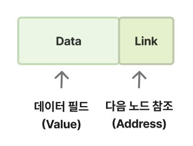

# 연결 리스트 (Linked List)

[Linked List | 👨🏻‍💻 Tech Interview](https://gyoogle.dev/blog/computer-science/data-structure/Linked%20List.html)

**<목차>**

---

# 연결 리스트 (Linked List) 개념

: 각 노드가 데이터와 포인터를 통해 한 줄로 연결되어 있는 방식으로 데이터를 저장하는 선형 데이터 구조

→ 포인터를 사용하여 서로 사슬처럼 연결되어 있음

연결 리스트의 시간 복잡도 = O(N)

**노드의 구조**

노드 = 데이터 필드 + 링크(연결) 필드



**연결 리스트의 구조**


**배열 VS 연결 리스트**


연결 리스트의 장점

- 크기 변경이 용이함
- 메모리 공간의 효율적인 사용 (동적)
- 삽입/삭제 연산이 효율적
  : 특정 위치에 노드를 추가하거나 삭제하는 작업이 O(1) 또는 O(n)의 시간 복잡도로 수행 가능

연결 리스트의 단점

- 임의로 액세스 허용 불가 (순회 필수)
  : 특정 인덱스로 접근하려면 처음부터 순회해야 함 (= 이진 검색 수행 불가능)
- 추가적인 포인터 필요
  : 각 노드마다 다음 노드를 가리키는 포인터가 필요 (배열보다 메모리 사용량 ⬆️)
- 메모리 오버헤드
  : 각 노드에 추가적인 포인터가 필요함 (= 각 노드마다 여분의 메모리 공간 필요)

## 연결 리스트 관련 용어


# 연결 리스트 (Linked List) 구현

**노드의 구현**

```c
struct Node {
    int data;           // 데이터
    struct Node *next;  // 다음 노드 주소
};
```

## 단일 연결 리스트 (SLL - Singly Linked List)


SLL의 형태

: 하나의 링크 필드를 이용하여 연결하는 가장 기본적인 형태의 연결 리스트

→ 노드마다 데이터 공간과 포인터 공간이 있으며, 각 노드의 포인터는 다음 노드를 가리킴 (마지막은 NULL)

**SLL에서의 새로운 노드 추가**

: malloc을 통해 새로운 데이터를 저장할 공간만큼 할당받은 후, 해당 공간에 새로운 노드 추가


```c
void add_to_SLL(int _v) {

    struct Node* new_node = (struct Node*)malloc(sizeof(struct Node));
    new_node->data = _v;
    new_node->next = 0;

    // head 값이 0 -> 자기 자신이 첫 번째 노드... 확인하기
    if (head == 0) {
        head = new_node;
        return;
    }

    struct Node* temp = head;

    // tmp로 하여금 맨 마지막 노드를 가리키게 하는 무한 while문
    while (1) {
        if (temp->next == 0) {
            break;
        }
        temp = temp->next;
    }

    // 맨 마지막에 새로운 노드 추가하기
    temp->next = new_node;
    return;
}
```

**SLL에서의 특정 노드 검색**

: 사용자가 변수를 입력해서 원하는 데이터를 찾을 수 있도록 해주는 코드

```c
struct Node* find_in_SLL(int _v) {

    struct Node* temp = head;

    while (temp != 0) {
        if (temp->data == _v) {
            printf("%d 값이 리스트에 존재 ", _v);
            return temp;  // 찾으면 해당 노드 주소 반환
        }
        temp = temp->next;
    }
    printf("%d 값은 리스트에 없음 ", _v);
    return 0;  // 못 찾으면 NULL 반환
}
```

**SLL에서의 노드 삭제 3가지 경우**

<aside>
💡

**SLL에서는 데이터를 삭제할 때, 삭제할 노드의 다음 노드 주소를 가리킨 후 공간 해제**

</aside>

1. 아무것도 없는 경우

   → 리스트 자체가 비었으니 삭제불가

   ```c
   // [Case 1] 아무것도 없는 경우 → 리스트 비었으니 삭제 불가
   if (head == 0) {
       return;
   }
   ```

1. 삭제하려는 노드가 head(맨 앞)에 위치한 경우

   → head의 위치를 옮긴 후 삭제 (새로운 head는 기존 head의 다음 노드)

   

   ```c
   // [Case 2] 삭제하려는 노드가 head(맨 앞)에 위치한 경우
   if (temp == head) {
       head = head->next;
       free(temp);
       return;
   }
   ```

1. 삭제하려는 노드가 head가 아닌 다른 노드인 경우

   → 삭제할 노드의 이전 노드와 다음 노드를 서로 연결해준 후에 삭제

   

   ```c
   // [Case 3] 삭제하려는 노드가 head가 아닌 다른 노드인 경우
   struct Node* tt = head;

   while (tt->next != temp) {
       tt = tt->next;
   }
   tt->next = temp->next;
   free(temp);
   return;
   ```

**SLL에서의 노드 중간 삽입**

: 리스트의 끝이 아니라 노드 사이에 새로운 노드를 추가해주는 코드


```c
void insert_into_SLL(int _nth, int _v) {

    if (_nth < 0) {
        return;
    }

    if (head == 0) {
        return;
    }

    struct Node* temp = head;

    // '_nth - 1'인 이유 : 한번 덜 가기
    // for문 : 삽입하려는 위치 찾기 (찾는 위치는 "_nth - 1")
    for (int i = 0; i < _nth - 1; i++) {

        temp = temp->next;

        // _nth가 없는 경우
        if (temp == 0) {
            return;
        }
    }

    // new_node 만들기
    struct Node* new_node = (struct Node*)malloc(sizeof(struct Node));
    new_node->data = _v;
    new_node->next = 0;

    // 진짜로 맨 앞에 넣는 경우
    if (_nth == 0) {
        new_node->next = head->next;
        head = new_node;
    }
    // 중간 또는 끝에 삽입하는 경우
    else {
        new_node->next = temp->next;-
        temp->next = new_node;
    }
}
```

### SLL 전체 코드 (C 버전)

```c
#include <stdio.h>
#include <stdlib.h> // standard library, malloc/free

// ======================================================================
struct Node {
    int data;  // 노드가 저장하는 데이터를 나타내는 변수
    struct Node* next;  // 다음 노드를 가리키는 포인터
};
// ======================================================================

/*
내 안에 나처럼 생긴 것의 주소가 있는 것이라 허용...
아래 코드(* 표시X)는 나처럼 생긴 것을 또 넣는 것이기 때문에 에러

struct Node {
    int data;
    struct Node next;
};
*/

// ======================================================================
// 주소 0의 의미? 아무것도 가리키고 있지 않음
// 리스트의 첫 번째 노드인 head 생성
struct Node* head = 0;
// ======================================================================

// ======================================================================
// add_to_SLL() : SLL에 요소를 추가해주는 함수
void add_to_SLL(int _v) {

    /*
    * malloc = 메모리에 공간을 할당받는 함수
    * new_node라는 새로운 변수를 만들었음
    *  -> 이 변수는 포인터... malloc으로 할당받은 공간의 '주소'가 저장되는 변수가 됨
    */
    struct Node* new_node = (struct Node*)malloc(sizeof(struct Node));
    new_node->data = _v;
    new_node->next = 0;

    // head 값이 0 -> 자기 자신이 첫 번째 노드... 확인하기
    if (head == 0) {
        head = new_node;
        return;
    }

    // tmp에 head 복사
    struct Node* temp = head;

    // tmp로 하여금 맨 마지막 노드를 가리키게 하는 무한 while문
    while (1) {
        if (temp->next == 0) {
            break;
        }
        temp = temp->next;
    }

    // 또는 아래 방법으로도 무한 while문 작성 가능...
    /*
    while (tmp->next != 0) {
        tmp = tmp->next;
    }
    */

    // 맨 마지막에 추가하기
    temp->next = new_node;
    return;
}
// ======================================================================

// ======================================================================
// print_SLL() : SLL을 전부 출력해주는 함수
void print_SLL(void) {

    struct Node* temp = head;

    while (1) {
        // 탈출 조건
        if (temp == 0) {
            break;
        }

        // 정상 작동
        printf("%d ", temp->data);
        temp = temp->next;
    }

    // 또는 아래 방법으로도 무한 while문 작성 가능...
    /*
    while (tmp != 0) {
        printf("%d ", tmp->data);
        tmp = tmp->next;
    }
    */

    return;
}
// ======================================================================

// ======================================================================
// insert_into_SLL() : 리스트 사이사이에 요소를 넣을 수 있도록 해주는 함수
/*
* 0, 1, 2, 3, 4...번째 ===> _nth
* value to be inserted ===> _v
*/
void insert_into_SLL(int _nth, int _v) {

    // if문 : 음수 인덱스는 무시하기
    if (_nth < 0) {
        return;
    }

    // 아무것도 없는 경우
    if (head == 0) {
        return;
    }

    // _nth번째 노드를 찾아가는 과정
    // head부터 시작하기
    // tmp는 내가 들어가려는 위치 노드의 바로 앞 노드를 가리키는 포인터 변수
    struct Node* temp = head;

    // '_nth - 1'인 이유 : 한번 덜 가기
    // for문 : 삽입하려는 위치 찾기 (찾는 위치는 "_nth - 1")
    for (int i = 0; i < _nth - 1; i++) {

        temp = temp->next;

        // _nth가 없는 경우
        if (temp == 0) {
            return;
        }
    }

    // new_node 만들기
    struct Node* new_node = (struct Node*)malloc(sizeof(struct Node));
    new_node->data = _v;
    new_node->next = 0;

    // 진짜로 맨 앞에 넣는 경우
    if (_nth == 0) {
        new_node->next = head->next;
        head = new_node;
    }
    // 중간 또는 끝에 삽입하는 경우
    else {
        /*
          10 20 30에서 10 20 22 30으로 하려면,
          _nth = 2, _v = 22, tmp = 20
          삽입하려는 22의 다음이 30이 되어야 하니 기존의 20 다음이 30이었고,
          즉 new_node->next = 30 = tmp->next
          new_node는 _v임
        */
        // 1.
        new_node->next = temp->next;
        // 2.
        temp->next = new_node;
    }
}
// ======================================================================

// ======================================================================
// find_in_SLL() : 특정 값을 가진 노드를 찾아 반환해주는 함수 (삭제X)
struct Node* find_in_SLL(int _v) {

    struct Node* temp = head;

    while (temp != 0) {
        if (temp->data == _v) {
            printf("%d 값이 리스트에 존재 ", _v);
            return temp;  // 찾으면 해당 노드 주소 반환
        }
        temp = temp->next;
    }
    printf("%d 값은 리스트에 없음 ", _v);
    return 0;  // 못 찾으면 NULL 반환
}
// ======================================================================

// ======================================================================
// destroy_SLL() : SLL의 요소를 '전부' 삭제해주는 함수
void destroy_SLL(void) {

    // bomb은 지워버릴 노드의 '주소'를 담고 있는 포인터 변수 (아래 while문)
    struct Node* bomb = 0;

    while (1) {
        // 탈출 조건 (break = 빠져나오기)
        if (head == 0) {
            break;
        }

        // 정상 작동 (아래 순서 꼭 지키기!)
        bomb = head;  // 폭탄 설치
        head = head->next;  // head 옮기기
        free(bomb);  // 폭파
    }
}
// ======================================================================

// ======================================================================
// del_from_SLL() : 특정 요소를 찾아서 해당되는 것을 삭제해주는 함수
void del_from_SLL(int _v) {

    // 아무것도 없는 경우
    if (head == 0) {
        return;
    }

    // _v를 값으로 갖는 노드를 찾기
    // 없으면 return
    struct Node* temp = head;

    while (1) {
        // 탈출 조건
        // 찾은 노드의 값이 _v랑 같은 경우엔 그만 찾기 (while문 탈출)
        if (temp->data == _v) {
            break;
        }
        // 정상 작동
        temp = temp->next;

        // 찾는 것이 없는 경우
        if (temp == 0) {
            return;  // return은 그냥 함수 자체를 종료
        }
    }

    // 만약, 지우려는 노드가 맨 앞에 있다면? -> head 옳기기
    if (temp == head) {
        head = head->next;
        free(temp);
        return;
    }

    // 지우려는 노드의 바로 앞 노드를 찾아야 함
    // tt = 삭제할 노드의 바로 전 노드를 가리키는 임시 포인터
    struct Node* tt = head;

    // tt를 움직여서 tt뒤에 tmp가 오도록 하기
    while (tt->next != temp) {
        tt = tt->next;
    }
    // tt->next = 삭제할 노드의 이전 노드의 next
    // tmp->next = 삭제할 노드의 next
    // 이 둘을 같게 한다...삭제하고 둘이 연결
    /*
     10 20 30에서 20 삭제
     tt = 10, tmp = 20
     tt->next는 원래 20이지만 20을 지우니 30이 되어야 함
     tmp->next는 30이니, tt->next가 이와 이어지려면 tt->next=tmp->next
    */
    tt->next = temp->next;
    free(temp);

    return;
}
// ======================================================================

// ======================================================================
// main() 함수
int main(void) {

    // 10 20 30 40 50 순서대로 인덱스 0, 1, 2, 3, 4 번째
    add_to_SLL(10);
    add_to_SLL(20);
    add_to_SLL(30);
    add_to_SLL(40);
    add_to_SLL(50);

    printf("수정 전 SLL 리스트 출력 : [ ");
    print_SLL();  // 출력결과 ==> 10, 20, 30, 40, 50
    printf("]\n");

    printf("3번째 인덱스에 33 추가한 후 SLL 리스트 출력 : [ ");
    insert_into_SLL(3, 33);
    print_SLL();  // 출력결과 ==> 10, 20, 30, 33, 40, 50
    printf("]\n");

    printf("추가한 값 33을 삭제하고 다시 SLL 리스트 출력 : [ ");
    del_from_SLL(33);
    print_SLL();  // 출력결과 ==> 10, 20, 30, 40, 50
    printf("]\n");

    printf("리스트에서 특정 값 찾기1 : [ ");
    find_in_SLL(20);
    printf("]\n");

    printf("리스트에서 특정 값 찾기2 : [ ");
    find_in_SLL(70);
    printf("]\n");

    printf("리스트 안의 모든 값 삭제 후 SLL 리스트 출력 : [ ");
    destroy_SLL();
    print_SLL();  // 출력결과 ==> 모두 삭제됨...
    printf("]\n");

    return 0;
}
// ======================================================================
```

## 이중 연결 리스트 (DLL - Doubly Linked List)


DLL의 형태

: 노드에 포인터 공간 두 개를 만들어 앞 뒤 모두 이동할 수 있게 만든 리스트

→ 앞 노드의 메모리 주소를 보관하는 포인터 prev를 추가로 만들어서 이전 노드로 이동 가능

**DLL에서의 새로운 노드 추가**

: malloc을 통해 새로운 데이터를 저장할 공간만큼 할당받은 후, 해당 공간에 새로운 노드 추가

```c
void add_to_DLL(int _v) {

	// 1. _v를 담는 새로운 노드 생성
	struct Node* new_node = createNode(_v);

	// 2. DLL이 비어있다면, 새로운 노드는 head
	if (head == 0) {
		head = new_node;
		return;
	}

	// 3. DLL이 비어있지 않다면, 맨 마지막을 찾아 붙여넣기
	struct Node* temp = head;  // temp는 맨 마지막 노드

	while (temp->next != 0) {
		temp = temp->next;
	}

	new_node->prev = temp;
	temp->next = new_node;

	return;
}
```

**DLL에서의 특정 노드 검색**

: 사용자가 변수를 입력해서 원하는 데이터를 찾을 수 있도록 해주는 코드

```c
struct Node* find_Node(int _k) {

	// temp = 찾으려는 노드를 가리키는 임시 포인터
	struct Node* temp = head;

	while (temp != 0) {
		if (temp->data == _k) {
			return temp;
		}
		temp = temp->next;
	}

	return temp;
}
```

**DLL에서의 노드 삭제 4가지 경우**

<aside>
💡

**DLL에서는 데이터를 삭제할 때, 삭제할 노드의 양 옆 노드끼리 연결해주고 해제**

</aside>

1. 아무것도 없는 경우

   → 리스트 자체가 비었으니 삭제불가

   ```c
   // [Case 1] 아무것도 없는 경우 → 리스트 비었으니 삭제 불가
   if (target == 0) {
   	return;
   }
   ```

1. 삭제하려는 노드가 head가 아닌 다른 노드인 경우

   → 양옆의 노드를 서로 연결하고 삭제할 노드인 target 삭제

   

   ```c
   // [Case 2] 삭제하려는 노드가 head가 아닌 다른 노드인 경우
   if (target->prev != 0 && target->next != 0) {
   	target->prev->next = target->next;
   	target->next->prev = target->prev;
   	free(target);
   	return;
   }
   ```

1. 삭제하려는 노드가 head(맨 앞)에 위치한 경우

   → head가 유일한 노드라면 head=NULL 후 삭제

   → 여러 노드 중 맨 앞에 위치한다면, head를 다음 노드로 옮기고 prev = NULL

   

   ```c
   // [Case 3] 삭제하려는 노드가 head(맨 앞)에 위치한 경우
   if (target == head) {
   	// 맨 앞, 혼자
   	if (target->next == 0) {
   		head = 0;
   		free(target);
   		return;
   	}
   	// 맨 앞, but 혼자 X
   	else {
   		head = head->next;
   		head->prev = 0;  // 새로운 head의 이전은 지워야하니 0
   		free(target);
   		return;
   	}
   }
   ```

1. 삭제하려는 노드가 맨 뒤에 위치한 경우

   → 이전 노드의 next를 NULL로 만들고 삭제

   

   ```c
   // [Case 4] 삭제하려는 노드가 맨 뒤의 노드인 경우
   if (target->next == 0) {
   	target->prev->next = 0;
   	free(target);
   	return;
   }
   ```

**DLL에서의 노드 중간 삽입**

: 리스트의 끝이 아니라 노드 사이에 새로운 노드를 추가해주는 코드

- 특정 노드의 앞에 삽입 (before)
- 특정 노드의 뒤에 삽입 (after)


```c
// ======================================================================
// insert_after_DLL() : 특정 위치의 뒤에 값을 추가해주는 함수
void insert_after_DLL(int _k, int _v) {

	// 1. _k 값을 갖는 노드를 찾기
	struct Node* target = find_Node(_k);

	// 2. 해당 값을 갖는 노드가 없다면 return
	if (target == 0) {
		return;
	}

	// 3. 있다면,
	// 4. _v를 담은 새 노드를 생성
	struct Node* new_node = createNode(_v);

	// 5. _k 뒤에 노드 추가
	// 5-1. 뒤에 노드가 있는 경우 (next != 0)
	if (target->next != 0) {
		new_node->next = target->next;
		new_node->prev = target;

		target->next = new_node;
		new_node->next->prev = new_node;
	}
	// 5-2. 뒤에 노드가 없는 경우 (next == 0) -> 마지막 부분에 추가
	else {
		new_node->prev = target;
		target->next = new_node;
	}
}
// ======================================================================

// ======================================================================
// insert_before_DLL() : 특정 위치의 앞에 값을 추가해주는 함수
void insert_before_DLL(int _k, int _v) {

	// 1. _k 값을 갖는 노드를 찾기
	struct Node* target = find_Node(_k);

	// 2. 해당 값을 갖는 노드가 없다면 return
	if (target == 0) {
		return;
	}

	// 3. 있다면,
	// 4. _v를 담은 새 노드를 생성
	struct Node* new_node = createNode(_v);

	// target이 head인 경우 (맨 앞에 있던 노드인 경우)
	if (target == head) {
		new_node->next = head;
		head->prev = new_node;

		head = new_node;
		return;
	}

	new_node->next = target;
	new_node->prev = target->prev;

	target->prev = new_node;
	new_node->prev->next = new_node;
}
// ======================================================================
```

### DLL 전체 코드 (C 버전)

```c
#include<stdio.h>
#include<stdlib.h>

// ======================================================================
struct Node {
	int data;
	struct Node* next;  // 다음 노드를 가리키는 포인터
	struct Node* prev;  // 앞의 노드를 가리키는 포인터
};

struct Node* head = 0;
// ======================================================================

// ======================================================================
// createNode() : Node를 만드는 함수
// (자주 쓸 것 같으니 미리 하나 만들어두기)
struct Node* createNode(int _v) {

	struct Node* new_node = (struct Node*)malloc(sizeof(struct Node));
	new_node->data = _v;
	new_node->next = new_node->prev = 0;  // Null로 초기화 = '없다'는 의미

	return new_node;  // new_node를 반환 (공간을 반환히는 것)
}
// ======================================================================

// ======================================================================
// find_Node() : Node를 찾는 함수
struct Node* find_Node(int _k) {

	// temp = 찾으려는 노드를 가리키는 임시 포인터
	struct Node* temp = head;

	while (temp != 0) {
		if (temp->data == _k) {
			return temp;
		}
		temp = temp->next;
	}

	return temp;
}
// ======================================================================

// ======================================================================
// add_to_DLL() : DLL에 요소를 추가해주는 함수
void add_to_DLL(int _v) {

	// 1. _v를 담는 새로운 노드 생성
	struct Node* new_node = createNode(_v);

	// 2. DLL이 비어있다면, 새로운 노드는 head
	if (head == 0) {
		head = new_node;
		return;
	}

	// 3. DLL이 비어있지 않다면, 맨 마지막을 찾아 붙여넣기
	struct Node* temp = head;  // temp는 맨 마지막 노드

	while (temp->next != 0) {
		temp = temp->next;
	}

	new_node->prev = temp;
	temp->next = new_node;

	return;
}
// ======================================================================

// ======================================================================
// print_DLL() : DLL을 전부 출력해주는 함수
void print_DLL() {

	struct Node* temp = head;

	while (temp != 0) {
		printf("%d ", temp->data);
		temp = temp->next;
	}

	return;
}
// ======================================================================

// ======================================================================
// print_revers_DLL() : DLL을 전부 "거꾸로" 출력해주는 함수
void print_reverse_DLL(void) {

	struct Node* temp = head;

	// temp가 마지막 노드를 가리키도록 이동
	while (temp->next != 0) {
		temp = temp->next;
	}

	while (temp != 0) {
		printf("%d ", temp->data);
		temp = temp->prev;
	}

	return;
}
// ======================================================================

// ======================================================================
// insert_after_DLL() : 특정 위치의 뒤에 값을 추가해주는 함수
void insert_after_DLL(int _k, int _v) {

	// 1. _k 값을 갖는 노드를 찾기
	struct Node* target = find_Node(_k);

	// 2. 해당 값을 갖는 노드가 없다면 return
	if (target == 0) {
		return;
	}

	// 3. 있다면,
	// 4. _v를 담은 새 노드를 생성
	struct Node* new_node = createNode(_v);

	// 5. _k 뒤에 노드 추가
	// 5-1. 뒤에 노드가 있는 경우 (next != 0)
	/*
	head <-> 10 <-> 20 <-> 30 <-> NULL
	위 예시에서,
	25를 20 뒤에 삽입하자
	_k = 20, _v = 25, target = 20
	이러면
	new_node->next = 30, (삽입한 25 다음이 30이니까...)
	삽입 전은 target->next = 30,
	즉 삽입 전의 30이랑 삽입 후의 30은 같다는 뜻 (-> 해당 자리에 배치하자)
	new_node->prev = target 으로 새 노드를 해당 위치에 정착
	(target은 20, new_node = 25 = _v)
	new_node->prev = 20 (이렇게 하여 20 뒤에 설치한다는 것을 표현)
	target 다음은 삽입한 new_node,
	new_node의 다음하고 전은 new_node
	*/
	if (target->next != 0) {
		new_node->next = target->next;
		new_node->prev = target;

		target->next = new_node;
		new_node->next->prev = new_node;
	}
	// 5-2. 뒤에 노드가 없는 경우 (next == 0) -> 마지막 부분에 추가
	else {
		new_node->prev = target;
		target->next = new_node;
	}
}
// ======================================================================

// ======================================================================
// insert_before_DLL() : 특정 위치의 앞에 값을 추가해주는 함수
void insert_before_DLL(int _k, int _v) {

	// 1. _k 값을 갖는 노드를 찾기
	struct Node* target = find_Node(_k);

	// 2. 해당 값을 갖는 노드가 없다면 return
	if (target == 0) {
		return;
	}

	// 3. 있다면,
	// 4. _v를 담은 새 노드를 생성
	struct Node* new_node = createNode(_v);

	// target이 head인 경우 (맨 앞에 있던 노드인 경우)
	if (target == head) {
		new_node->next = head;
		head->prev = new_node;

		head = new_node;
		return;
	}
	/*
	head <-> 10 <-> 20 <-> 30 <-> NULL
	위 예시에서,
	20 앞에 15를 삽입하자
	_k = 20, _v = 15, target = 20
	이러면
	new_node의 다음을 20으로 하는거니까 new_node->next = target (바로 앞에 삽입)
	삽입하면 새 노드의 이전 노드가 기존 target의 이전 노드가 되니
	new_node->prev = target->prev가 됨
	대상(target)의 앞에 삽입하는 것이니까 target->prev = new_node가 됨
	새로운 노드의 이전 노드의 다음 노드를 새로운 노드로 설정하려면,
	new_node->prev->next = new_node; -> 앞뒤로 연결됨을 의미
	*/
	new_node->next = target;
	new_node->prev = target->prev;

	target->prev = new_node;
	new_node->prev->next = new_node;
}
// ======================================================================

// ======================================================================
// find_Node() : DLL에서 특정 값을 가진 노드를 찾는 함수
struct Node* find_in_DLL(int _v) {

	struct Node* temp = head;

	while (temp != NULL) {
		if (temp->data == _v) {
			printf("%d 값이 리스트에 존재 ", _v);
			return temp;  // 찾으면 해당 노드 주소 반환
		}
		temp = temp->next;
	}
	printf("%d 값은 리스트에 없음 ", _v);
	return NULL;  // 못 찾으면 NULL 반환
}
// ======================================================================

// ======================================================================
// destroy_DLL() : DLL의 요소를 '전부' 삭제해주는 함수
void destroy_DLL(void) {

	struct Node* temp = head;
	struct DLL_node* temp2 = 0;

	// 1. temp에 아무것도 없을 때, return
	if (temp == 0) {
		return;
	}

	// 2. 맨 끝의 노드를 찾는 코드
	while (temp->next != 0) {
		temp = temp->next;
	}

	// 3. temp가 NULL이 아닌 한 계속 도는 코드
	while (temp != 0) {
		temp2 = temp->prev;
		free(temp);
		temp = temp2;  // temp를 이전 노드인 temp2로 이동시키고 반복
	}
	head = 0;  // 뒤에서부터 head까지 와서 전부 파괴함
}
// ======================================================================

// ======================================================================
// del_from_DLL() : 특정 요소를 찾아서 해당되는 것을 삭제해주는 함수
void del_from_DLL(int _k) {

	// 1. _k값을 가진 노드 찾기
	struct Node* target = find_Node(_k);

	// 2. 해당 값을 갖는 노드가 없다면 return
	if (target == 0) {
		return;
	}

	// 3. 있다면,
	// 3-1. 지우려는 _k 노드가 중간에 위치
	if (target->prev != 0 && target->next != 0) {
		target->prev->next = target->next;
		target->next->prev = target->prev;
		free(target);
		return;
	}

	// 3-2. 지우려는 _k 노드가 맨 앞에 있는 경우
	if (target == head) {
		// 맨 앞, 혼자
		if (target->next == 0) {
			head = 0;
			free(target);
			return;
		}
		// 맨 앞, but 혼자 X
		else {
			head = head->next;
			head->prev = 0;  // 새로운 head의 이전은 지워야하니 0
			free(target);
			return;
		}
	}

	// 3-3. 지우려는 _k 노드가 맨 뒤에 있는 경우
	if (target->next == 0) {
		target->prev->next = 0;
		free(target);
		return;
	}
}
// ======================================================================

// ======================================================================
// main() 함수
int main() {

	// 10 20 30 40 50 순서대로 인덱스 0, 1, 2, 3, 4 번째
	add_to_DLL(10);
	add_to_DLL(20);
	add_to_DLL(30);
	add_to_DLL(40);
	add_to_DLL(50);

	printf("수정 전 DLL 리스트 출력 : [ ");
	print_DLL();  // 출력결과 ==> 10, 20, 30, 40, 50
	printf("]\n");

	printf("특정 값 뒤에 새로운 값 추가한 후 리스트 출력 : [ ");
	insert_after_DLL(30, 80);
	print_DLL();  // 출력결과 ==> 10, 20, 30, 80, 40, 50
	printf("]\n");

	printf("특정 값 앞에 새로운 값 추가한 후 리스트 출력 : [ ");
	insert_before_DLL(30, 70);
	print_DLL();  // 출력결과 ==> 10, 20, 70, 30, 80, 40, 50
	printf("]\n");

	printf("추가했던 값들만 삭제한 후 리스트 출력 : [ ");
	del_from_DLL(70);
	del_from_DLL(80);
	print_DLL();  // 출력결과 ==> 10, 20, 30, 40, 50
	printf("]\n");

	printf("리스트에서 특정 값 찾기1 : [ ");
	find_in_DLL(20);
	printf("]\n");

	printf("리스트에서 특정 값 찾기2 : [ ");
	find_in_DLL(80);
	printf("]\n");

	printf("DLL을 거꾸로 뒤집은 후 리스트 출력 : [ ");
	print_reverse_DLL();  // 출력결과 ==> 50, 40, 30, 20, 10
	printf("]\n");

	printf("리스트 안의 모든 값 삭제 후 DLL 리스트 출력 : [ ");
	destroy_DLL();
	print_DLL();  // 출력결과 ==> 모두 삭제됨...
	printf("]\n");

	return 0;
}
// ======================================================================
```

---

_참고 자료_

[[CS] 연결 리스트(Linked List)](https://velog.io/@rlvy98/CS-%EC%97%B0%EA%B2%B0-%EB%A6%AC%EC%8A%A4%ED%8A%B8Linked-List)

[[자료구조] 연결 리스트(Linked list)](https://velog.io/@letskuku/%EC%9E%90%EB%A3%8C%EA%B5%AC%EC%A1%B0-%EC%97%B0%EA%B2%B0-%EB%A6%AC%EC%8A%A4%ED%8A%B8Linked-list#%EC%9B%90%ED%98%95-%EC%97%B0%EA%B2%B0-%EB%A6%AC%EC%8A%A4%ED%8A%B8)

[[Data Structure] 연결 리스트(Linked List) — hyeinisfree](https://hyeinisfree.tistory.com/64)

[[ C ] 자료 구조 : SLL (Singly Linked List, 단일 연결 리스트)](https://velog.io/@sw801733/C-%EC%9E%90%EB%A3%8C-%EA%B5%AC%EC%A1%B0-SLL-Singly-Linked-List-%EB%8B%A8%EC%9D%BC-%EC%97%B0%EA%B2%B0-%EB%A6%AC%EC%8A%A4%ED%8A%B8#%EC%A0%84%EC%B2%B4-%EC%BD%94%EB%93%9C)

[[C] 자료구조 DLL : (Doubly Linked List , 이중 연결 리스트)](https://velog.io/@sw801733/C-%EC%9E%90%EB%A3%8C%EA%B5%AC%EC%A1%B0-DLL-Doubly-Linked-List-%EC%9D%B4%EC%A4%91-%EC%97%B0%EA%B2%B0-%EB%A6%AC%EC%8A%A4%ED%8A%B8#%EA%B2%80%EC%83%89)

[원형 연결 리스트(Circular Linked List)](https://limecoding.tistory.com/90)

[[C] 원형 연결 리스트(Circular Linked List) :: Per ardua ad astra.](https://dev-astra.tistory.com/107)
