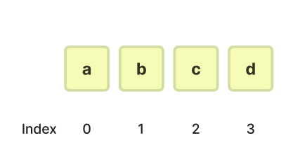

# Array vs ArrayList vs LinkedList

[Array vs ArrayList vs LinkedList | 👨🏻‍💻 Tech Interview](https://gyoogle.dev/blog/computer-science/data-structure/Array%20vs%20ArrayList%20vs%20LinkedList.html)

**<목차>**

---

# Array

: 동일한 데이터 타입의 원소들을 연속된 메모리 공간에 저장하는 선형 자료구조



## Array의 특징

### Array의 장/단점

Array의 장점

- 메모리에 논리적인 순서대로 연속적으로 저장됨 → 순서 유지
- 순서가 존재함 = 인덱스 번호를 통한 데이터 접근 가능… 시간복잡도 = O(1)
- 요소들이 연속된 메모리 공간에 저장되기 때문에 메모리 관리가 용이함

Array의 단점

- 처음 선언할 때 정한 크기를 나중에 변경할 수 없음
- 삽입/삭제 작업 시 다른 인덱스의 요소들을 한꺼번에 이동시켜야 함
  → 최악의 경우 시간복잡도 = O(n)

# ArrayList

: 크기가 가변적인 동적 배열을 구현한 선형 자료구조


## ArrayList의 특징

### Doubling

: ArrayList에서 크기를 동적으로 조정할 수 있도록 배열의 크기를 늘리는 작업

시간 복잡도 = O(n)


Doubling 예제 코드

```java
public class ArrayList {
    private int size;
    private int index;
    private Object[] ary;

    public ArrayList() {
        this.size = 1;
        this.index = 0;
        this.ary = new Object[this.size];
    }

    public void add(Object obj) {
        if (isFull()) doubling();
        ary[this.index++] = obj;
    }

    private boolean isFull() {
        return this.index == this.size - 1;
    }

    // Doubling
    private void doubling() {
        this.size = this.size * 2;
        Object[] douAry = new Object[this.size];
        for (int i = 0; i < this.ary.length; i++) douAry[i] = this.ary[i];
        this.ary = douAry;
    }
}
```

### ArrayList의 장/단점

ArrayList의 장점

- 삽입/삭제 작업 시에 자동으로 크기 조정 가능 (동적 크기)
- 내부적으로 배열을 사용하여 저장하기 때문에 인덱스를 통한 접근 가능… 시간복잡도 = O(1)
- 동적으로 크기를 조정 = 메모리의 효율적인 사용 가능

ArrayList의 단점

- 삽입/삭제 작업 시 다른 인덱스의 요소들을 한꺼번에 이동시켜야 함
  → 최악의 경우 시간복잡도 = O(n)

# LinkedList

: 데이터 요소(Node)들이 링크(포인터)로 연결되어 선형 자료구조를 형성하는 자료구조


단일 연결 리스트


다중 연결 리스트

## LinkedList의 특징

### Node

: 연결 리스트(LinkedList)를 구성하는 요소


**노드의 구성**

- 데이터 필드 : 실제 데이터 값이 들어있는 영역
- 링크(연결) 필드 : 다음 노드의 주소값이 들어있는 영역 (= 포인터)

### LinkedList의 장/단점

LinkedList의 장점

- 링크를 통해 연결되는 구조 → 크기 변화가 유연 (동적 크기)
- 링크에 대한 연산만으로 삽입/삭제 작업 수행 가능
- 필요에 따라 메모리 공간을 유연하게 조절 가능 → 메모리 낭비 ⬇️

LinkedList의 단점

- Node에 데이터와 포인터를 같이 저장해야 하기 때문에 추가적인 메모리 공간이 필요
- 인덱스를 통한 접근이 힘들기 때문에, 순차적 탐색 필요…
  → 최악의 경우 시간복잡도 = O(n)

---

_참고 자료_

[[JAVA] Array vs ArrayList vs LinkedList](https://stonage.tistory.com/229)

[https://novlog.tistory.com/entry/JAVA-Array-vs-ArrayList-vs-LinkedList-내부-구조-및-성능-비교](https://novlog.tistory.com/entry/JAVA-Array-vs-ArrayList-vs-LinkedList-%EB%82%B4%EB%B6%80-%EA%B5%AC%EC%A1%B0-%EB%B0%8F-%EC%84%B1%EB%8A%A5-%EB%B9%84%EA%B5%90)

[[Data Structure/자료구조] 배열과 리스트(Array, ArrayList, LinkedList)](https://sohyeonnn.tistory.com/17)

[Array vs LinkedList vs ArrayList](https://velog.io/@hxwxnxx/Array-vs-LinkedList-vs-ArrayList)

[[자료구조] 배열(Array) & ArrayList & 연결 리스트(LinkedList)](https://twingtwing.tistory.com/entry/%EC%9E%90%EB%A3%8C%EA%B5%AC%EC%A1%B0-%EB%B0%B0%EC%97%B4Array-ArrayList-%EC%97%B0%EA%B2%B0-%EB%A6%AC%EC%8A%A4%ED%8A%B8LinkedList)

[ArrayList 개념에 대해 알아볼게요.](https://azurealstn.tistory.com/147)
