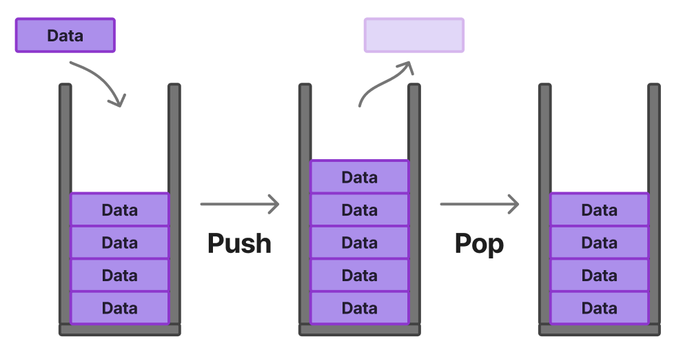

# 스택 (Stack) & 큐 (Queue)

[스택 & 큐 | 👨🏻‍💻 Tech Interview](https://gyoogle.dev/blog/computer-science/data-structure/Stack%20&%20Queue.html)

**<목차>**

---

# 스택 (Stack)

: 사전적 의미로는 “쌓는다”, 단어 뜻대로 데이터를 차곡차곡 쌓아올린 형태의 자료구조



> **LIFO (Last In First Out, 후입선출) : 가장 나중에 들어온 것이 가장 먼저 나감**

데이터의 삽입과 삭제가 한 부분으로만 이루어지는 자료 구조

**시간 복잡도**

- **삽입**: Insertion O(1)
- **삭제**: Deletion O(1) (pop) / O(N) (remove)
- **검색**: Search O(N)

## **스택(Stack) 명령어**

top이란? Stack의 처음 기본값을 나타내는 명령어

(Stack의 처음 기본값 = -1)

**C버전**

```c
int top = -1;
```

### 1. push()

: Stack에 새로운 데이터를 넣는 함수

```c
void push(int _v) {
    if (is_full()) {   // 스택이 가득 차있다면? return
        return;
    }
    top = top + 1;     // 최대 top을 하나 증가시킨 후
    stack[top] = _v;   // 해당 위치에 새로 들어온 값 저장
    return;
}
```

### 2. pop()

: Stack에서 맨 위에 있는 데이터를 빼는 함수

```c
int pop(void) {
    if (is_empty()) {     // 스택이 비어있으면 꺼낼 게 없음
        return -999;      // 비어있음을 의미하는 약속값 (= NULL)
    }
    int result = stack[top]; // 맨 위 값을 꺼내고
    top = top - 1;           // top을 하나 줄임
    return result;           // 꺼낸 값 반환
}
```

### 3. isEmpty()

: Stack이 비었는지 확인하는 함수

```c
int is_empty(void) {
    if (top == -1) {
        return 1;   // 비어있음
    } else {
        return 0;   // 비어있지 않음
    }
}
```

### 4. isFull()

: Stack이 가득 찼는지 확인하는 함수

```c
int is_full(void) {
    return (top == (STACK_SZ - 1)) ? 1 : 0;
    // top이 마지막 인덱스까지 차 있으면 1, 아니면 0
}
```

### 5. Peek()

: Stack에서 맨 위에 있는 데이터가 무엇인지 **확인**하는 함수 (≠ pop)

```c
int peek(void) {
    if (is_empty()) {    // 스택이 비었다면?
        return -999;     // 비어있음을 의미하는 약속값 (= NULL)
    }
    return stack[top];   // top이 현재 가리키는 요소 그대로 반환 (확인만 함)
}
```

## 전체 코드 (Stack)

**C버전**

```c
#include <stdio.h>

// stack의 크기를 지정
#define STACK_SZ 5

int stack[STACK_SZ];  // stack을 int 배열로 구현

// top 이란? stack에 어디까지 데이터가 쌓여있는지를 나타내는 변수
int top = -1;  // stack이 비었다면, stack 상태는 -1

// ======================================================================
// is_full() 함수
// stack이 full이면 1을 반환하는 함수 (full이 아니면 0을 반환함)
int is_full(void) {
	return (top == (STACK_SZ - 1)) ? 1 : 0;
}
// ======================================================================

/*
위 is_full 함수의 다른 모습
방법 1)
// stack이 full이면 0이 아닌 다른 수를 반환하는 함수 (full이 아니면 0을 반환함...)
int is_full(void) {
	return (top == (STACK_SZ - 1));
}

방법 2) 삼항 연산자 풀어쓴 것
int is_full(void) {
	// 1
	if (top == (STACK_SZ - 1)) { // stack full
		return 1;
	}
	return 0;
}
*/

// ======================================================================
// push(int _v) 함수
// _v값을 받아서 stack에 push하는 함수
// 앞에 '_'를 붙이는 이유 -> 파라미터로 받아온 지역변수인 것을 표시하기 위해서!
void push(int _v) {

	// 예외 상황...stack is 'full'인 경우엔 어떻게 처리할까?
	if (is_full()) {
		return;  // is_full 함수를 대신 넣음
	}

	// _v를 어느 위치에 넣어야 할까?
	//  = top보다 위의 자리, top을 update해야 함 -> top = top + 1
	// stack[top]는 현재 스택의 제일 위에 있는 요소
	top = top + 1;
	stack[top] = _v;

	return;
}
// ======================================================================

// ======================================================================
// is_empty(void) 함수
int is_empty(void) {
	if (top == -1) {
		return 1;
	}
	else {
		return 0;
	}
}
// ======================================================================

// ======================================================================
// pop(void) 함수
int pop(void) {

	// 예외 상황
	if (is_empty()) {
		return -999;  // empty라는 뜻으로 약속하자
	}

	// 아래 세 개중 아무거나...첫번째가 제일 가독성 좋음
	// 1) 가독성 제일 이해하기에 good
	int result = stack[top];
	top = top - 1;
	return result;

	// 2)
	//top = top - 1;
	//return stack[top + 1];

	// 3)
	//return stack[top--];
}
// ======================================================================

// ======================================================================
// peek(void) 함수
int peek(void) {

	// 예외 상황
	if (is_empty()) {
		return -999;  // empty라는 뜻으로 약속하자
	}

	return stack[top];
}
// ======================================================================

// ======================================================================
int main() {

	// 스택에 값 넣기
	push(10);
	push(20);
	push(30);

	printf("현재 가장 위에 있는 데이터 : %d\n", peek()); // ==> 30

	printf("pop : %d\n", pop()); // ==> 30
	printf("pop : %d\n", pop()); // ==> 20

	printf("현재 가장 위에 있는 데이터 : %d\n", peek()); // ==> 10

	printf("pop : %d\n", pop()); // ==> 10

	printf("현재 스택에서 peek : %d\n", peek()); // ==> -999 (비었음)
	printf("현재 스택에서 pop : %d\n", pop());   // ==> -999 (비었음)

	return 0;
}
// ======================================================================
```

**JAVA 버전**

```java
public class Main {

    static final int STACK_SZ = 5;

    static int[] stack = new int[STACK_SZ];

    static int top = -1;

    // ======================================================================
    public static void main(String[] args) {

    	push(10);
    	push(20);
    	push(30);

    	System.out.printf("현재 가장 위에 있는 데이터 : %d\n", peek()); // ==> 30

    	System.out.printf("pop : %d\n", pop()); // ==> 30
    	System.out.printf("pop : %d\n", pop()); // ==> 20

    	System.out.printf("현재 가장 위에 있는 데이터 : %d\n", peek()); // ==> 10

    	System.out.printf("pop : %d\n", pop()); // ==> 10

    	System.out.printf("현재 스택에서 peek : %d\n", peek()); // ==> -999 (비었음)
    	System.out.printf("현재 스택에서 pop : %d\n", pop());   // ==> -999 (비었음)

    	return;
    }
    // ======================================================================


    // ======================================================================
    // is_full() 함수
    static int is_full() {
        return (top == (STACK_SZ - 1)) ? 1 : 0;
    }
    // ======================================================================

    // ======================================================================
    // push(int _v) 함수
    static void push(int _v) {

        if (is_full() == 1) {
            return;
        }

        top = top + 1;
        stack[top] = _v;

        return;
    }
    // ======================================================================

    // ======================================================================
    // is_empty(void) 함수
    static int is_empty() {
        if (top == -1) {
            return 1;
        }
        else {
            return 0;
        }
    }
    // ======================================================================

    // ======================================================================
    // pop(void) 함수
    static int pop() {

        if (is_empty() == 1) {
            return -999;
        }

        int result = stack[top];
        top = top - 1;
        return result;
    }
    // ======================================================================

    // ======================================================================
    // peek(void) 함수
    static int peek() {

        if (is_empty() == 1) {
            return -999;
        }

        return stack[top];
    }
    // ======================================================================
}
```

# 큐 (Queue)

: 사전적 의미로는 “대기”, 단어 뜻대로 데이터를 줄을 서서 순서대로 출입하는 형태의 자료구조


> **FIFO (First In First Out, 선입선출) : 가장 먼저 들어온 것이 가장 먼저 나옴**

스택(Stack)과 달리 한 부분에서는 삽입이, 다른 부분에서는 삭제가 이루어지는 자료 구조

**시간 복잡도**

- **삽입**: Insertion O(1)
- **삭제**: Deletion O(1)(dequeue) / O(N)(remove)
- **검색**: Search O(N)

## 큐(Queue)의 종류

### 선형 큐


### 원형 큐


## **큐(Queue) 명령어**

**front** : 맨 앞 요소를 가리킴 (deQueue 하면 한 칸 앞으로 이동)

**rear** : 맨 뒤 요소를 가리킴 (enQueue 하면 한 칸 뒤로 이동)

⇒ **들어올 때 rear로 들어오고, 나올 때는 front부터 빠지는 특성을 가짐**

```c
int front = 0;
int rear = 0;
```

### 1. enQueue()

: Queue에 새로운 데이터를 넣는 함수

```c
void enque(int _v) {

	// queue가 full 상태라면 아무것도 X
	if (is_que_full()) {
		return;
	}

	// queue가 full 상태 X일땐 rear 한 칸씩 옮기기
	rear = (rear + 1) % QUE_SZ;
	myque[rear] = _v;
	return;
}
```

### 2. deQueue()

: Queue에서 데이터를 빼는 함수

```c
int deque(void) {

	if (is_que_empty()) {
		return -999;
	}

	// front 한 칸씩 옮기기
	front = (front + 1) % QUE_SZ;
	return myque[front];
}
```

### 3. isEmpty()

: Queue가 비었는지 확인하는 함수

```c
int is_que_empty(void) {
	return (front == rear);
}
```

### 4. isFull()

: Queue가 가득 찼는지 확인하는 함수

```c
int is_que_full(void) {
	// 아래 (rear + 1) % QUE_SZ)는 rear의 다음 위치를 나타내는 계산식
	// rear의 다음 위치가 front와 일치 -> 꽉 참
	return (((rear + 1) % QUE_SZ) == front);
}
```

### 5. getFront()

: Queue에서 front의 가장 위에 있는 데이터가 무엇인지 **확인**하는 함수 (≠ deQueue)

```c
int getFront(void) {
	if (is_que_empty()) {
		return -999;  // 비었음
	}
	return myque[(front + 1) % QUE_SZ];  // front 다음 값
}
```

## 전체 코드 (Queue)

**C버전**

```c
#include <stdio.h>

#define QUE_SZ 5

int myque[QUE_SZ];
int front = 0;
int rear = 0;

// ======================================================================
int is_que_full(void) {
	// 아래 (rear + 1) % QUE_SZ)는 rear의 다음 위치를 나타내는 계산식
	// rear의 다음 위치가 front와 일치 -> 꽉 참
	return (((rear + 1) % QUE_SZ) == front);
}
// ======================================================================

// ======================================================================
int is_que_empty(void) {
	return (front == rear);
}
// ======================================================================

// ======================================================================
void enque(int _v) {

	// queue가 full 상태라면 아무것도 X
	if (is_que_full()) {
		return;
	}

	// queue가 full 상태 X일땐 rear 한 칸씩 옮기기
	rear = (rear + 1) % QUE_SZ;
	myque[rear] = _v;
	return;
}
// ======================================================================

// ======================================================================
int deque(void) {

	if (is_que_empty()) {
		return -999;
	}

	// front 한 칸씩 옮기기
	front = (front + 1) % QUE_SZ;
	return myque[front];
}
// ======================================================================

// ======================================================================
int getFront(void) {
	if (is_que_empty()) {
		return -999;  // 비었음
	}
	return myque[(front + 1) % QUE_SZ];  // front 다음 값
}
// ======================================================================

// ======================================================================
int main(void) {

	enque(10);
	enque(20);
	enque(30);
	enque(40);

	printf("현재 가장 앞에 있는 데이터 : %d\n", getFront()); // ==> 10

	printf("deQueue : %d\n", deque()); // ==> 10
	printf("deQueue : %d\n", deque()); // ==> 20

	printf("현재 가장 앞에 있는 데이터 : %d\n", getFront()); // ==> 30

	printf("deQueue : %d\n", deque()); // ==> 30
	printf("deQueue : %d\n", deque()); // ==> 40

	printf("현재 큐에서 peek : %d\n", getFront());   // ==> -999 (비었음)
	printf("현재 큐에서 deQueue : %d\n", deque()); // ==> -999 (비었음)

	return 0;
}
// ======================================================================
```

**JAVA 버전**

```java
public class Main {

	static final int QUE_SZ = 5;

    static int[] myque = new int[QUE_SZ];
    static int front = 0;
    static int rear = 0;

    // ======================================================================
    public static void main(String[] args) {

        enque(10);
        enque(20);
        enque(30);
        enque(40);

        System.out.printf("현재 가장 앞에 있는 데이터 : %d\n", getFront()); // ==> 10

        System.out.printf("deQueue : %d\n", deque()); // ==> 10
        System.out.printf("deQueue : %d\n", deque()); // ==> 20

        System.out.printf("현재 가장 앞에 있는 데이터 : %d\n", getFront()); // ==> 30

        System.out.printf("deQueue : %d\n", deque()); // ==> 30
        System.out.printf("deQueue : %d\n", deque()); // ==> 40

        System.out.printf("현재 큐에서 peek : %d\n", getFront());   // ==> -999 (비었음)
        System.out.printf("현재 큐에서 deQueue : %d\n", deque());   // ==> -999 (비었음)

        return;
    }
    // ======================================================================


    // ======================================================================
    static int is_que_full() {
        // 아래 (rear + 1) % QUE_SZ)는 rear의 다음 위치를 나타내는 계산식
        // rear의 다음 위치가 front와 일치 -> 꽉 참
        return ((rear + 1) % QUE_SZ == front) ? 1 : 0;
    }
    // ======================================================================

    // ======================================================================
    static int is_que_empty() {
        return (front == rear) ? 1 : 0;
    }
    // ======================================================================

    // ======================================================================
    static void enque(int _v) {

        // queue가 full 상태라면 아무것도 X
        if (is_que_full() == 1) {
            return;
        }

        // queue가 full 상태 X일땐 rear 한 칸씩 옮기기
        rear = (rear + 1) % QUE_SZ;
        myque[rear] = _v;
        return;
    }
    // ======================================================================

    // ======================================================================
    static int deque() {

        if (is_que_empty() == 1) {
            return -999;
        }

        // front 한 칸씩 옮기기
        front = (front + 1) % QUE_SZ;
        return myque[front];
    }
    // ======================================================================

    // ======================================================================
    static int getFront() {
        if (is_que_empty() == 1) {
            return -999;  // 비었음
        }
        return myque[(front + 1) % QUE_SZ];  // front 다음 값
    }
    // ======================================================================
}
```

---

_참고 자료_

[[CS] 스택(Stack)](https://velog.io/@rlvy98/CS-%EC%8A%A4%ED%83%9DStack)

[[CS] 큐(Queue)](https://velog.io/@rlvy98/CS-%ED%81%90Queue)

[[자료구조] 스택(Stack)과 큐(Queue)](https://velog.io/@letskuku/%EC%9E%90%EB%A3%8C%EA%B5%AC%EC%A1%B0-%EC%8A%A4%ED%83%9DStack%EA%B3%BC-%ED%81%90Queue)

[[Data Structure] 스택(Stack) — hyeinisfree](https://hyeinisfree.tistory.com/65?category=1042908)

[[Data Structure] 큐(Queue) — hyeinisfree](https://hyeinisfree.tistory.com/66?category=1042908)
