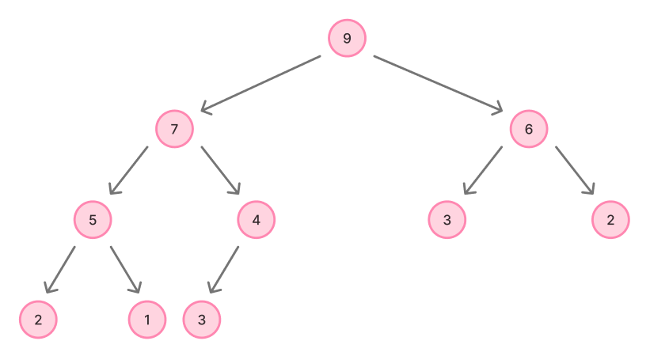

# 힙 (Heap)

[힙(Heap) | 👨🏻‍💻 Tech Interview](https://gyoogle.dev/blog/computer-science/data-structure/Heap.html)

**<목차>**

---

# 힙(Heap)

: 완전이진트리(complete binary tree) 기반의 자료구조로, 트리에서 최댓값 또는 최솟값을 빠르게 찾을 수 있는 자료 구조

- 힙 트리는 중복된 값 허용 (이진 탐색 트리는 중복값 허용X)

힙(Heap)의 종류

- 최대 힙(max heap) : 부모 노드의 키 값이 자식 노드의 키 값보다 크거나 같은 완전 이진 트리
- 최소 힙(min heap) : 부모 노드의 키 값이 자식 노드의 키 값보다 작거나 같은 완전 이진 트리

**최대 힙(max heap)**



**최소 힙(min heap)**


# 힙(Heap)의 구현

**부모 노드와 자식 노드 관계**

```
왼쪽 자식 index = (부모 index) * 2

오른쪽 자식 index = (부모 index) * 2 + 1

부모 index = (자식 index) / 2
```

## 힙의 삽입

삽입 과정

1. 힙에 새로운 요소가 들어오면, 일단 새로운 노드를 힙의 마지막 노드에 삽입
2. 새로운 노드를 부모 노드들과 교환

```cpp
void insert_max_heap(int x) {

    maxHeap[++heapSize] = x;
    // 힙 크기를 하나 증가하고, 마지막 노드에 x를 넣음

    for( int i = heapSize; i > 1; i /= 2) {

        // 마지막 노드가 자신의 부모 노드보다 크면 swap
        if(maxHeap[i/2] < maxHeap[i]) {
            swap(i/2, i);
        } else {
            break;
        }
    }
}
```

## 힙의 삭제

삭제 과정

1. 최대 힙에서 최대값은 루트 노드이므로 루트 노드가 삭제됨

   (= 최대 힙에서 삭제 연산은 최대값 요소를 삭제하는 것)

2. 삭제된 루트 노드에는 힙의 마지막 노드를 가져옴
3. 힙을 재구성

```cpp
int delete_max_heap() {

    if(heapSize == 0) // 배열이 비어있으면 리턴
        return 0;

    int item = maxHeap[1]; // 루트 노드의 값을 저장
    maxHeap[1] = maxHeap[heapSize]; // 마지막 노드 값을 루트로 이동
    maxHeap[heapSize--] = 0; // 힙 크기를 하나 줄이고 마지막 노드 0 초기화

    for(int i = 1; i*2 <= heapSize;) {

        // 마지막 노드가 왼쪽 노드와 오른쪽 노드보다 크면 끝
        if(maxHeap[i] > maxHeap[i*2] && maxHeap[i] > maxHeap[i*2+1]) {
            break;
        }

        // 왼쪽 노드가 더 큰 경우, swap
        else if (maxHeap[i*2] > maxHeap[i*2+1]) {
            swap(i, i*2);
            i = i*2;
        }

        // 오른쪽 노드가 더 큰 경우
        else {
            swap(i, i*2+1);
            i = i*2+1;
        }
    }
    return item;
}
```

---

_참고 자료_

[[CS] 힙(Heap)](https://velog.io/@rlvy98/CS-%ED%9E%99Heap)

[[자료구조] 힙(Heap)](https://velog.io/@letskuku/%EC%9E%90%EB%A3%8C%EA%B5%AC%EC%A1%B0-%ED%9E%99Heap)

[[자료구조] 힙(heap)이란 - Heee's Development Blog](https://gmlwjd9405.github.io/2018/05/10/data-structure-heap.html)

[[자료구조] 힙[heap]이란?](https://velog.io/@bada308/%EC%9E%90%EB%A3%8C%EA%B5%AC%EC%A1%B0-%ED%9E%99heap%EC%9D%B4%EB%9E%80)

[[자료구조] 그림으로 알아보는 힙(Heap)](https://velog.io/@emplam27/%EC%9E%90%EB%A3%8C%EA%B5%AC%EC%A1%B0-%EA%B7%B8%EB%A6%BC%EC%9C%BC%EB%A1%9C-%EC%95%8C%EC%95%84%EB%B3%B4%EB%8A%94-%ED%9E%99Heap)
