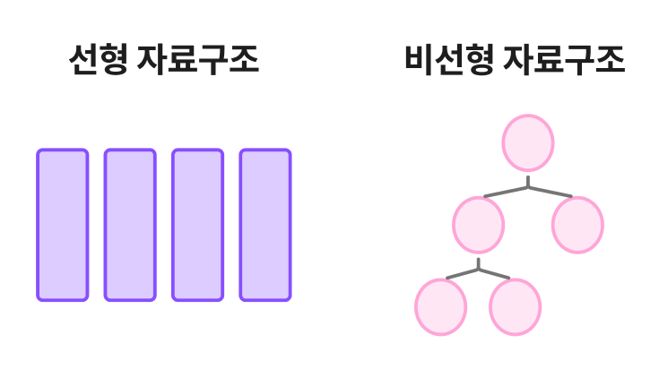

# 트리 (Tree)

[Tree | 👨🏻‍💻 Tech Interview](https://gyoogle.dev/blog/computer-science/data-structure/Tree.html)

**<목차>**

---

# 트리(Tree)의 개념과 특징

> Node와 Edge로 이루어진 비선형 계층적 자료구조 (단방향)



## **트리(Tree)의 기본 구조**


## **트리(Tree) 관련 용어**

- **노드 (Node)** : 트리를 구성하고 있는 각각의 요소
- **간선 (Edge)** : 노드와 노드 사이를 연결하는 선
- **루트 노드 (Root Node)** : 트리 구조에서 최상단에 위치한 노드 (= 부모가 없는 노드)
- 부모 노드 (Parent Node) : 자신과 연결된 상위 노드
- 자식 노드 (Child node) : 자신과 연결된 하위 노드
- 형제 노드 (Sibling node) : 같은 부모 노드를 가지고 있는 노드
- **단말 노드 (Leaf Node)** : 트리 구조에서 최하단에 위치한 노드 (= 자식이 없는 노드)
- 레벨(level, 깊이(depth)): 루트에서 특정 노드까지의 경로 길이 (간선의 수)
- 높이(height): 특정 노드에서 리프 노드까지 가장 긴 경로의 간선(Edge) 수
- **차수(degree)** : 각 노드와 이어져 있는 간선 개수

## **트리(Tree)의 특징**

- 트리는 사이클(Cycle)이 존재하지 않음 (사이클이 있다면 그건 그래프가 됨)
- 데이터를 순차적으로 저장X = 비선형 자료구조
- 트리 내에 또다른 트리가 존재 = 재귀적 자료구조
- 노드 간에 부모 ~ 자식 관계가 이루어짐 = 계층형 자료구조
- 모든 노드는 자료형으로 표현 가능
- 단순 순환(Loop)을 갖지 않은 채로 연결 = 무방향 그래프
- 루트 노드로부터 특정 노드로 가는 경로는 하나뿐이다.
- 노드의 개수 = N개라면, 간선의 개수 = N - 1 개

# Tree의 순회 방식


## 1. **전위 순회 (pre-order)**

: 각 루트(Root)를 순차적으로 먼저 방문하는 방식

**방문 순서**

루트 노드 -> 왼쪽 하위 트리 -> 오른쪽 하위 트리

ex)

```
1 → 2 → 4 → 8 → 9 → 5 → 10 → 11 → 3 → 6 → 12 → 7 → 13
```

## 2. **중위 순회 (in-order)**

: 왼쪽 하위 트리를 먼저 방문 후, 루트(Root)를 방문하는 방식

**방문 순서**

왼쪽 하위 트리 -> 루트 노드 -> 오른쪽 하위 트리

ex)

```
8 → 4 → 9 → 2 → 10 → 5 → 11 → 1 → 6 → 12 → 3 → 13 → 7
```

## 3. **후위 순회 (post-order)**

: 왼쪽 하위 트리부터 하위를 모두 방문 후, 루트(Root)를 방문하는 방식

**방문 순서**

왼쪽 하위 트리 -> 오른쪽 하위 트리 -> 루트 노드

ex)

```
8 → 9 → 4 → 10 → 11 → 5 → 2 → 12 → 6 → 13 → 7 → 3 → 1
```

## 4. **레벨 순회 (level-order)**

: 루트(Root)부터 계층 별로 방문하는 방식

**방문 순서**

높이가 최대 2라면? Level0 → Level1 → Level2 순서 (위 → 아래)

ex)

```
1 → 2 → 3 → 4 → 5 → 6 → 7 → 8 → 9 → 10 → 11 → 12 → 13
```

# 트리(Tree)의 종류


## 1. 일반 트리

: 각 노드들이 서로 다른 개수의 자식 노드를 가지는 트리

## 2. 이진 트리

: 모든 노드가 2개의 서브트리를 가지고 있는 트리

---

_참고 자료_

[[CS] 트리(Tree)](https://velog.io/@rlvy98/CS-%ED%8A%B8%EB%A6%ACTree)

[[CS 기초 - 자료구조] Tree](https://velog.io/@deannn/CS-%EA%B8%B0%EC%B4%88-%EC%9E%90%EB%A3%8C%EA%B5%AC%EC%A1%B0-Tree)

[[자료구조] 트리 (Tree)](https://yoongrammer.tistory.com/68)

[[자료구조/알고리즘] Tree, Graph](https://velog.io/@jungmin211/%EC%9E%90%EB%A3%8C%EA%B5%AC%EC%A1%B0%EC%95%8C%EA%B3%A0%EB%A6%AC%EC%A6%98-Tree-Graph)
