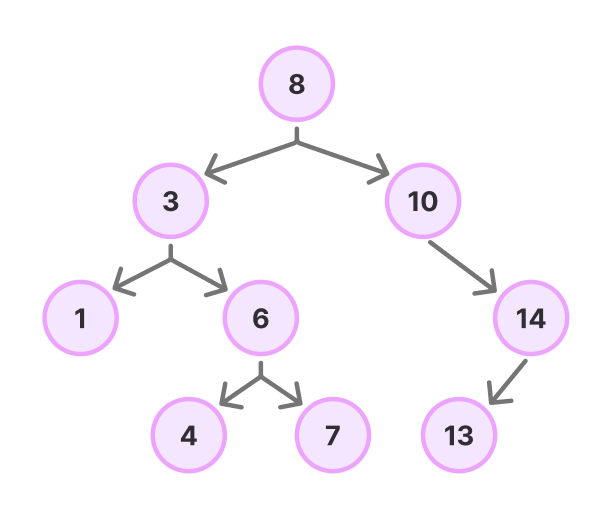

# 이진 탐색 트리 (BST)

[이진탐색트리 (Binary Search Tree) | 👨🏻‍💻 Tech Interview](https://gyoogle.dev/blog/computer-science/data-structure/Binary%20Search%20Tree.html)

**<목차>**

---

# 이진 탐색 트리(BST)

## 이진 탐색 트리의 개념 & 목적

<aside>
💡

트리 중에서 각 노드가 하나의 값과 두 개의 자식 노드(왼쪽 & 오른쪽 자식)를 가지는 구조

</aside>

**이진 탐색 트리의 목적**

> 이진탐색 + 연결리스트

- 이진탐색 : 탐색에 소요되는 시간복잡도는 O(logN), 그러나 삽입 & 삭제 불가능
- 연결리스트 : 삽입 & 삭제의 시간복잡도는 O(1), 그러나 탐색의 시간복잡도가 O(N)
  이 두가지를 합한 것 **'이진탐색트리'**
  ⇒ 효율적인 탐색 능력을 가지고, 자료의 삽입 삭제도 가능하게 만들자

**이진 탐색 트리의 시간 복잡도**

- 최선의 경우 (균등 상태 트리)
  → 탐색 & 삽입 & 삭제 = O(log N)
- 최악의 경우 (편향 상태 트리)
  → 탐색 &삽입 & 삭제 = O(N)

시간 복잡도는 **트리의 깊이(Depth)**에 비례…

## **이진 탐색 트리의 특징**

- 각 노드의 자식 노드는 2개 이하
- 각 노드의 왼쪽 자식은 부모보다 작고, 오른쪽 자식은 부모보다 큰 값을 가짐
- 중복된 노드 허용X
  - Why? 중복이 많은 경우 검색 속도 ⬇️
  - 중복이 있다면, 트리 대신 노드에 count값을 부여하고 처리
- 이진탐색트리의 순회 = 중위순회(inorder) 방식 (왼쪽 → 루트 → 오른쪽)
  - 중위 순회로 **정렬된 순서**를 읽을 수 있음

# 이진 탐색 트리(BST)의 연산

BST에서는 **탐색, 삽입, 삭제**와 같은 주요 연산을 **이진 탐색(Binary Search)**의 원리를 기반으로 구현

## BST의 탐색 (Search)

_ex) key = 60 찾기_

탐색 순서

1. **루트 노드**에서 시작하고, 찾으려는 값(**target**)과 **현재 노드의 값**을 비교
2. **target**이 **현재 노드의 값보다 작다면 왼쪽 서브트리로 이동**
3. **target**이 **현재 노드의 값보다 크다면 오른쪽 서브트리로 이동**
4. **target**을 찾으면 탐색 종료, 찾지 못하면 `null`을 반환 후 탐색 종료

## BST의 삽입 (Insert)

_ex) key = 10 삽입_

삽입 순서

1. **루트 노드**에서 시작하고, **삽입할 값(newValue)**을 **현재 노드의 값**과 비교
2. **newValue**가 **현재 노드의 값보다 작다면 왼쪽 서브트리로 이동**
3. **newValue**가 **현재 노드의 값보다 크다면 오른쪽 서브트리로 이동**
4. **비어있는 자리를 찾을 때까지** 이동을 반복한 후, 해당 위치에 **새로운 노드**를 삽입

## BST의 삭제 (Delete)

**삭제의 3가지 케이스 :**

- 자식이 없는 leaf 노드일 때
- 자식이 1개인 노드일 때
- 자식이 2개인 노드일 때

### 1. 자식이 없는 Leaf 노드 삭제

: 단순히 해당 노드를 삭제

### 2. 자식이 1개인 노드 삭제

: 삭제할 노드를 자식 노드와 교체한 후 삭제

### 3. 자식이 2개인 노드 삭제

: 후계자 혹은 선행자를 찾아 교체한 후 삭제

- 후계자(successor) = 삭제할 노드의 **오른쪽 서브트리에서 가장 작은 값**
- 선행자(predecessor) = 삭제할 노드의 **왼쪽 서브트리에서 가장 큰 값**

_ex) successor 예시 (오른쪽)_

---

_참고 자료_

[[CS] 이진 탐색 트리(Binary Search Tree, BST)](https://velog.io/@rlvy98/CS-%EC%9D%B4%EC%A7%84-%ED%83%90%EC%83%89-%ED%8A%B8%EB%A6%ACBinary-Search-Tree-BST)

[[자료구조] 이진트리와 이진탐색트리](https://velog.io/@letskuku/%EC%9E%90%EB%A3%8C%EA%B5%AC%EC%A1%B0-%EC%9D%B4%EC%A7%84%ED%8A%B8%EB%A6%AC%EC%99%80-%EC%9D%B4%EC%A7%84%ED%83%90%EC%83%89%ED%8A%B8%EB%A6%AC)

[[자료구조] 이진 탐색 트리 (BST, Binary Search Tree)](https://yoongrammer.tistory.com/71)

[[자료구조] Tree - Binary Serach Tree (이진 탐색 트리) - 개념과 구현](https://velog.io/@dankj1991/Tree-Binary-Serach-Tree#12-binary-search-tree%EC%9D%98-%EC%A3%BC%EC%9A%94-%EC%9A%A9%EB%8F%84)
