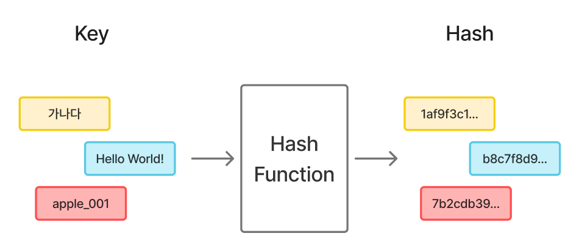

# 해시 (Hash)

[해시(Hash) | 👨🏻‍💻 Tech Interview](https://gyoogle.dev/blog/computer-science/data-structure/Hash.html)

**<목차>**

---

# 해시 (Hash)

<aside>
💡

해시(Hash)란?

→ 임의의 길이의 데이터를 고정된 길이의 데이터로 매핑(mapping)한 **결과값**

</aside>

해시 함수를 구현하여 데이터 값을 해시 값으로 매핑!

**해시의 과정 기본 구조**

## 해시 함수 (Hash Function)

<aside>
💡

임의의 길이의 데이터를 **고정된 길이의 데이터**로 매핑하는 **함수 (알고리즘)**

</aside>

- Keys : 매핑 전 기존 데이터 값
- Hashes : 매핑 후 데이터 값 (= values)

위 해시 함수를 사용하여 새로운 값으로 추출하는 과정을 **해싱(Hashing)**이라고 함!

**해시 충돌?**

: 해시 함수가 서로 다른 두 개의 키(Keys)를 동일한 해시값(Hashes)으로 매핑하는 현상

(데이터가 많은 경우에 주로 발생…)

## **해시 테이블 (Hash Table)**

<aside>
💡

해시 함수를 사용하여 키를 해시 값으로 매핑하고,
이러한 해시 값을 index나 주소로 삼아서 데이터의 값을 키와 함께 저장하는 자료구조

⇒ key - value로 이루어진 자료구조

</aside>

**해시 테이블의 시간 복잡도 (탐색 · 삽입 · 삭제)**

충돌X인 경우 (평균) = **`O(1)`**

충돌O인 경우 (최악) = **`O(N)`**

해시 테이블의 장점

- 적은 자원으로 많은 데이터를 효율적으로 관리 가능
- 데이터 저장/읽기 속도가 빠름 => 검색 속도 ⬆️
- 특정 Key로 데이터에 접근 가능 (효율성 ⬆️)

해시 테이블의 단점

- 더 많은 저장 공간이 필요 (낭비되는 공간 多)
  - 값이 저장된 Hash값이 0, 4, 5 라면? → 1, 2, 3의 공간은 비어있음
- 충돌 문제를 해결하려면 별도의 자료구조 필요
- 데이터 충돌이 발생하면 Chaining에 연결된 리스트들까지 모두 검색을 해야 함…

# 해시 충돌 (Hash Collision)

<aside>
💡

서로 다른 키 값(입력값)이 동일한 해시 값을 갖게 되는 현상

</aside>

**비둘기집 원리**

\*\*\*\*: N개의 상자에 N+1개의 물건을 넣으면, 최소한 한 상자에는 반드시 두 개 이상 들어가 있음

= 아무리 좋은 해시 함수를 사용해도 충돌은 일어날 수 있음!

## 해결 방법1 : 체이닝 (Chaining)

: 버킷에 값이 들어있을 때, Hash값을 해당 버킷의 다음 슬롯에 연이어서 연결 리스트처럼 넣어주는 방법

**체이닝(Chaining)의 구조**

**체이닝(Chaining)의 장/단점**

## 해결 방법2 : 개방 주소법 (Open Addressing)

: 해시 함수로 얻은 주소가 아닌 다른 주소에 데이터를 저장할 수 있도록 허용하는 방법

→ 해당 버킷이 아닌 다음 버킷을 찾아서 저장 (= 다른 위치)

탐사(Probing) 방식 사용…

> **탐사(probing)란?**
> : 탐색/삽입/삭제를 수행하기 위해 해시 테이블 내에서 새로운 주소(해시값)을 찾는 과정

**개방 주소법(Open Addressing)의 구조**

**개방 주소법(Open Addressing)의 종류**

- 선형 탐사 (Linear Probing)
- 제곱 탐사 (Quadratic Probing)

### 해결 방법2-1 : 선형 탐사 (Linear Probing)

: 충돌이 발생하면 바로 다음 위치를 확인하고, 계속 다음 위치로 이동하며 빈 공간을 찾는 방식

= **정해진 고정 폭**으로 옮겨 해시값의 중복을 피함

ex)

한 칸씩 이동하며 공간 확인…

### 해결 방법2-2 : 제곱 탐사 (Quadratic Probing)

: 충돌이 발생하면 일정 간격만큼 이동하며 빈 공간을 찾는 방식

= **정해진 고정 폭을 제곱수**로 옮겨 해시값의 중복을 피함

ex)

1의 제곱 = 1이니 한 칸 이동 후 확인, 2의 제곱은 4이니 4칸 이동 후 확인, 3의 제곱은 9이니 9칸 이동 후 확인…

인덱스 10에서 시작했다면? 10 → 11 → 15 → 24 → …

---

_참고 자료_

[[CS] 해시(Hash)](https://velog.io/@rlvy98/CS-%ED%95%B4%EC%8B%9CHash)

[[자료구조] 해시(Hash)](https://velog.io/@letskuku/%EC%9E%90%EB%A3%8C%EA%B5%AC%EC%A1%B0-%ED%95%B4%EC%8B%9CHash)

[[CS] Hash의 개념과 사용 예시 | Cometa's blog!](https://yanghs6.github.io/posts/1001_hash_basic/)

[[자료구조] 해시(Hash)란 무엇인가](https://ablue-1.tistory.com/68)

[[자료구조] 해시 Hash](https://yelkim0210.tistory.com/158)

[[책 정리] Chapter 11. 해싱](https://velog.io/@rhddbwls5843/%EC%B1%85-%EC%A0%95%EB%A6%AC-Chapter-11.-%ED%95%B4%EC%8B%B1#%EC%9D%B4%EC%A4%91-%ED%95%B4%EC%8B%B1%EB%B2%95)

[Open Addressing (선형탐사, 제곱탐사)](https://velog.io/@xowen96/Open-Addressing)
