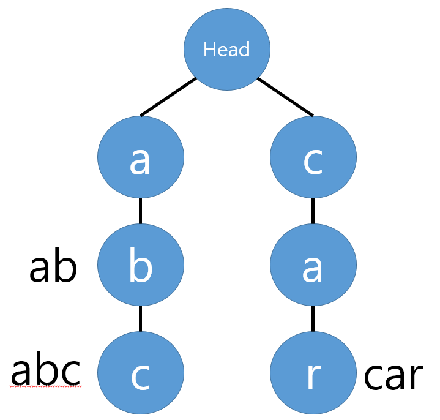

# 트라이 (Trie)

[트라이(Trie) | 👨🏻‍💻 Tech Interview](https://gyoogle.dev/blog/computer-science/data-structure/Trie.html)

**<목차>**

---

# **트라이 (Trie)**

<aside>
💡

문자열을 저장하고 효율적으로 탐색하기 위한 **트리 형태**의 자료구조 (검색 속도 ⬆️)

</aside>

**자동 완성, 사전 검색 등 문자열을 탐색하는 것에 특화**된 자료구조

ex)

찾으려는 단어가 “Datastructure”인 경우,

‘D’입력 후 ‘a’, ‘t’, … 순으로 하나씩 입력하여 찾아가는 기능 (= 자동 완성)

## 트라이(Trie)의 특징

**루트 노드**

- 루트노드는 항상 비어있음
- 루트 노드의 자식 노드 = **저장된 모든 단어들의 첫 글자**

**마지막 글자 표시**

- 파란색으로 칠해져 있는 노드 = 각 문자열의 마지막 글자

**각 노드의 구성**

- 자식 노드는 **Map 자료구조**로 관리하여, 여러 갈래(문자)를 효율적으로 연결
- 단어의 끝은 boolean을 사용하여 구분함
  - 각 단어의 마지막 글자를 저장한 노드에는 `endOfWord = true`로 표시

```java
class Node{

    //노드의 자식 노드들을 저장
    HashMap<Character, Node> child;

    //이 노드가 단어의 끝인지 저장
    boolean endOfWord;
}
```

## **트라이(Trie)의 장/단점**

장점

- 문자열 검색 속도 ⬆️
- 동일한 접두사는 공유 = 메모리 효율성 ⬆️

단점

- 포인터들을 배열로 모두 저장 중 = 저장 공간 ⬆️

# 트라이(Trie)의 주요 연산

- **삽입 (Insert)**
  : 문자열을 하나씩 루트부터 따라가면서 트리에 삽입
- **탐색 (Search)**
  : 찾고자 하는 문자열을 루트부터 따라가며 일치하는지 확인
- **삭제 (Delete)**
  : 삭제 시, 해당 문자열의 마지막 노드까지 찾아가서 삭제를 표시하거나, 더 이상 필요 없는 노드들을 정리
- **접두사 검색 (Prefix Search)**
  : 접두사가 일치하는 노드를 찾아 그 노드로부터 아래에 연결된 모든 단어를 반환 (자동 완성에서 유용)

# 트라이(Trie) 예제

Q. _'abc', 'ab', 'car'_ 단어들을 *'abc'*부터 **트라이**에 저장하기



**1) 'abc' 단어 삽입**

1. 첫 번째 문자는 'a', 초기 `트라이` 자료구조는 비었음 → Head의 자식노드에 'a'를 추가
2. 'a'노드에도 현재 자식이 하나도 없음 → 'a'의 자식노드에 'b'를 추가
3. 'c'도 마찬가지로 'b'의 자식노드로 추가
4. 'abc' 단어가 여기서 끝남을 알리기 위해 현재 노드에 abc라고 표시

**2) 'ab' 단어 삽입**

1. 현재 Head의 자식노드로 'a'가 이미 존재 → 'a'노드를 추가하지 않고, 기존에 있는 'a'노드로 이동
2. 'b'도 'a'의 자식노드로 이미 존재하므로 'b'노드로 이동
3. 'ab' 단어가 여기서 끝이므로 현재 노드에 ab를 표시

**3) 'car' 단어 삽입**

- Head의 자식노드로 'a'만 존재하고, 'c'는 존재하지 않음 → 따라서 'c'를 자식노드로 추가
- 'c'의 자식노드가 없으므로 마찬가지로 'a'를 추가
- 'a'의 자식노드가 없으므로 마찬가지로 'r'을 추가
- 'car' 단어가 여기서 끝이므로 현재 노드에 car를 표시

---

_참고 자료_

[[자료구조] 트라이 (Trie)](https://velog.io/@kimdukbae/%EC%9E%90%EB%A3%8C%EA%B5%AC%EC%A1%B0-%ED%8A%B8%EB%9D%BC%EC%9D%B4-Trie)

[[JAVA/자료구조] 트라이(Trie) 개념, 직접 구현하기 — HS_dev_log](https://innovation123.tistory.com/116)

[[자료구조] 트라이(Trie) 정리 (TS)](https://velog.io/@littlegiant/%EC%9E%90%EB%A3%8C%EA%B5%AC%EC%A1%B0-%ED%8A%B8%EB%9D%BC%EC%9D%B4Trie-%EC%A0%95%EB%A6%AC-TS)
