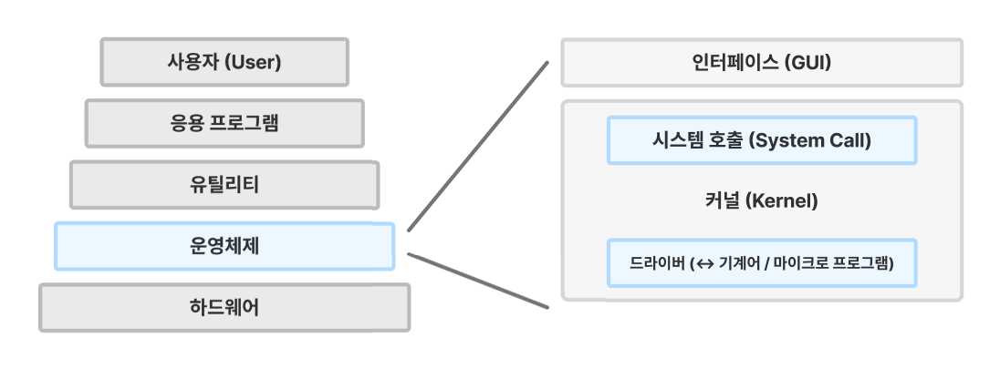

# 운영체제란?

[👨🏻‍💻 Tech Interview](https://gyoogle.dev/blog/computer-science/operating-system/Operation%20System.html)

**<목차>**

---

# **운영체제 (OS, Operating System)**

<aside>
💡

**사용자가 컴퓨터를 편리하고 효과적으로 사용할 수 있는 환경을 제공해주는 시스템 소프트웨어**

\*\*\*\*= 하드웨어를 효율적으로 사용할 수 있게 관리하는 소프트웨어 (중재자 역할)

</aside>

- 넓은 의미 : 시스템 소프트웨어 전반
- 좁은 의미 : 제어 프로그램 (Kernel)

_ex) Windows, Linux, UNIX, MS-DOS 등_

## 운영체제의 사용 목적

**1. 처리 능력 향상**

: 자원 관리를 통해 일정 시간 내에 시스템이 처리하는 일의 양을 향상시킴

**2. 반환 시간 단축**

: 사용자가 시스템에 요청한 작업을 완료할 때까지 소요되는 시간을 단축

**3. 사용 가능도 향상**

: 시스템 자원을 최대한 빨리 제공하여 바로 사용할 수 있도록 기능 향상

**4. 신뢰도 향상**

: 입력한 값에 따라 정확한 결과를 제출하도록 기능 향상

# 운영체제의 구조 & 구성 요소

## **운영체제의 기본 구조**

## **운영체제의 구성 요소**

**인터페이스**

: 사용자가 운영체제와 직접 상호작용할 수 있게 해주는 장치

**커널**

: 하드웨어와 응용 프로그램 사이에서 인터페이스를 제공하는 역할 (컴퓨터 자원 관리)

- 시스템 호출(System Call)
  = 사용자나 프로그램이 직접 컴퓨터 자원에 직접 접근하는 것을 막는 인터페이스
        (운영체제 서비스를 제공해주는 통로)
- 드라이버(Driver)
  = 커널과 하드웨어의 인터페이스
        (운영체제가 하드웨어를 인식·제어할 수 있도록 해주는 소프트웨어)

# 운영체제의 **성능 평가 기준**

**1. 처리량 (Throughput)**

: 일정한 단위 시간내에 얼마나 많은 작업량을 처리하는가?

**2. 반환시간 (Turn around time)**

: 컴퓨터 센터에 작업을 지시하고 나서부터 결과를 받을 때까지 소요되는 시간

**3. 신뢰도 (Reliability)**

: 시스템이 주어진 문제를 얼마나 정확하게 해결하는가?

**4. 이용 가능도 (Availability)**

: 컴퓨터 시스템 내에서 여러 사용자가 요구할 때, 얼마나 빠르게 지원해 줄 수 있는가?

(시스템의 전체 운영 시간 중에서 실제 가동하여 오류없이 사용 중인 시간의 비율)

**5. 자원 이용도 (Resource Utilization)**

: 전체 시간에 대해 주어진 자원이 실제로 사용되는 시간의 비율

→ 병목 현상이 얼마나 적게 발생하는가?

# 운영체제의 역할

## 1. 프로세스 관리

<aside>
💡

운영체제에서 작동하는 응용 프로그램을 관리하는 기능

</aside>

- 프로세스, 스레드
- 스케줄링
- 동기화
- IPC 통신

1. CPU를 점유할 프로세스를 결정

2. 실제로 CPU를 프로세스에 할당

3. 프로세스 간 자원 접근 및 통신 관리

= 시스템 자원의 효율적 사용 & 작업 성능 최적화(속도⬆️) 보장

### **1-1. 프로그램과 프로세스**

프로그램이 메모리로 적재되면 프로세스가 되는 구조

- **프로그램 (Program)**
  : 하드디스크에 저장된 명령어들의 집합
  (단순히 "파일" 상태이며, 메모리에 올라가지 않으면 실행X)
- **프로세스 (Process)**
  : 프로그램이 메모리에 적재되어 **실행 중**인 상태 (= 프로그램의 실행 인스턴스… 객체)

### **1-2. 프로세스의 상태**

- **`new`** : program이 메인 메모리로 적재된 상태
- **`ready`** : process가 실행될 모든 준비가 끝난 상태
- **`run`** : cpu가 실제로 process를 실행하는 상태
- **`wait`** : process가 대기하는 상태
  (process에 입출력 등의 명령이 있다면, 이 process는 입출력이 동작하는 동안 waiting…)
- **`terminated(exit)`** : process가 종료된 상태

## 2. 저장장치 관리

<aside>
💡

메인 메모리(1차 저장장치)와 하드디스크 & NAND (2차 저장장치) 등을 관리하는 기능

</aside>

- 메모리 관리
- 가상 메모리
- 파일 시스템

**1차 저장장치 (Main Memory - ROM, RAM)**

- 프로세스에 할당하는 메모리 영역의 할당과 해제
- 각 메모리 영역 간의 침범 방지
- 메인 메모리의 효율적 활용을 위한 가상 메모리 기능

**2차 저장장치 (HDD, NAND Flash Memory 등…)**

- 파일 형식의 데이터 저장
- 이런 파일 데이터 관리를 위한 파일 시스템을 OS에서 관리
- `FAT, NTFS, EXT2, JFS, XFS` 등 많은 파일 시스템들이 개발되어 사용 중

## 3. 네트워킹

<aside>
💡

네트워크 통신을 위한 프로토콜 지원 및 자원 관리 기능

</aside>

- TCP/IP
- 기타 프로토콜

응용 프로그램 등에서 네트워크를 사용하려면?

→ 운영체제에서 네트워크 프로토콜(TCP/IP)을 지원해야 함…

**TCP/IP 프로토콜**

**TCP/IP 프로토콜 작동 구조**

## 4. 사용자 관리

<aside>
💡

각 계정을 관리하고, 파일이나 시스템 자원에 접근 권한을 지정하는 기능

= 하나의 PC에 여러개의 계정이 있을 때를 대비하여, 각 계정을 관리할 수 있는 기능

</aside>

- 계정 관리
- 접근 권한 관리

### **4-1. 계정 관리**

**식별과 인증**

- 식별 : 어떤 시스템에 로그인하기 위해 먼저 자신이 누군지를 응답
- 인증 : 로그인을 허용하기 위한 확인

**보안의 4가지 인증 방법**

- 알고 있는 것 : 머릿속에 기억하고 있는 정보를 이용하여 인증 수행
- 가지고 있는 것 : 신분증이나 OTP 장치 등을 통해 인증 수행
- 자신의 모습 : 홍채, 지문 등의 생체 정보로 인증 수행
- 위치하는 곳 : 현재 접속을 시도하는 위치의 적절성을 확인하거나 콜백을 사용해 인증 수행
  (콜백이란? 접속 시도자의 신원을 확인하기 위해, 저장된 전화번호를 통하여 본인인지 확인하는 것)

**운영체제의 계정 관리**

- 운영체제에 대한 권한을 가지게 된다면?
  → 해당 시스템의 다른 응용 프로그램에 대해서도 어느 정도의 권한을 갖게 됨
- 일반 사용자 권한의 계정도 시스템의 상당 부분에 대한 읽기 권한은 가질 수 있음 (읽기만…)
- 운영체제 내에서는 관리자 권한이 있는 계정뿐만 아니라, 일반 사용자 권한이 있는 계정도 적절하게 제한
  → 권한마다 제한 정도가 다름!

### **4-2. 접근 권한 관리**

**접근 제어**

- 허가받지 않은 사람의 시스템에 대한 접근을 제어하는 것 (권한 부여)
- 외부의 침입으로부터 시스템 자원을 보호하기 위한 것

**접근 제어의 요소**

- **주체(Subject)** : 행위를 시도하는 주체 (누가?)
- **객체(Object)** : 보호해야 할 자원 (무엇을?)
- **접근(Access)** : 주체가 객체에 대해 수행할 수 있는 행위들 (어떻게?)

_ex) 사용자 A가 파일 report.docx를 열어서 읽으려고 하는 경우_

_주체 = 사용자 A가,_

_객체 = 파일 report.docx를,_

_접근 = 읽기(Read)만 허용_

## 5. 디바이스 드라이버

<aside>
💡

하드웨어를 추상화 해주는 계층

(디바이스 드라이버 = 하드웨어를 조작하는 소프트웨어)

</aside>

- 순차 접근 장치
- 임의 접근 장치
- 네트워크 장치

> 운영체제 → 시스템의 자원, 하드웨어를 관리

시스템에는 여러 개의 하드웨어가 붙어있는데,

이들을 운영체제에서 인식하고 관리하게 만들어 응용 프로그램이 하드웨어를 사용할 수 있게 만들어야 함

_ex) 입출력 장치인 키보드, 마우스 등을 사용하려면 각각의 장치에 맞는 “드라이버” 필요…_

### 5-1. 디바이스 드라이버의 역할 & 기능

**1. 하드웨어 추상화**

: 하드웨어의 복잡성을 숨기고, 운영체제에 일관된 인터페이스를 제공

**2. 하드웨어 제어**

: 하드웨어 장치의 작동을 직접 제어

_ex) 장치를 초기화하고, 데이터를 전송하며, 장치의 상태를 모니터링하는 명령 등…_

**3. 데이터 전송**

: 메모리와 하드웨어 장치 간의 데이터 전송을 관리

_ex) 읽기 및 쓰기 요청을 처리하고, 필요한 경우 데이터 포맷 변환을 수행_

**4. 오류 처리**

: 하드웨어 장치로부터 발생할 수 있는 오류를 감지 후 이에 대해 적절한 오류 메시지를 생성하여 시스템 또는 사용자에게 전달

**5. 인터럽트 처리**

: 많은 하드웨어 장치는 작업 완료나 특정 상태 변경을 알리기 위해 인터럽트를 발생시킴

→ 드라이버는 이러한 인터럽트를 처리하고, 필요한 작업을 수행함

---

_참고 자료_

[[CS] 운영체제 총정리 — 기억보다 기록](https://uiop5809.tistory.com/350)

[[CS / 운영체제] 운영체제의 역할과 기본 원리 소개](https://velog.io/@urjimyu/CS-%EC%9A%B4%EC%98%81%EC%B2%B4%EC%A0%9C-%EC%9A%B4%EC%98%81%EC%B2%B4%EC%A0%9C%EC%9D%98-%EC%97%AD%ED%95%A0%EA%B3%BC-%EA%B8%B0%EB%B3%B8-%EC%9B%90%EB%A6%AC-%EC%86%8C%EA%B0%9C)

[[CS / 운영체제] 운영체제란? OS 용어 정리 - 쉘, 시스템콜, API — HS_dev_log](https://innovation123.tistory.com/225)

[[운영체제] 운영체제의 구조 (커널과 인터페이스)](https://ardor-dev.tistory.com/22#google_vignette)

[운영체제란?](https://velog.io/@hoyun7443/%EC%9A%B4%EC%98%81%EC%B2%B4%EC%A0%9C%EB%9E%80#5-%EB%94%94%EB%B0%94%EC%9D%B4%EC%8A%A4-%EB%93%9C%EB%9D%BC%EC%9D%B4%EB%B2%84)

[[운영체제] 운영체제란 무엇일까 | ChanBLOG](https://chanhuiseok.github.io/posts/cs-1/)

[[TIL][CS] 운영체제(OS) 톺아보기](https://developer-jinnie.tistory.com/33)

[[운영체제] 프로세스 관리](https://velog.io/@yeunjoo121/%EC%9A%B4%EC%98%81%EC%B2%B4%EC%A0%9C-%ED%94%84%EB%A1%9C%EC%84%B8%EC%8A%A4-%EA%B4%80%EB%A6%AC)

[[컴퓨터 개론] 5장-02 운영체제: 프로세스 관리](https://project-chan.tistory.com/entry/%EC%BB%B4%ED%93%A8%ED%84%B0-%EA%B0%9C%EB%A1%A0-5%EC%9E%A5-02-%EC%9A%B4%EC%98%81%EC%B2%B4%EC%A0%9C-%ED%94%84%EB%A1%9C%EC%84%B8%EC%8A%A4-%EA%B4%80%EB%A6%AC?category=1193718)

[TCP/IP 프로토콜 개요](https://velog.io/@octo__/TCPIP-%ED%94%84%EB%A1%9C%ED%86%A0%EC%BD%9C-%EA%B0%9C%EC%9A%94)

[운영체제의 역할 - 네트워킹, 사용자 관리, 디바이스 드라이버](https://velog.io/@hyeonahhh/%EC%9A%B4%EC%98%81%EC%B2%B4%EC%A0%9C%EC%9D%98-%EC%97%AD%ED%95%A0-%EB%84%A4%ED%8A%B8%EC%9B%8C%ED%82%B9-%EC%82%AC%EC%9A%A9%EC%9E%90-%EA%B4%80%EB%A6%AC-%EB%94%94%EB%B0%94%EC%9D%B4%EC%8A%A4-%EB%93%9C%EB%9D%BC%EC%9D%B4%EB%B2%84)

[시스템 보안의 이해와 운영체제의 계정 관리](https://louis-j.tistory.com/entry/%EC%8B%9C%EC%8A%A4%ED%85%9C-%EB%B3%B4%EC%95%88%EC%9D%98-%EC%9D%B4%ED%95%B4%EC%99%80-%EC%9A%B4%EC%98%81%EC%B2%B4%EC%A0%9C%EC%9D%98-%EA%B3%84%EC%A0%95-%EA%B4%80%EB%A6%AC)

[장치 드라이버(Device driver)란? 하드웨어 제어 시 필요한 장치 드라이버에 관하여](https://yaneodoo2.tistory.com/entry/%EC%9E%A5%EC%B9%98-%EB%93%9C%EB%9D%BC%EC%9D%B4%EB%B2%84Device-driver%EB%9E%80-%ED%95%98%EB%93%9C%EC%9B%A8%EC%96%B4-%EC%A0%9C%EC%96%B4-%EC%8B%9C-%ED%95%84%EC%9A%94%ED%95%9C-%EC%9E%A5%EC%B9%98-%EB%93%9C%EB%9D%BC%EC%9D%B4%EB%B2%84%EC%97%90-%EA%B4%80%ED%95%98%EC%97%AC)

[10-8 장치 드라이버 - 리눅스로 공부하는 운영체제](https://wikidocs.net/232302)
