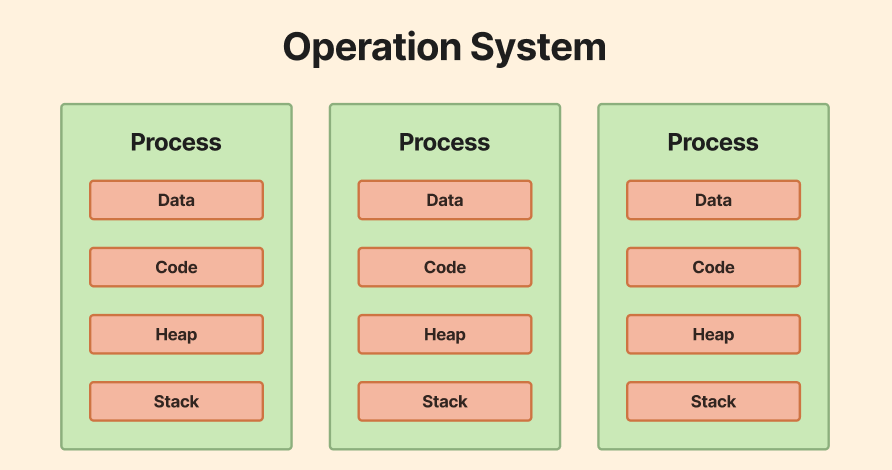

# 프로세스와 스레드

[프로세스 & 스레드 | 👨🏻‍💻 Tech Interview](https://gyoogle.dev/blog/computer-science/operating-system/Process%20vs%20Thread.html)

**<목차>**

---

# 프로세스 & 스레드

**프로세스 전체 구조**

**스레드 전체 구조**

프로세스마다 최소 1개의 스레드 보유 (메인 스레드 포함)

## 프로세스 (Process)

개념 구분

- 프로그램 : 어떤 데이터를 사용하여 어떤 작업을 할지 그 절차를 적어 놓은 것
      → 하드디스크 등의 저장 장치에 보관됨
- 프로세스 : 프로그램을 실행한 것 (= 프로그램이 메모리 위에 올라가 작업이 진행되는 것)

<aside>
💡

메모리에 올라와 실행되고 있는 프로그램의 인스턴스 (독립적인 개체)

**= 실행 중인 프로그램**

</aside>

### 프로세스의 구조

**프로세스는 각각 별도의 주소공간 할당 (독립적)**

**<Process>의 내부 구조**

**1. code 영역(Text Segment)**

**2. Data 영역(Data Segment)**

**3. Stack**

**4. Heap**

**1. code 영역(Text Segment)**

: 내가 작성한 **코드가 저장되는 메모리 영역**으로, 0과 1로 변환된 기계어가 저장됨

2. **Data 영역(Data Segment)**

: 내가 작성한 코드에서 선언된 **전역 변수, 정적 변수, 배열, 상수 등을 저장**하는 영역

- 초기화된 변수와 초기화되지 않은 변수들이 나눠서 저장
  - 초기화 된 데이터 = data 영역에 저장
  - 초기화 되지 않은 데이터 = bss 영역에 저장
- 데이터 영역은 프로그램의 시작 시 초기화되며, 프로세스가 종료될 때까지 유지

**3. Stack**

: 내가 작성한 함수에서 **지역변수, 매개변수, return 값들을 저장**하는 영역 (임시 메모리 영역)

- 프로세스마다 독립적인 stack을 가질 수 있고, stack 포인터를 통해 스택의 상태를 관리함
- 함수가 호출되면 stack 공간이 생성되며, 함수가 종료되면 제거됨

**4. Heap**

: 내가 작성한 코드에서 **동적으로 생성되는 데이터 구조나 객체들을 저장**하는 영역 (`new()`, `malloc()` 등)

- 데이터가 추가됨에 따라 유동적으로 공간을 늘릴 수 있음
- 힙은 프로세스의 주소 공간의 나머지 영역에 위치하며, **크기는 동적으로 확장 가능**

### 프로세스의 상태

**1. 프로세스 생성 (new)**

: 프로세스가 **생성된 상태**

(생성만 되었고, 아직 실행되기 위한 자원을 할당받지 못한 상태)

**2. 실행 가능 (Ready)**

: 프로세스가 **실행을 기다리는 상태** (실행 준비는 끝났지만 CPU 할당X)

→ CPU를 할당받기 위해 스케줄링 대기열(Queue)에 들어가게 됨

**3. 실행 상태 (Running)**

: 프로세스가 CPU를 할당받아 실제로 **코드를 실행하는 상태**

**4. 대기(Blocked)**

: **프로세스가 잠시 멈춘 상태**

(처리중에 작업 시간이 초과되거나 자원 사용을 위해 대기해야 하는 이벤트가 발생할 때…)

**5. 종료(Terminated, exit)**

: 프로세스의 실행이 완료되어 **종료된 상태**

→ 할당된 자원이 해제되고, 프로세스의 메모리 공간은 운영체제에 반환됨

### **프로세스의 PC와 SP**

> 프로세스가 실제로 돌아가려면 PC(Program Counter)와 SP(Stack Pointer)가 필요…

**PC(Program Counter)**

: 메모리에서 실행할 다음 명령어의 주소를 가리키는 레지스터

작성한 프로그램 코드가 있을 때, PC가 한줄 씩 코드를 읽어나가면서 다음 줄의 코드 주소를 PC에 저장

→ PC는 이렇게 다음에 실행할 코드의 주소를 저장하는 레지스터

**SP(Stack Pointer)**

: 현재 실행 중인 프로세스의 스택(Stack)의 최상단(= 마지막 프로그램 요청 주소)을 가리키는 레지스터

가장 최근에 호출한 함수 순서대로 Stack에 쌓이는데, 가장 최근에 호출된 함수(최상단 함수)의 위치를 알

고 있으면, 어디까지 함수가 호출되어 있는지 프로세스가 알게 됨

## 스레드 (Thread)

<aside>
💡

**프로세스 내에서 실행되는 흐름의 단위**

(CPU가 처리하는 작업 단위

= 프로세스로부터 전달받은 스레드)

</aside>

← 하나의 프로세스는 내부에 여러 스레드가 포함될 수 있음

### 스레드의 구조

> 프로세스의 4가지 영역(Code, Data, Heap, Stack)에서 스레드는 Stack만 할당받아 복사 후, 나머지 3 영역인 Code, Data, Heap은 **다른 스레드들과 공유**

스레드가 Stack을 가짐 → 독립적인 실행 흐름 가능

vs 프로세스

- 프로세스 = 자신만의 고유 공간과 자원을 할당받아 사용
- 스레드 = 다른 스레드와 공간, 자원을 공유하면서 사용

### 스레드의 특징

**특징 ①**

: 스레드는 프로세스 내부에 존재하기에 **프로세스의 데이터 영역에 접근이 가능**

& **스레드들끼리 서로의 데이터에 접근 가능**

**특징 ②**

: **스레드도 프로세스처럼 작업을 병렬로 처리**해서 속도⬆️ 가능

**특징 ③**

: 스레드는 **함수 단위로 동작**하며, 프로세스 내 여러 메모리를 공유(Stack 제외)하면서도 각 스레드마다 별도의 스택 메모리(thread stack)를 가짐

**특징 ④**

: 하나의 프로세스는 내부에 여러 개의 스레드를 가질 수 있음

# 멀티 프로세스 (**Multi** Process)

<aside>
💡

하나의 프로그램을 여러개의 프로세스로 구성하여 **각 프로세스가 병렬적으로 작업을 수행**하는 것

</aside>

각 프로세스 간 메모리 구분이 필요하거나 독립된 주소 공간을 가져야 할 경우 사용

## 멀티 프로세스의 장/단점

장점

- 안전성 (메모리 침범 문제를 OS 차원에서 해결)
  - 여러 개의 자식 프로세스 중 하나에 문제가 발생하면 그 자식 프로세스가 죽는 것 이상으로 다른 영향이 확산되지 않음
    = 다른 프로세스에 영향 X

단점

- 멀티스레드보다 많은 메모리 공간과 CPU 처리시간을 차지
- 각각 독립된 메모리 영역을 갖고 있음 → 작업량이 많을수록 오버헤드 발생
- Context Switching 과정에서 캐쉬 메모리 초기화 등 무거운 작업이 진행되어 성능 저하
  - _Context Switching?_
    : CPU가 실행 중인 프로세스의 상태를 저장하고, 다른 프로세스를 불러와 실행을 전환하는 과정
        = `CPU`에서 여러 프로세스를 돌아가면서 작업을 처리하는 것
    저장/복원 작업이 많을수록…
    → CPU가 실제 일을 하는 시간보다 전환에 쓰는 시간이 늘어나서 **성능 저하**

# 멀티 스레드 (**Multi Thread)**

<aside>
💡

하나의 응용 프로그램에서 여러 스레드를 구성해 **각 스레드가 하나의 작업을 처리**하는 것

</aside>

## 멀티 스레드의 장/단점

장점

- 시스템 자원 소모 감소 (자원의 효율성 증대)
- 시스템 처리량 증가 (처리 비용 감소)
- 스레드 간의 자원(Code, Data, Heap) 공유 → 응답 시간 단축

단점

- 하나의 스레드에서 오류가 발생 → 전체 프로세스에 영향 (공유 메모리를 갖고 있기 때문)
- 너무 많은 스레드를 사용할 때 → 오버헤드 발생

---

_참고 자료_

[👩‍💻 ‍완전히 정복하는 프로세스 vs 스레드 개념](https://inpa.tistory.com/entry/%F0%9F%91%A9%E2%80%8D%F0%9F%92%BB-%ED%94%84%EB%A1%9C%EC%84%B8%EC%8A%A4-%E2%9A%94%EF%B8%8F-%EC%93%B0%EB%A0%88%EB%93%9C-%EC%B0%A8%EC%9D%B4)

[[운영체제] 프로세스와 스레드](https://velog.io/@aeong98/%EC%9A%B4%EC%98%81%EC%B2%B4%EC%A0%9COS-%ED%94%84%EB%A1%9C%EC%84%B8%EC%8A%A4%EC%99%80-%EC%8A%A4%EB%A0%88%EB%93%9C)

[[OS] 프로세스와 스레드](https://jtm0609.tistory.com/163)

[[운영체제] 프로세스란?](https://jerryjerryjerry.tistory.com/178#google_vignette)

[[운영체제] 스레드란? / 스레드의 장단점 / 멀티 스레드](https://jerryjerryjerry.tistory.com/184)

[[운영체제(OS)] 프로세스와 스레드 - (1) 프로세스란?](https://kjhoon0330.tistory.com/entry/%EC%9A%B4%EC%98%81%EC%B2%B4%EC%A0%9COS-%ED%94%84%EB%A1%9C%EC%84%B8%EC%8A%A4%EC%99%80-%EC%8A%A4%EB%A0%88%EB%93%9C-1-%ED%94%84%EB%A1%9C%EC%84%B8%EC%8A%A4%EB%9E%80)

[[운영체제(OS)] 프로세스와 스레드 - (2) 프로세스 제어 블록과 문맥 교환](https://kjhoon0330.tistory.com/entry/%EC%9A%B4%EC%98%81%EC%B2%B4%EC%A0%9COS-%ED%94%84%EB%A1%9C%EC%84%B8%EC%8A%A4%EC%99%80-%EC%8A%A4%EB%A0%88%EB%93%9C-2-%ED%94%84%EB%A1%9C%EC%84%B8%EC%8A%A4-%EC%A0%9C%EC%96%B4-%EB%B8%94%EB%A1%9D%EA%B3%BC-%EB%AC%B8%EB%A7%A5-%EA%B5%90%ED%99%98)

[[운영체제(OS)] 프로세스와 스레드 - (3) 스레드](https://kjhoon0330.tistory.com/entry/%EC%9A%B4%EC%98%81%EC%B2%B4%EC%A0%9COS-%ED%94%84%EB%A1%9C%EC%84%B8%EC%8A%A4%EC%99%80-%EC%8A%A4%EB%A0%88%EB%93%9C-3-%EC%8A%A4%EB%A0%88%EB%93%9C)

[프로세스와 스레드의 차이 — 인간 디버거의 로그 찍기](https://developer-ellen.tistory.com/201)
