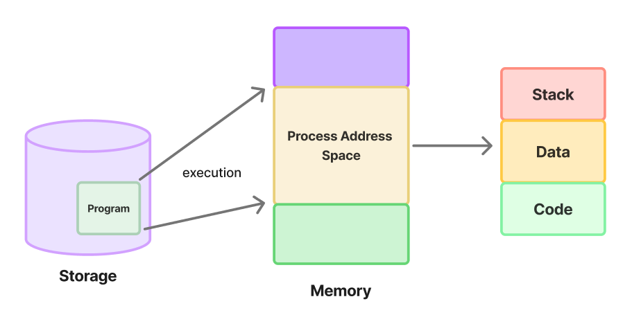

# 프로세스의 주소 공간

[프로세스의 주소 공간 | 👨🏻‍💻 Tech Interview](https://gyoogle.dev/blog/computer-science/operating-system/Process%20Address%20Space.html)

**<목차>**

---

# **프로세스 주소 공간**

<aside>
💡

프로그램이 실행되면 메모리를 할당받는데, 이렇게 할당받은 메모리를 관리하기 위해 프로세스가 만드는 특정 구조

</aside>

프로세스 주소 공간 구성 요소 = Code, Data, Stack

## **1. Code(Text) 영역**

- 우리가 작성한 **소스코드**가 보관되는 곳으로, **실행할 프로그램의 코드가 저장**되는 영역
- 실행 파일을 구성하는 명령어들이 올라가는 메모리 영역 (함수, 제어문, 상수 등)
- **Read-Only** (컴파일 후 코드 변경 불가)

## 2. **Data 영역**

- 프로그램의 **전역 변수와 정적(static) 변수가 저장**되는 영역
- 프로그램의 시작과 함께 할당되며, 프로그램이 종료되면 소멸
- **Read-Write** (실행 중도에 전역변수가 변경 될 수도 있음)

## 3. Stack 영역

- 함수의 호출과 관계되는 **지역 변수와 매개변수가 저장**되는 영역
- 함수의 호출과 함께 할당되며, 함수의 호출이 완료되면 소멸
- 원시타입의 데이터가 값과 함께 할당
- 메모리의 높은 주소에서 낮은 주소의 방향으로 할당
- **컴파일 타임에 크기가 결정되기 때문에 무한히 할당 불가**
  **→** stack 영역을 초과하면 **stack overflow 에러**가 발생

# 공간 구분

## **Code 부분을 따로 두는 이유**

- Program의 Code는 Program이 만들어지고(컴파일되고) 나서는 바뀔 일 X
  → Read Only
- 같은 프로그램이라면 Code 부분은 다 똑같은 내용이니, Code 부분을 공유하여 메모리 사용량 ⬇️

## **Stack과 Data 공간을 구분하는 이유**

프로그램의 함수와 지역 변수는, LIFO(가장 나중에 들어간게 먼저 나옴) 특성을 가진 스택에서 실행됨

→ 전역 변수(global variables)는 어떤 함수에서도 접근 할 수 있기 때문에 Data로 따로 관리

함수 실행 시마다 잠깐 쓰이는 지역 변수는 Stack에, 프로그램 전체에서 공유되는 전역 변수는 Data에 저장

---

_참고 자료_

[[운영체제] 프로세스 주소 공간](https://velog.io/@klm03025/%EC%9A%B4%EC%98%81%EC%B2%B4%EC%A0%9C-%ED%94%84%EB%A1%9C%EC%84%B8%EC%8A%A4-%EC%A3%BC%EC%86%8C-%EA%B3%B5%EA%B0%84)

[[OS] 프로세스의 주소 공간 — while(true) { continue; }](https://m42-orion.tistory.com/128)

[[운영체제] 프로세스 주소 공간 :: y-log](https://yaelimeee.tistory.com/47)
