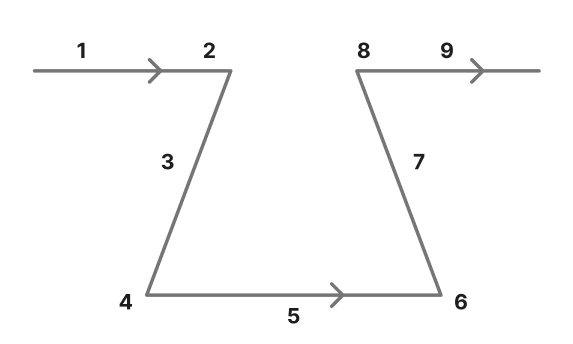

# 인터럽트 (Interrupt)

[인터럽트(Interrupt) | 👨🏻‍💻 Tech Interview](https://gyoogle.dev/blog/computer-science/operating-system/Interrupt.html)

**<목차>**

---

# **인터럽트 (Interrupt)**

<aside>
💡

프로그램을 실행하는 도중에 예기치 않은 상황이 발생한 경우, 현재 실행 중인 작업을 즉시 중단하고 발생된 상황에 대한 우선 처리가 필요함을 CPU에게 알리는 것

</aside>

외부/내부 인터럽트 = `CPU의 하드웨어 신호에 의해 발생`

소프트웨어 인터럽트 = `명령어의 수행에 의해 발생`

인터럽트는, **발생시기를 예측하기 힘든 경우에 컨트롤러가 가장 빠르게 대응할 수 있는 방법**

## 인터럽트 종류

### **외부 인터럽트**

> 입출력 장치, 타이밍 장치, 전원 등 외부적인 요인으로 발생

ex) 전원 이상, 기계 착오, 외부 신호, 입출력 등…

- 전원 이상 인터럽트(Power fail Interrupt) : 정전, 파워 이상 등의 경우
- 기계 착오 인터럽트(Machine Check Interrupt) : CPU의 기능적인 오류의 경우
- 외부 신호 인터럽트(External Interrupt)
  : 타이머 인터럽트(자원이 할당된 시간이 다 끝난 경우), 키보드 인터럽트(`Control` + `Alt` + `Delete`), 외부장치 인터럽트
- 입출력 인터럽트(I/O Interrupt): 입출력 장치가 데이터 전송을 요구하거나 다음 동작이 수행되어야 할 경우 입출력 데이터에 이상이 있는 경우

### 내부 인터럽트

> 잘못된 명령이나 잘못된 데이터를 사용할 때 발생 (Trap이라고도 불림)

프로그램 검사 인터럽트(Program Check Interrupt)

: 0으로 나눈 경우, Overflow/Underflow, 기타 예외 경우

### **소프트웨어 인터럽트**

> 프로그램 처리 중 명령의 요청에 의해 발생한 것 (SVC 인터럽트)

- 사용자가 프로그램을 실행시킬 때 발생
- 소프트웨어 이용 중에 다른 프로세스를 실행시키면, 시분할 처리를 위해 자원 할당 동작이 수행

## 인터럽트 처리 과정

1.  주 프로그램 실행
2.  인터럽트 발생
3.  복귀주소 저장
4.  인터럽트 벡터로 점프
5.  인터럽트 처리
6.  인터럽트 처리 완료
7.  복귀주소 로드
8.  마지막에 실행되던 주소로 점프
9.  주 프로그램 실행

## **인터럽트 우선순위**

하드웨어 인터럽트 > 소프트웨어 인터럽트

외부 인터럽트 > 내부 인터럽트

1. 전원 이상
2. 기계 착오
3. 외부 신호
4. 입출력 신호
5. 명령어 잘못
6. 프로그램 검사
7. SVC

### 우선순위 판별 방법

**폴링 방식**

: 사용자가 명령어를 사용해 입력 핀의 값을 계속 읽어 변화를 알아내는 방식

인터럽트 요청 플래그를 차례로 비교하여 우선순위가 가장 높은 인터럽트 자원을 찾아 이에 맞는 인터럽트 서비스 루틴을 수행 (하드웨어보다 속도 느림)

**인터럽트 방식**

: MCU 자체가 하드웨적으로 변화를 체크하여 변화 시에만 일정한 동작을 하는 방식

- Daisy Chain
- 병렬 우선순위 부여

폴링에 비해 신속하게 대응하는 것이 가능 → 실시간 대응이 필요할 때 필수

---

_참고 자료_

[[CS - 운영체제] 인터럽트란?](https://velog.io/@wngkdroqkf441/CS-%EC%9A%B4%EC%98%81%EC%B2%B4%EC%A0%9C-%EC%9D%B8%ED%84%B0%EB%9F%BD%ED%8A%B8%EB%9E%80)

[[CS 스터디] 인터럽트 (Interrupt) — Yoo 스터디](https://doubleyoo.tistory.com/56)

[운영체제 - 인터럽트(Interrupt) — Ho_Tech_Story](https://hotechstory.tistory.com/155)
