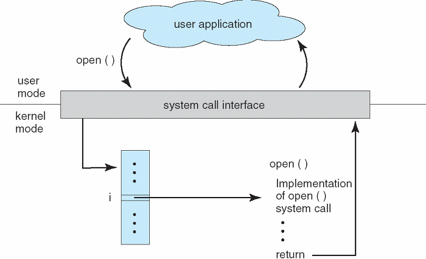

# 시스템 콜 (System Call)

[System Call | 👨🏻‍💻 Tech Interview](https://gyoogle.dev/blog/computer-science/operating-system/System%20Call.html)

**<목차>**

---

# 시스템 콜 (**System Call)**

<aside>
💡

프로세스가 시스템의 자원이나, 서비스를 필요로 할 경우 운영체제에게 요청하는 것

</aside>

## 시스템 콜 동작 과정



1. 사용자 프로세스가 시스템 콜 호출(Kernel mode 진입)
2. 커널은 내부적으로 시스템 콜을 분하기 위해 기능별로 고유번호를 할당한 후, 그 번호에 해당하는 제어 루틴을 정의
3. 커널은 요청받은 시스템 콜에 대응하는 고유번호 확인하고 번호에 맞는 서비스 루틴 호출
4. 커널은 서비스 루틴을 처리하고, 사용자 모드(User mode)로 전환

## 시스템 콜 유형

### 1. **프로세스 제어**

- 끝내기(exit), 중지(abort)
- 적재(load), 실행(execute)
- 프로세스 생성(create process) - fork

**Fork**

> 새로운 Process를 생성할 때 사용 (그러나 이상한 방식임)

```c
#include <stdio.h>
#include <stdlib.h>
#include <unistd.h>

int main(int argc, char *argv[]) {
    printf("pid : %d", (int) getpid()); // pid : 29146

    int rc = fork();					// 주목

    if (rc < 0) {
        exit(1);
    }									// (1) fork 실패
    else if (rc == 0) {					// (2) child 인 경우 (fork 값이 0)
        printf("child (pid : %d)", (int) getpid());
    }
    else {								// (3) parent case
        printf("parent of %d (pid : %d)", rc, (int)getpid());
    }
}
```

```
pid : 29146

parent of 29147 (pid : 29146)

child (pid : 29147)
```

**wait**

> child 프로세스가 종료될 때까지 기다리는 작업

```c
#include <stdio.h>
#include <stdlib.h>
#include <unistd.h>
#include <sys/wait.h>

int main(int argc, char *argv[]) {
    printf("pid : %d", (int) getpid()); // pid : 29146

    int rc = fork();					// 주목

    if (rc < 0) {
        exit(1);
    }									// (1) fork 실패
    else if (rc == 0) {					// (2) child 인 경우 (fork 값이 0)
        printf("child (pid : %d)", (int) getpid());
    }
    else {								// (3) parent case
        int wc = wait(NULL)				// 추가된 부분
        printf("parent of %d (wc : %d / pid : %d)", wc, rc, (int)getpid());
    }
}
```

wait를 통해서, child의 실행이 끝날 때까지 기다려줌…

parent가 먼저 실행되더라도, wait()는 child가 끝나기 전에는 return 안함 (반드시 child가 먼저 실행됨)

**exec**

> 단순 fork는 동일한 프로세스의 내용을 여러 번 동작할 때 사용하지만,
> child에서는 parent와 다른 동작을 하고 싶을 때는 exec를 사용할 수 있음

```c
#include <stdio.h>
#include <stdlib.h>
#include <unistd.h>
#include <sys/wait.h>

int main(int argc, char *argv[]) {
    printf("pid : %d", (int) getpid()); // pid : 29146

    int rc = fork();					// 주목

    if (rc < 0) {
        exit(1);
    }									// (1) fork 실패
    else if (rc == 0) {					// (2) child 인 경우 (fork 값이 0)
        printf("child (pid : %d)", (int) getpid());
        char *myargs[3];
        myargs[0] = strdup("wc");		// 내가 실행할 파일 이름
        myargs[1] = strdup("p3.c");		// 실행할 파일에 넘겨줄 argument
        myargs[2] = NULL;				// end of array
        execvp(myarges[0], myargs);		// wc 파일 실행.
        printf("this shouldn't print out") // 실행되지 않음.
    }
    else {								// (3) parent case
        int wc = wait(NULL)				// 추가된 부분
        printf("parent of %d (wc : %d / pid : %d)", wc, rc, (int)getpid());
    }
}
```

exec가 실행되면…

→ execvp( 실행 파일, 전달 인자 ) 함수는, code segment 영역에 실행 파일의 코드를 읽어와서 덮어 씌움

씌운 이후에는, heap, stack, 다른 메모리 영역이 초기화되고, OS는 그냥 실행한다. 즉, 새로운 Process를 생성하지 않고, 현재 프로그램에 wc라는 파일을 실행 (= execvp() 이후의 부분은 실행 X)

### 2.  **파일 조작**

- 읽기(read), 쓰기(write)
- 열기(open), 닫기(close)
- 파일 생성(create file), 파일 삭제(delete file)

### 3. **장치 관리**

- 하드웨어의 제어와 상태 정보를 얻음(ioctl)
- 장치를 요구(request devices), 장치를 방출(release device)
- 읽기(read), 쓰기(write)

### 4. **정보 유지**

- getpid(), alrarm(), sleep()
- 시간과 날짜의 설정과 획득(time)
- 시스템 데이터의 설정과 획득(date)

### 5. 통신

- pipe(), shm_open(), mmap()
- 통신 연결의 생성 및 제거
- 메시지의 송신 및 수신

---

_참고 자료_

[[운영체제] 운영체제(OS), 시스템 콜(System Call) — 밝은별 개발 블로그](<https://brightstarit.tistory.com/13#%EC%8B%9C%EC%8A%A4%ED%85%9C%20%EC%BD%9C(system%20call)-1>)

[[운영체제] 인터럽트 & 시스템 콜(Interrupt, System Call) — 유릉이의 개발 블로그](https://yunchan97.tistory.com/68)
