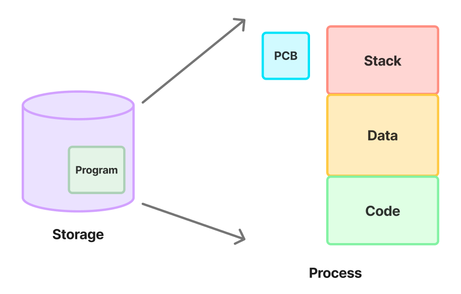

# PCB & Context Switching

[PCB & Context Switching | 👨🏻‍💻 Tech Interview](https://gyoogle.dev/blog/computer-science/operating-system/PCB%20&%20Context%20Switching.html)

**<목차>**

---

# **Process Management**

> CPU가 여러 개의 프로세스를 갖고 있을 때, CPU 스케줄링을 통해 관리하는 것

CPU는 각 프로세스들의 특징을 구분해야 관리 가능

→ **Process Metadata (프로세스의 속성 정보)** 사용!

Process Metadata의 종류

- Process ID (프로세스 고유 식별 번호)
- Process State (프로세스 상태)
- Process Priority (프로세스 우선 순위)
- CPU Registers (CPU 레지스터 정보)
- Owner (계정 정보)
- CPU Usage (CPU 사용량)
- Memory Usage (메모리 사용량)

위 메타데이터들은 프로세스가 생성된 후, **PCB(Process Control Block)**에 저장됨

# **PCB (Process Control Block)**

<aside>
💡

프로세스의 상태에 대한 정보를 저장하는 커널 내 자료구조

→ 한 PCB에는 하나의 프로세스에 대한 정보가 담김 (1 : 1 저장 형태)

</aside>



프로세스가 생성 → 해당 프로세스의 고유 PCB가 생성 → 프로세스가 완료되면 해당 PCB 제거

**프로세스 생성 과정**

```smalltalk
프로그램 실행 → 프로세스 생성 → 프로세스 주소 공간에 (코드, 데이터, 스택) 생성
 → 이 프로세스의 메타데이터들이 PCB에 저장
```

## PCB의 역할

**1. CPU 스케줄링**

여러 프로세스가 CPU를 공유하는 환경에서는 운영 체제가 어떤 프로세스를 얼마나 실행시킬지 결정해야 함

→ PCB에 저장된 프로세스의 우선 순위와 상태 정보 등을 활용하여 적절한 스케줄링 수행

**2. 프로세스 상태 관리**

프로세스가 생성되면 준비 상태(Ready), 실행 상태(Running), 대기 상태(Waiting) 등의 상태로 변화

→ 이러한 프로세스의 상태 변화를 PCB에 반영하여 관리

**3. 문맥 전환**

CPU는 여러 프로세스 사이에서 빠르게 전환하는데, 이때 현재 실행 중이던 프로세스의 상태를 저장하고 다음에 실행할 프로세스의 상태를 복원하는 작업 필요

→ PCB에 저장된 레지스터 값 등은 이러한 문맥 전환을 원활하게 하도록 도움

**4. 자원 관리**

PCB는 프로세스에게 할당된 자원 정보도 포함하여 관리

→ 운영 체제는 메모리, 입출력 장치 등의 자원을 효율적으로 관리 & 프로세스에 필요한 자원 할당

## PCB의 특징

**PCB(Process Control Block)의 상세 구조**


PCB의 특징

- 운영체제에서 프로세스는 PCB로 표현됨
- PCB는 프로세스 상태 관리와 context switching 을 위해서 필수
- PCB는 프로세스의 중요한 정보들을 가짐 → 일반 사용자는 접근 불가능한 보호된 메모리 영역에 존재

## **PCB가 필요한 이유**

CPU는 프로세스의 상태에 따라 교체 작업이 이루어짐

→ PCB는 문맥 교환 과정에서 **앞으로 다시 수행할 대기 중인 프로세스에 관한** 정보/상태/문맥을 저장해줌

현재 CPU 상에서 실행되던 프로세스의 정보를 자신의 PCB에 저장 후, 새롭게 CPU를 할당받는 프로세스는 PCB로부터 예전에 저장했던 그 정보를 복원시켜 이어받음

## **PCB의 관리 방식**


**Linked List 방식**으로 관리

- 프로세스 테이블을 통해 각 프로세스의 PCB를 관리하며, PCB는 연결 리스트 방식으로 관리됨
- PCB List Head에 PCB들이 생성될 때마다 하나씩 이어서 붙여짐
  → 삽입/삭제가 용이함
- 프로세스가 생성되면 해당 PCB가 생성되고, 프로세스 완료시 제거

# **Context Switching**

<aside>
💡

실행중이던 프로세스의 상태를 PCB에 보관하고, 새로 들어오는 프로세스의 PCB 정보를 바탕으로 레지스터에 값을 적재하는 과정

</aside>

**Context Switching이 필요한 경우…**


프로세스가 **`Ready → Running`**, **`Running → Ready`**, **`Running → Waiting`**… 처럼 **상태 변경** 시 발생!

## **Context Switching 과정**

**1. 요청 발생**


기존에 작업 중이던 프로세스 정지

**2. PCB에 프로세스 정보를 저장**


프로세스 정지 후, 기존에 실행 중이던 프로세스와 관련된 정보들(= Context)을 PCB0에 저장

**3. 새롭게 CPU 할당**


기존의 프로세스 정보를 PCB에 저장한 후, 새롭게 실행할 PCB1을 운영 체제가 가져와서 CPU 레지스터에 적재하고 해당 프로세스를 실행

운영체제는 새롭게 실행할 프로세스에 대한 정보를 해당 PCB에서 가져와 CPU 레지스터에 적재

**4. 새로운 프로세스 종료 후 기존 프로세스 다시 실행**


새로 실행하던 프로세스 종료 & 기존 프로세스 재실행

## **Context Switching Overhead**

Overhead = 과부하,

운영체제가 하나의 프로세스에서 다른 프로세스로 전환할 때 발생하는 상태 저장과 복원에 필요한 **추가적인 시간과 자원 낭비 (= 성능 손실)**

### **Overhead가 필요한 경우**

```
프로세스를 수행하던 중, 입출력 이벤트가 발생하여 기존 프로세스를 대기 상태로 전환시킴
  -> 이때, CPU를 그냥 가만히 놔두는 것보다 다른 프로세스를 수행시키는 것이 훨씬 효율적
```

다른 프로세스를 실행시키면서 동시에 문맥 교환 = Overhead 발생

_Why? CPU가 놀지 않도록 만들고, 사용자에게 빠른 일처리를 제공해주기 위한 것_

### **Overhead 해결 방안**

- 다중 프로그래밍 수준(time slice 주기)을 낮추어 문맥 교환 발생 빈도 감소
- 스레드를 이용해 문맥 교환 부하 최소화
  → 스레드는 메모리 영역을 공유하여 메모리 주소 관련 처리를 수행할 필요 X
- 스택 이용 프로그램의 경우, 스택 포인터를 활용해 문맥 교환 부하 ⬇️

---

_참고 자료_

[PCB 와 Context Switching 알아보기](https://velog.io/@haero_kim/PCB-%EC%99%80-Context-Switching-%EC%95%8C%EC%95%84%EB%B3%B4%EA%B8%B0)

[프로세스 제어 블록(PCB, Process Control Block)](https://ground90.tistory.com/100)

[[OS] PCB와 Context Switching : 네이버 블로그](https://m.blog.naver.com/adamdoha/222019884898)

[[OS] Context Switching, PCB (Process Control Block)](https://velog.io/@nnnyeong/OS-Context-Switching-PCB-Process-Control-Block#pcb-process-control-block)

[[운영체제] PCB와 문맥 교환(Context Switching) — ZU-TECHLOG](https://zu-techlog.tistory.com/123)

[운영체제 - PCB와 Context Switching — Ho_Tech_Story](https://hotechstory.tistory.com/157)
