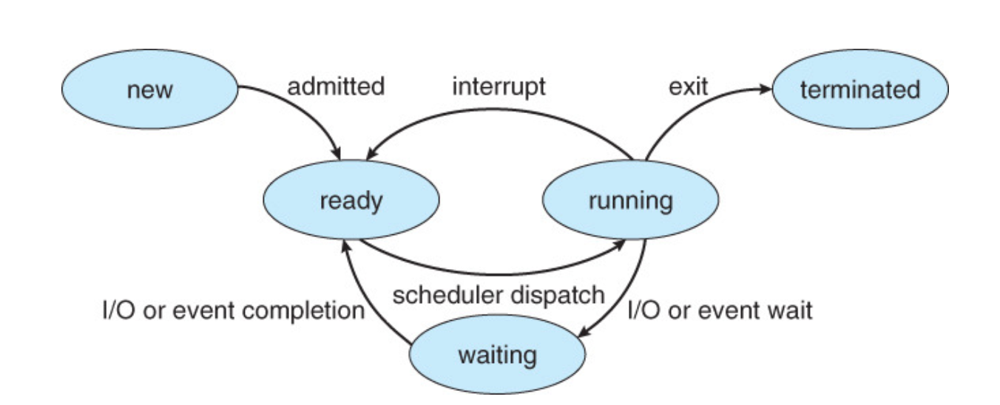

# CPU Scheduling

[CPU Scheduling | 👨🏻‍💻 Tech Interview](https://gyoogle.dev/blog/computer-science/operating-system/CPU%20Scheduling.html)

**<목차>**

---

# **CPU 스케줄링이란?**

<aside>
💡

작업을 처리하기 위해 프로세스들에게 CPU를 할당하기 위한 정책을 계획하는 것
**= 프로세스가 실행되는 순서를 정해주는 작업**

</aside>

컴퓨터 시스템의 효율은 어떤 프로세스에 CPU를 먼저 배정하는지에 따라 달라짐!

## **필요한 이유**

ex) 프로세스가 CPU를 점유하여 작업을 수행하는 도중 I/O 또는 인터럽트(Interrupt)가 발생한다면?

→ 프로세스는 인터럽트 때문에 일시적으로 CPU를 사용하지 않는데도 CPU를 계속 점유하게 됨

위 상황을 줄여서 CPU를 최대한 활용한다면 시스템의 성능 개선 가능

## **목표**

조건 : 오버헤드 ↓ / 사용률 ↑ / 기아 현상 ↓

모든 시스템의 목표

- 각각의 프로세스에 공평하게 CPU를 할당해야 함
- 시스템의 모든 부분을 사용 상태로 유지해야 함

**1. Batch system (일괄 처리 시스템)**

온라인처럼 일에 대한 요청이 발생했을 때 즉각적으로 처리하는게 아닌, 일정량을 모아뒀다가 한번에 처리하는 방식

목표 : 가능하면 많은 일을 수행, 시간(time) 보단 처리량(throughout)이 중요

**2. Interactive system (대화형 시스템)**

온라인같이 일에 대한 요청을 즉각 처리하여 응답을 받을 수 있는 시스템

목표 : 빠른 응답 시간 & 적은 대기 시간

**3. Real-time system (실시간 시스템)**

주어진 문제를 해결하기 위해 정해진 시간동안 처리하는 시스템

목표 : 데이터 손실을 피하고, 정해진 시간내에 완료해야 함

# CPU 스케줄링의 규모

**고수준 스케줄링**

시스템 내의 전체 작업 수를 조절하는 스케줄링 (어떤 작업을 시스템이 승인/거부할지 결정)

→ 이 부분에 따라 시스템 내에서 동시 실행 가능한 프로세스의 총 개수가 결정됨

**중간 수준 스케줄링**

중지/활성화로 전체 시스템의 활성화된 프로세스 수 조절 → 과부하 X

(+ 이미 활성화된 프로세스 중 일부를 보류 상태로 전달)

**저수준 스케줄링**

활성화된 프로세스를 준비 상태로 보낼지, 실행 상태로 보낼지, 대기 상태로 보낼지 결정하는 것

= 실제로 작업이 이루어지는 스케줄링

# CPU 스케줄링의 구분 (**선점 / 비선점 스케줄링)**

## **선점형 스케줄링 (Preemptive scheduling)**

> 어떤 프로세스가 CPU를 할당받아 실행 중이더라도 운영체제가 해당 CPU를 강제로 빼앗는 것이 가능한 스케줄링 방식
> (우선 순위가 높은 다른 프로세스가 현재 프로세스를 중단시키고 CPU를 점유함)

장점

- 비교적 응답이 빠름

단점

- 처리 시간을 예측하기 어려움
  ex) OS가 CPU의 사용권을 선점할 수 있는 경우, 강제 회수하는 경우
- 높은 우선순위 프로세스들이 계속 들어오는 경우 오버헤드가 발생할 수 있음

## **비선점형 스케줄링 (Non-preemptive scheduling)**

> 어떤 프로세스가 CPU를 점유한다면, 다른 프로세스가 이를 빼앗을 수 없는 스케줄링 방식

프로세스 종료 or I/O 등의 이벤트가 있을 때까지 실행 보장

→ 처리 시간 편차가 적은 특정 프로세스 환경에 유용 (처리시간 예측 용이)

장점

- 모든 프로세스에 대한 요구를 공정하게 처리할 수 있다
- 응답 시간을 예측할 수 있다

단점

- 짧은 작업을 수행하는 프로세스라도 긴 작업이 종료될 때까지 기다려야 할 가능성 ⬆️

## 프로세스

### **프로세스의 생명 주기**

프로세스 실행 = `CPU 실행`과 `입/출력 대기`의 사이클로 구성

**CPU I/O Burst Cycle**

: CPU 실행(execution)과 I/O 요청 대기(I/O wait)가 번갈아가며 프로세스의 실행이 이루어지는 것

선점 스케줄링 : `Interrupt`, `I/O or Event Completion`, `I/O or Event Wait`, `Exit`

비선점 스케줄링 : `I/O or Event Wait`, `Exit`

**<프로세스의 상태>**

- `생성(new)` : 프로세스가 메모리에 올라간 상태
- `준비(ready)` : 다른 프로세스가 CPU를 사용하고 있어서 할당을 기다리고 있는 상태
- `수행(running)` : 프로세스가 CPU를 점령하여 명령어가 실행되고 있는 상태
- `대기(waiting)` : I/O requests나 이벤트가 완료될 때까지 기다리고 있는 상태
  →해당 작업이 완료되면 ready queue로 이동함
- `종료(terminated)` : 프로세스의 명령어가 끝까지 진행, 또는 중간에 exit()이 발생하면 프로세스 종료

**<프로세스의 상태 전이>**

**승인 (Admitted)** : 프로세스 생성이 가능하여 승인됨

**스케줄러 디스패치 (Scheduler Dispatch)**
 : 준비 상태에 있는 프로세스 중 하나를 선택하여 실행시키는 것 (= 할당)

**인터럽트 (Interrupt)**
 : 예외, 입출력, 이벤트 등이 발생하여 현재 실행 중인 프로세스를 준비 상태로 바꾸고, 해당 작업을 먼저 처리하는 것

**입출력 또는 이벤트 대기 (I/O or Event wait)**
 : 실행 중인 프로세스가 입출력이나 이벤트를 처리해야 하는 경우, 입출력/이벤트가 모두 끝날 때까지 대기 상태로 만드는 것

**입출력 또는 이벤트 완료 (I/O or Event Completion)**
 : 입출력/이벤트가 끝난 프로세스를 준비 상태로 전환하여 스케줄러에 의해 선택될 수 있도록 만드는 것

### 프로세스의 우선순위

**커널 프로세스 vs 일반 프로세스**

커널 프로세스에서 더 많은 중요한 작업이 이루어지므로

- 커널 프로세스 : 커널 영역(Kernel Space)에서 동작하는 프로세스
  - 실행 작업 = 시스템 자원 관리(CPU, 메모리, 디스크, 네트워크 등), 입출력 제어, 인터럽트 처리 등…
- 일반 프로세스 : 사용자 공간(User Space)에서 동작하는 프로세스
  - 실행 작업 = 사용자가 실행한 응용 프로그램 (예: 웹브라우저, 엑셀, 게임 등)

우선순위는 `커널 프로세스 > 일반 프로세스`

**CPU 집중 프로세스 vs 입출력 집중 프로세스**

- CPU 집중 프로세스 : CPU 버스트(CPU Burst)가 많은 프로세스
  - PCU 버스트 = CPU를 할당받아 실행하는 작업
- 입출력 집중 프로세스 : 입출력 버스트(I/O Burst)가 많은 프로세스
  - 입출력 버스트 = 입출력 작업 (ex. 저장 장치에서 데이터 복사…)

우선순위는 `입출력 집중 프로세스 > CPU 집중 프로세스`

**전면 프로세스 vs 후면 프로세스**

- 전면 프로세스 : 입출력을 사용하여 사용자와 상호작용이 가능한 프로세스 → 즉각 반응 필요
- 후면 프로세스 : 사용자와 상호작용이 없음 (= 일괄 작업 프로세스)

우선순위는 `전면 프로세스 > 후면 프로세스`

# **CPU 스케줄링의 종류**

## 비선점 스케줄링의 종류

### FCFS (First Come First Served) 스케줄링

> CPU를 먼저 요청한 프로세스가 먼저 CPU를 배정 받는 스케줄링 방식

특징

- 큐에 도착한 순서대로 CPU 할당
  = 한 프로세스가 CPU를 차지하면 그 프로세스의 수행이 완료된 후 다음 프로세스가 CPU 차지
- 중요한 프로세스가 나중에 수행될 수 있는 불합리함 존재

### SJF (Shortest Job First) 스케줄링

> 준비 큐에 있는 프로세스 중에서 실행 시간이 가장 짧은 작업부터 CPU를 할당하는 방식

특징

- FCFS보다 평균 대기 시간이 짧으며, 짧은 작업에 유리
- 일괄처리 환경에서 구현이 쉬움
- 알고리즘으로 실행할 프로세스의 CPU 소요시간이 미리 주어짐
- CPU 요구시간이 긴 작업과 짧은 작업간의 불평등 ⬆️
  = CPU 요구시간이 긴 프로세스는 기아 현상발생

### HRN (Highest Response-ratio Next) 스케줄링

> SJF 스케줄링에서 발생할 수 있는 기아 상태를 해결하기 위해 만들어진 비선점형 알고리즘 방식
> (= 최고 응답률 우선 스케줄링)

SJF의 스케줄링의 우선순위 판단 기준 = 프로세스의 실행 시간

HRN의 스케줄링의 우선순위 판단 기준 = 대기 시간 & CPU 사용 시간 → **실행 시간을 고려**하여 스케줄링!

특징

- SJF 스케줄링의 단점인 기아 상태(점유 불평등)는 완화, 그러나 여전히 공평성 문제로 사용률 ⬇️
- _우선순위 계산 수식_
  $$
  우선순위 = \frac{대기\ 시간 + CPU\ 사용\ 시간}{CPU\ 사용\ 시간}
  $$
- 대기 시간이 긴 프로세스 → 우선순위 높음

## 선점 스케줄링의 종류

### 우선순위 (Priority) 스케줄링

> 정적/동적으로 각 프로세스마다 우선순위를 부여하여 우선순위가 높은 순서대로 처리하는 방식

특징

- 우선순위가 같을 경우 FCFS 적용
- 설정, 자원 상황등에 따른 우선순위를 선정해 주요/긴급 프로세스에 대한 우선처리 가능
- 우선 순위가 낮은 프로세스가 무한정 기다리는 **기아 상태**가 발생할 수 있음
  _해결 방법) Aging 방법 사용 → 오래 기다릴수록 우선순위를 조금씩 높여주는 방식_

### 라운드 로빈 (Round Robin) 스케줄링

> 한 프로세스가 할당받은 시간(`Time Slice (Time Quantum)`) 동안 작업을 하다가 완료하지 못하면 준비 큐의 맨 뒤로 가서 자기 차례를 기다리는 방식

`Time Slice (Time Quantum)` : 실행의 최소 단위 시간

특징

- 프로세스마다 같은 크기의 CPU 시간을 할당받음 (보통 10 ~ 100 ms 정도…)
- 선점형 알고리즘 중 우선순위가 적용되지 않은 가장 단순한 방식
  → 프로세스의 작업 완료까지 계속 순환 실행…
- 균등한 CPU 점유 시간을 보장하며, 시분할 시스템에 주로 사용
- 할당 시간(`Time Quantum`)이 크면 FCFS와 같아짐
- 작으면 문맥 교환 (Context Switching) 잦아짐 → 오버헤드 증가

### SRT (Shortest Remaining Time) 스케줄링

> SJF 스케줄링과 라운드 로빈 스케줄링을 혼합한 방식 (= 최소 잔류 시간 우선 스케줄링)

기본적으로는 라운드 로빈 스케줄링을 사용하며, CPU를 할당받을 프로세스를 선택할 때는 남은 작업 시간이 가장 적은 프로세스를 선택

먼저 CPU를 할당받아 실행되고 있는 프로세스가 있더라도 대기 큐에 작업 시간이 더 적은 프로세스가 도착

→ 현재 실행되고 있는 프로세스를 대기 상태로 전송 & 작업 시간이 더 적은 프로세스가 CPU를 할당받게 함

특징

- SJF 스케줄링의 선점형 버전 (SJF는 비선점형 스케줄링 방식)
- SJF 스케줄링보다 평균 대기 시간이 더 짧음
- 운영체제가 프로세스 종료 시간을 예측하기 어렵고 기아 상태 발생 가능성 ⬆️ = 사용률 ⬇️
- 각 프로세스가 서비스를 받은 시간을 기록 + 선점을 위한 문맥 교환이 필요 = SJF보다 오버헤드 ⬆️

### Multilevel-Queue (다단계 큐)

> 우선순위에 따라 준비 큐를 여러 개 사용하는 방식

특징

- 우선순위가 낮은 큐들이 실행 못하는 걸 방지하고자 각 큐마다 다른 `Time Quantum`을 설정
  → 우선순위가 높은 큐는 작은 `Time Quantum` 할당, 우선순위가 낮은 큐는 큰 `Time Quantum` 할당
  (`Time Quantum` or `Time Slice` = 실행의 최소 단위 시간)
- 각 큐는 자신만의 독자적인 스케쥴링을 가짐

### Multilevel-Feedback-Queue (다단계 피드백 큐)

> 입출력 위주 / CPU 위주인 프로세스의 특성에 따라 큐마다 서로 다른 CPU 시간 할당량을 부여하는 방식
> (FCFS + 라운드 로빈 기법)

다단계 큐에서 자신의 `Time Quantum`을 다 채운 프로세스는 밑으로 이동

- 자신의 `Time Quantum`을 다 채우지 못한 프로세스는 원래 큐 그대로 대기

(Time Quantum을 다 채운 프로세스는 CPU burst 프로세스로 판단하기 때문)

특징

- n개의 단계가 있는 경우, 각 단계마다 하나씩의 큐가 존재
  단계 k는 단계 k+1에 피드백을 전달… 단계가 커질수록 시간 할당량은 커지는 형태로 구성
- 새로운 프로세스는 높은 우선순위를 가지지만 프로세스의 실행 시간이 길어질수록 점점 낮은 우선순위 큐로 이동 → 마지막 단계가 되면 FCFS 방식을 적용
  (우선 순위가 낮을 수록 시간할당량을 크게 줌으로써 보완)
- 짧은 작업에 유리, 입출력 위주(= Interrupt가 잦은) 작업에 우선권 부여
- 처리 시간이 짧은 프로세스를 먼저 처리 → Turnaround 평균 시간 ⬇️

# **CPU 스케줄링의 척도**

### 시스템 관점 비교

**1) CPU utilization (CPU 이용률)**

CPU가 쉬지 않고 일한 시간의 비율 → 이용률이 높을수록 좋음

CPU 스케줄링(어떤 프로세스를 먼저하는지 등)에 따라서 이용률의 차이가 발생

**2) Throughput (처리량)**

단위시간 당 처리량 → 처리량이 높을수록 좋음

= 시스템 입장에서 얼마나 많은 일을 했는가? (= 프로세스를 얼마나 처리했는지?)

### 사용자 관점 비교

**3) Response Time (응답 시간)**

작업이 처음 실행되기까지 걸린 시간

= 특정 프로세스가 CPU를 사용하기 위해 들어오고, CPU를 최초로 사용하기까지 걸린 시간

**4) Waiting time (대기시간)**

CPU를 사용하기 위해 기다린 전체 시간의 합

**5) Turnaround Time (소요 시간, 반환 시간)**

CPU Burst에 들어와서 I/O Burst가 될 때까지 걸린 전체 시간의 합

= Ready Queue에서 기다린 시간 + 실제로 CPU를 사용한 시간

---

_참고 자료_

[[CS] CPU 스케줄링](https://velog.io/@marisol/CS-CPU-%EC%8A%A4%EC%BC%80%EC%A4%84%EB%A7%81)

[[운영체제] CPU 스케줄링](https://rob-coding.tistory.com/31)

[multilevel queue](https://notesformsc.org/multilevel-queue/)

[운영체제(OS) - 스케줄링(Scheduling) — Clamp](https://clamp-coding.tistory.com/71)

[[면접을 위한 CS 전공지식 노트] 3-4 CPU 스케줄링 알고리즘](https://woohyun-king.tistory.com/335)

[[운영체제 03] 스케줄링 알고리즘 - 차근차근 개발로그](https://hyuntaekhong.github.io/blog/OperatingSystem03/)

[운영체제 - CPU스케줄링이 필요한 이유, CPU스케줄링 성능척도](https://structuring.tistory.com/133#google_vignette)
