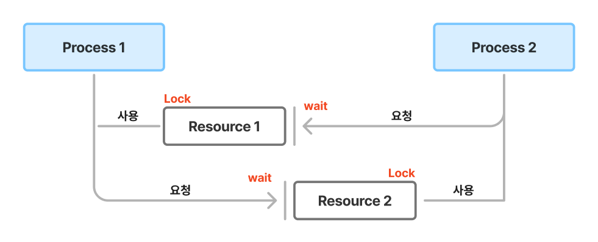

# 데드락 (Dead Lock, 교착 상태)

[데드락 (DeadLock, 교착 상태) | 👨🏻‍💻 Tech Interview](https://gyoogle.dev/blog/computer-science/operating-system/DeadLock.html)

**<목차>**

---

# **데드락 (Dead Lock, 교착 상태)**

<aside>
💡

둘 이상의 프로세스나 스레드가 다른 프로세스가 점유하고 있는 자원을 서로 기다릴 때 무한 대기에 빠지는 상황 (= 처리 불가 상태)

</aside>

_ex) Process 1과 Process 2 모두 Resource1, 2가 필요한 상황…_

_서로 자원을 각각 하나씩 점유하고 있고, 상대방이 자원을 해제할때까지 대기 중 = 무한 대기(wait) 상태_

## 데드락(**Dead Lock)** 발생 조건

아래 4가지 조건을 **전부 충족**해야 데드락 발생

(하나라도 성립하지 않는다면 데드락 발생 X, 해결 가능)

1. **상호배제(Mutual Exclusion)**

> 여러 프로세스가 공유 자원 사용 → 자원은 한 번에 한 프로세스만이 사용할 수 있어야 함

1. **점유 대기 (Hold and wait)**

> 자원을 최소한 하나 보유하고, 다른 프로세스에 할당된 자원을 점유하기 위해 대기하는 프로세스가 존재해야 함

1. **비선점 (No preemption)**

> 이미 할당된 자원을 강제로 빼앗을 수 없음 (비선점)

1. **순환대기(Circular Wait)**

> 대기 프로세스의 집합이 순환 형태로 자원을 대기하고 있어야 함

## 데드락(**Dead Lock) 예방 & 회피**

### 예방

위 발생조건 4가지 중 하나를 부정하므로써 데드락을 예방 (그러나 자원의 낭비 ⬆️)

**자원의 상호 배제 조건 방지**

> 한 번에 여러 프로세스가 공유 자원을 사용할 수 있게 하기 → 추후 동기화 관련 문제 발생 가능⬆️

**점유 대기 조건 방지**

> 프로세스가 실행되기 전 필요한 모든 자원을 할당하기

**비선점 (No preemption) 방지**

> 이미 다른 프로세스에게 할당된 자원이 선점권이 없다고 가정할 때, 높은 우선 순위의 프로세스가 해당 자원을 선점할 수 있도록 하기

**순환 대기 조건 방지**

> 자원을 순환 형태로 대기하지 않도록 일정한 한 쪽 방향으로만 자원을 요구하도록 만들기

### 회피

_키워드 : **Safe sequence, Safe state** 등…_

- **안정 상태 (safe state)**
  : 시스템의 프로세스들이 요청하는 모든 자원을, 데드락을 발생시키지 않으면서 차례대로 모두에게 할당해 줄 수 있는 상태
- **안전 순서 (safe sequence)**
  : 특정한 순서로 프로세스들에게 자원을 할당, 실행 및 종료 등의 작업을 할 때 **데드락이 발생하지 않는 순서**를 찾을 수 있는 것

회피? 자원을 할당한 후에도 시스템이 항상 **Safe state**에 있을 수 있도록 할당을 허용해야 함

→ “은행원 알고리즘” 사용!

**은행원 알고리즘 (Banker’s Algorithm)**

어떤 자원의 할당을 허용하는지에 관한 여부를 결정하기 전에, **미리 결정된 모든 자원들의 최대 가능한 할당량을 가지고 시뮬레이션 해서 Safe state에 들 수 있는지 여부**를 검사하는 알고리즘

= 대기중이 다른 프로세스들의 활동에 대한 교착 상태 가능성을 미리 조사하는 것

_ex) 처음에 시스템이 총 12개의 자원을 가지고 있다고 가정_

`P0 ~ P2` : 프로세스

MAX : 각 프로세스마다 최대 자원 요청량

Allocation : 현재 프로세스에 할당 중인 자원의 양

Need : 남은 필요한 자원의 양(Max-Allocation)

1. 현재 t0일 때 할당된 자원의 양은 5 + 2 + 2 = 9, 즉 현재 Available 자원은 12 - 9 = 3개
2. `P0`은 2개가 할당되어 있고 2개를 추가적으로 할당받기를 대기 중,

   현재 **Available 자원은 3개**이므로, 이 중에 2개를 P1에게 할당

   ⇒ **현재 Available은 3 - 2 = 1개**

3. 실행이 끝난 `P1`은 자신에게 할당되어 있던 자원 4개를 모두 반납

   ⇒ **현재 Available은 1 + 4 = 5개**

4. 현재 Available 자원이 5개이고, 이를 **P0에게 모두 할당해 주면** P0도 실행 가능

   ⇒ **현재 Available은 5 - 5 = 0개**

5. 실행이 끝난 `P0`은 자신에게 할당되어 있던 자원 10개를 모두 반납

   ⇒ **현재 Available은 0 + 10 = 10개**

6. 마지막으로 `P2`에게 자원 7개를 할당

   ⇒ **현재 Available은 10 - 7 = 3개**

7. 실행이 끝난 `P2`는 자신에게 할당되어 있던 자원 9개를 모두 반납

   ⇒ **현재 Available은 3 + 9 = 12개**

자원의 부족함 없이 올바르게 할당하여 모든 프로세스가 실행 가능!

은행원 알고리즘 단점 :

- 미리 최대 자원 요구량을 알아야 함
- 할당할 수 있는 자원 수가 일정해야 함 → 자원 이용도의 하락

## 데드락(**Dead Lock) 탐지 & 회복**

데드락 상태가 되도록 허용한 뒤, 그것을 탐지하여 회복시키는 방법

### 탐지

> Allocation, Request, Available 등으로 시스템에 **데드락이 발생했는지 여부를 탐색**
> (현재 시스템의 자원 할당 상태를 가지고 파악)

또는 자원 할당 그래프를 활용하여 교착 상태를 탐지…

### 회복

> 교착 상태 일으킨 프로세스를 종료하거나, 할당된 자원을 해제시켜 회복시키는 방법
> (`순환 대기` 상태에서 벗어나 데드락 해제)

회복 방법

- **프로세스 종료 방법**
  - 교착 상태인 모든 프로세스 중단
  - 프로세스를 하나씩 중단시키며 데드락 탐지 & 회복
- **자원 선점 방법**
  - 프로세스에 할당된 자원을 선점해서, 교착 상태를 해결할 때까지 그 자원을 다른 프로세스에 할당
    (우선 순위가 낮은 프로세스나 수행 횟수가 적은 프로세스 위주로 프로세스 자원 선점)

---

_참고 자료_

[[CS] 데드락(Deadlock)](https://velog.io/@qweadzs/CS-%EB%8D%B0%EB%93%9C%EB%9D%BDDeadlock)

[[CS] 교착상태(Deadlock)란?](https://velog.io/@xnelb013/CS-%EA%B5%90%EC%B0%A9%EC%83%81%ED%83%9CDeadlock%EB%9E%80)

[[운영체제] 데드락(Deadlock, 교착 상태)이란? | ChanBLOG](https://chanhuiseok.github.io/posts/cs-2/)
