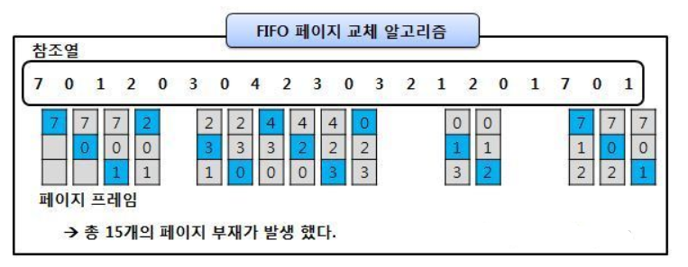

# 페이지 교체 알고리즘

[페이지 교체 알고리즘 | 👨🏻‍💻 Tech Interview](https://gyoogle.dev/blog/computer-science/operating-system/Page%20Replacement%20Algorithm.html)

**<목차>**

---

# 페이지 교체 알고리즘

## 개요

<aside>
💡

페이지 부재 발생 → 새로운 페이지를 할당해야 함

→ 현재 할당된 페이지 중 어떤 것 교체할 지 결정하는 방법

</aside>

### 가상 메모리와 페이지 교체의 관계

- 가상 메모리는 **요구 페이징 기법(Demand Paging)** 을 통해 필요한 페이지만 메모리에 적재하고, 사용하지 않는 부분은 그대로 보조기억장치에 보관
- 그러나 시간이 지나면, 메모리가 가득 차고 **사용이 끝난 페이지가 자리만 차지하고 있는 상황**이 발생

### 페이지 교체가 필요한 이유

1️⃣ 메모리가 가득 차면 새 페이지를 올릴 수 없음

2️⃣ 따라서 사용하지 않는 페이지를 메모리에서 내보내야 함 (Swap Out)

3️⃣ 그 공간에 새로 필요한 페이지를 올림 (Swap In)

→ 이때 **어떤 페이지를 내보낼지**를 결정하는 게 바로 페이지 교체 알고리즘

### **Page Reference String**

> CPU의 주소 요구에 따라 페이지 결함이 일어나지 않는 부분은 생략하여 표시하는 방법

- CPU는 논리 주소를 통해 특정 주소를 요구
- 메인 메모리에 올라와 있는 주소들은 페이지의 단위로 가져옴
  → 페이지 번호가 연속되어 나타나게 되면 페이지 결함 발생 X

## 주요 페이지 교체 알고리즘

### **FIFO 알고리즘**

> 메모리에 먼저 올라온 페이지를 먼저 내보내는 알고리즘 (First-in First-out)

**victim page** : out 되는 페이지는, 가장 먼저 메모리에 올라온 페이지

- 가장 간단한 방법으로, 특히 초기화 코드에서 적절한 방법
- `초기화 코드` : 처음 프로세스 실행될 때 최초 초기화를 시키는 역할만 진행하고 다른 역할은 수행하지 않으므로, 메인 메모리에서 빼도 상관 X
- 하지만 처음 프로세스 실행시에는 무조건 필요한 코드이므로, FIFO 알고리즘을 사용하면 초기화를 시켜준 후 가장 먼저 내보내는 것이 가능

### **OPT 알고리즘**

### **LRU 알고리즘**

## **교체 방식**

### **Global 교체**

> 메모리 상의 모든 프로세스 페이지에 대해 교체하는 방식

모든 프로세스의 페이지를 대상으로 교체

### **Local 교체**

> 메모리 상의 자기 프로세스 페이지에서만 교체하는 방식

자기 프로세스 내부의 페이지에서만 교체

- 전체를 기준으로 페이지를 교체하는 것이 더 효율적…

→ 자기 프로세스 페이지에서만 교체를 하면, 교체를 해야할 때 각각 다 교체를 진행해야 하니 비효율적

---

_참고 자료_

[[OS] 페이지 교체 알고리즘 - FIFO/LRU/LFU/MFU/NUR :: DOHAN's iOS](https://doh-an.tistory.com/28)

[[운영체제] 페이지 교체 알고리즘](https://rob-coding.tistory.com/37)

[[OS] 페이지 교체 알고리즘 (FIFO/최적/LRU/LFU/NUR)](https://sommda.tistory.com/67)

[OS는 할껀데 핵심만 합니다. 17편 페이지 교체 알고리즘(FIFO, LRU, LFU , NUR, 2차 기회 알고리즘, 시계 알고리즘)](https://velog.io/@chappi/OS%EB%8A%94-%ED%95%A0%EA%BB%80%EB%8D%B0-%ED%95%B5%EC%8B%AC%EB%A7%8C-%ED%95%A9%EB%8B%88%EB%8B%A4.-17%ED%8E%B8-%ED%8E%98%EC%9D%B4%EC%A7%80-%EA%B5%90%EC%B2%B4-%EC%95%8C%EA%B3%A0%EB%A6%AC%EC%A6%98FIFO-LRU-LFU-NUR-2%EC%B0%A8-%EA%B8%B0%ED%9A%8C-%EC%95%8C%EA%B3%A0%EB%A6%AC%EC%A6%98-%EC%8B%9C%EA%B3%84-%EC%95%8C%EA%B3%A0%EB%A6%AC%EC%A6%98)
