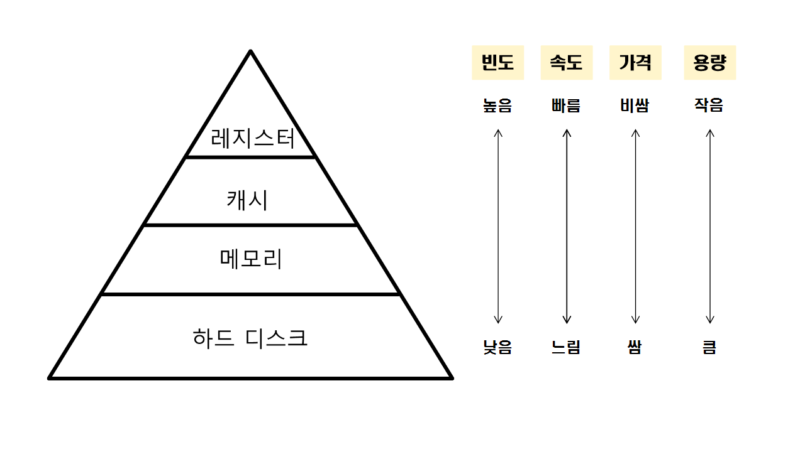

# 메모리(Memory)

[메인 메모리(main memory) | 👨🏻‍💻 Tech Interview](https://gyoogle.dev/blog/computer-science/operating-system/Memory.html)

**<목차>**

---

# **메인 메모리(main memory)**

## **메인 메모리(main memory)**란?

<aside>
💡

CPU가 직접 접근할 수 있는 기억 장치

(= 주기억장치 or RAM)

</aside>

→ 프로세스의 실행은 프로그램이 메모리에 올라와야 가능 (프로세스로 변함)

**RAM(Random Access Memory)**

: 어느 위치에 저장된 데이터든지 접근하는 데 동일한 시간이 걸리는 메모리

RAM의 종류

- DRAM(동적 메모리) ← 주기억장치
- SRAM(정적 메모리)



## 메인 메모리의 특징

- 컴퓨터의 CPU가 현재 처리중인 데이터나 명령만을 일시적으로 저장하는 **휘발성 메모리**
  → 전원을 끄면 메인 메모리에 저장된 내용들이 전부 삭제됨
- 컴퓨터가 꺼진 이후에도 데이터를 유지하고 싶은 경우엔 데이터를 **하드디스크**에 저장해야 함
- 보조기억장치(HDD, SSD 등)보다 접근속도가 빠름
- 매번 메인 메모리에 직접 접근하는 것은 비효율적
  → CPU와 메인 메모리 속도를 맞추기 위해 **캐시 메모리**가 존재

# 주소 체계

## **주소 체계를 구분하는 이유**

- 프로그램이 실행되고 삭제되면서 주소가 달라질 수 있음
- 같은 프로그램을 실행할때, 오늘 실행한 주소값과 내일 실행한 주소값이 다를 수 있음

## **주소 체계의 종류**

> **물리 주소 (Physical Address)**
>
> : 실제 메모리 하드웨어(RAM) 안의 주소 (= 데이터가 실제로 저장되어 있는 위치)

> **논리 주소 (Logical Address)**
>
> : CPU와 실행 중인 프로그램 입장에서 보는 주소 (= MMU가 만들어주는 CPU가 직접 다루는 가상 주소)


왼쪽(논리주소) VS 오른쪽(물리주소)

논리 주소 측면에서 프로그램1, 프로그램2는 0부터 시작하는 자신만의 논리주소를 가질 수 있음

→ CPU는 해당 논리 주소를 받아들이고, 해석하고, 연산

# **MMU(Memory Management Unit, 메모리 관리 장치)**

<aside>
💡

CPU 내 레지스터를 토대로 논리 주소를 물리 주소로 변환해주며, 메모리 보호나 캐시 관리 등 CPU가 메모리에 접근하는 것을 총 관리해주는 하드웨어 장치

</aside>

**변환 적용 방식 : 베이스 레지스터 + 논리 주소 = 물리 주소**

CPU는 레지스터가 지시하는대로 메모리에 접근하여 다음에 수행할 명령어를 가져옴,

그러나 명령어 수행 시 메모리에 필요한 데이터가 없으면 해당 데이터를 우선으로 가져와야 함…

= MMU가 하는 역할!

**가상 주소** (= 논리 주소)

: 메모리의 공간이 한정적이기 때문에, 사용자에게 더 많은 메모리를 제공하기 위해 생긴 개념

위 가상 주소에서 실제 데이터가 담겨 있는 곳에 접근하려면? 빠른 주소 변환이 필요! → **MMU**를 사용

**MMU의 장점**

- 모든 프로세스가 동일한 논리 주소를 사용할 수 있게 해줌
      → 실제로는 서로 다른 공간에 매핑되니 충돌 X
- 물리적으로 떨어진 데이터를 연속된 데이터처럼 표현 가능
- CPU가 직접 물리 주소(physical address)를 관리하지 않아도 됨 → 메모리 접근 관리의 단순화
- 프로세스의 크기가 실제 메모리의 용량을 초과해도 실행될 수 있게 해줌 (가상 메모리)

## **MMU의 메모리 보호**

프로세스는 독립적인 메모리 공간을 가져야 하며, 자신에게 할당된 공간만 접근해야 함

→ MMU는 한 프로세스에게 합법적인 주소 영역을 설정하고, 잘못된 접근이 오면 trap을 발생시키며 보호


**base와 limit 레지스터를 활용한 메모리 보호 기법**

- base 레지스터 : 메모리 상의 프로세스 시작 주소를 물리 주소로 저장
- limit 레지스터 : 프로세스의 사이즈를 저장

**프로세스의 접근 가능한 합법적인 메모리 영역(x)**

```
base <= x < base+limit
```

이 영역 밖에서 접근을 요구 = trap 발생

- base와 limit 레지스터는 커널 모드에서만 수정 가능하도록 설계하자 (사용자 모드에서는 수정 불가)

# 메모리 관리 기법

## **메모리 과할당(over allocating)**

<aside>
💡

실제 메모리의 사이즈보다 더 큰 사이즈의 메모리를 프로세스에 할당한 상황

</aside>

가상 메모리 사용 = 실제 메모리 사이즈보다 더 큰 사이즈의 메모리를 사용하는 것처럼 보여짐

**과할당 상황에서 위 가상 메모리 사용이 들키는 경우 (순서)**

1. 프로세스 실행 도중 페이지 폴트 발생
2. 페이지 폴트를 발생시킨 페이지 위치를 디스크에서 찾음
3. 메모리의 빈 프레임에 페이지를 올려야 하는데, 모든 메모리가 사용중이니 빈 프레임이 없는 상황 발생

**과할당 해결 방법 2가지 (빈 프레임 확보 후 페이지 교체)**

1. 메모리에 올라와 있는 한 프로세스를 종료시켜 빈 프레임을 얻음

   → 사용X (사용자에게 페이징 시스템을 들킬 가능성⬆️)

2. 프로세스 하나를 swap out하고, 이 공간을 빈 프레임으로 활용

   → swapping 기법

과할당 해결법 → **swapping 기법** 사용!

swapping 기법이란?

일시적으로 사용하지 않는 프로세스(또는 일부 페이지)를 보조기억장치(디스크)로 내보내고, 필요한 프로세스를 다시 메모리로 불러오는 **메모리 관리 기법**

## **페이지 교체**

<aside>
💡

메모리 과할당이 발생했을 때, 프로세스 하나를 swap out하여 빈 프레임을 확보하는 것

</aside>

**페이지 교체 과정**

1. 프로세스 실행 도중 페이지 부재 발생
2. 페이지 폴트를 발생시킨 페이지 위치를 디스크에서 찾음
   1. _페이지 폴트 : 프로그램이 현재 물리 메모리에 없는 데이터를 참조하려 할 때 발생하는 예외 상황_
3. 메모리에 빈 프레임이 있는지 확인
   1. 빈 프레임이 있다면? 해당 프레임을 사용
   2. 빈 프레임이 없다면? 대상 프레임(victim)을 선정해 디스크에 기록 후 페이지 테이블을 업데이트
4. 빈 프레임에 페이지 폴트가 발생한 페이지를 올리고, 페이지 테이블 업데이트

페이지 교체가 이루어지면 프로세스를 계속 수행시키며 사용자가 **_인지하지 못하도록_** 해야 함

→ 페이지 교체 당시 오버헤드를 최대한 줄이자!

### **오버헤드를 감소시키는 해결법**

빈 프레임이 없는 상황에서 대상 프레임(victim)을 비울 때와 원하는 페이지를 프레임으로 올릴 때, 두 번의 디스크 접근이 이루어짐

페이지 교체가 많이 이루어지면… → 입출력 연산이 많이 발생하게 되면서 **오버헤드** 문제가 발생

**해결법1**

> **변경비트**를 모든 페이지마다 둬서, 대상 페이지가 정해지면 해당 페이지의 비트를 확인하기

비트를 활용해 디스크에 기록하는 횟수를 줄이면서 오버헤드에 대한 수를 최대 절반으로 감소시키는 방법

- 해당 비트가 `set 상태` → 해당 페이지 내용이 디스크 상의 페이지 내용과 달라진 상황
  (= 페이지가 메모리 올라온 이후 한번이라도 수정이 일어남… 디스크에 기록 필수)
- 해당 비튼가 `clear 상태` → 디스크 상의 페이지 내용과 메모리 상의 페이지가 정확히 일치하는 상황
  (= 디스크와 내용이 같아서 기록할 필요 X)

**해결법2**

> 페이지 교체 알고리즘을 상황에 따라 잘 선택하기

현재 상황에서 페이지 폴트를 발생할 확률을 최대한 줄여줄 수 있는 교체 알고리즘을 사용하자

- **FIFO(First In, First Out) - 선입선출 알고리즘**
      : 메모리에 가장 먼저 들어온 페이지를 가장 먼저 내보내는 방식
- **OPT(Optimal) - 최적 교체 알고리즘**
      : 앞으로 가장 오랫동안 사용되지 않을 페이지(= 가장 늦게 쓰일 페이지)를 교체하는 방식
- **LRU(Least Recently Used) - 최근에 가장 덜 사용된 페이지 교체**
      : 최근에 가장 적게 사용된 것을 교체하는 알고리즘(제일 오랫동안 사용안한 것)

# **캐시 메모리**

## 캐시 메모리란?

<aside>
💡

주기억장치에 저장된 내용의 일부를 임시로 저장해두는 기억장치,

CPU와 주기억장치 사이의 속도 차이로 인한 성능 저하를 방지하기 위한 방법

</aside>

프로세서가 매번 메인 메모리에 접근해 데이터를 받아온다면? 시간이 매우 오래 걸림…

= 캐시에 자주 사용하는 데이터를 보관하고, 해당 데이터가 필요할 때 메인 메모리 대신 캐시에 접근

캐시의 특징

- 플리플롭 소자로 구성 (= SRAM)
- 저장 공간이 작고 DRAM보다 더 빠른 속도를 가짐
- 비용이 더 비쌈

### **CPU와 기억장치의 상호작용**

CPU에서 주소를 전달 → 캐시 기억장치에 해당 명령(데이터)이 존재하는지 확인

**(존재) Hit**

해당 명령어를 CPU로 전송 → 완료

**(비존재) Miss**

명령어를 갖고 주기억장치로 접근 → 해당 명령어를 가진 데이터 인출 → 해당 명령어 데이터를 캐시에 저장 → 해당 명령어를 CPU로 전송 → 완료

캐시를 활용하면 비용을 줄일 수 있음

= 활용하기 위해선 CPU가 어떤 데이터를 원할지 어느정도 예측해야 함

(캐시에 많이 활용되는 쓸모 있는 정보가 들어있어야 성능 ⬆️)

적중률을 극대화하려면? **`지역성의 원리`** 사용하기

## 지역성(**Locality)**

<aside>
💡

기억 장치 내의 정보를 균일하게 액세스 하는 것이 아니라, 한 순간에 특정부분을 집중적으로 참조하는 특성 (균일하게 액세스 X)

</aside>

**시간 지역성** : 최근에 참조된 주소의 내용은 곧 다음에도 참조되는 특성

**공간 지역성** : 실제 프로그램이 참조된 주소와 인접한 주소의 내용이 다시 참조되는 특성

## **캐싱 라인**

<aside>
💡

캐시에 데이터를 저장할 때, set이나 map 등의 자료구조를 활용해 데이터와 데이터의 메모리 주소를 함께 묶어서 저장하는 것

</aside>

빈번하게 사용되는 데이터들을 캐시에 저장했어도, 필요한 데이터를 캐시에서 찾을 때 모든 데이터를 하나하나 순회하는 것은 시간 낭비… → 바로 접근하여 출력할 수 있어야 함!

캐시에 저장하는 데이터에 데이터의 메모리 주소를 함께 저장하면서 빠르게 원하는 정보를 찾을 수 있음

---

_참고 자료_

[[CS] 메인 메모리와 캐시](https://velog.io/@rlvy98/CS-%EB%A9%94%EC%9D%B8-%EB%A9%94%EB%AA%A8%EB%A6%AC%EC%99%80-%EC%BA%90%EC%8B%9C)

[[CS] MMU(Memory Management Unit, 메모리 관리 장치)](https://velog.io/@rlvy98/CS-MMUMemory-Management-Unit-%EB%A9%94%EB%AA%A8%EB%A6%AC-%EA%B4%80%EB%A6%AC-%EC%9E%A5%EC%B9%98)

[[CS] 메모리 주소 체계와 MMU](https://letstry.tistory.com/56)

[[운영체제] 페이지 교체 알고리즘(FIFO, OPT, LRU), 쓰레싱, working set](https://cano721.tistory.com/18)
