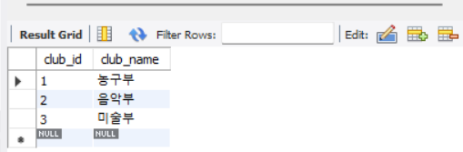

# 조인(Join)

[Join | 👨🏻‍💻 Tech Interview](https://gyoogle.dev/blog/computer-science/data-base/Join.html)

**<목차>**

---

# 조인(Join)이란?

## 조인(Join)의 개념

<aside>
💡

두 개 이상의 테이블이나 데이터베이스를 연결하여 데이터를 검색하는 방법

(MySQL은 **JOIN**, MongoDB는 **lookup** 쿼리 사용)

</aside>

테이블을 연결하려면…

→ 적어도 하나의 컬럼은 서로 공유되고 있어야 함!

## 조인(Join)의 특징

**조인 속성** : 조인 검색을 위해 테이블을 연결해주는 속성

조인 조건의 특징

- 연결하려는 테이블 간에 조인 속성의 이름은 달라도 되지만 도메인은 같아야 함
- 일반적으로 외래키를 조인 속성으로 이용함
- 속성 이름 앞에 해당 속성이 소속된 테이블의 이름을 표시
  ex) member.memberId

ex)

```sql
SELECT 컬럼명
FROM 테이블A
JOIN 테이블B ON 테이블A.공통컬럼 = 테이블B.공통컬럼;
```

# **조인(JOIN)의 종류**

- INNER JOIN
- LEFT OUTER JOIN
- RIGHT OUTER JOIN
- FULL OUTER JOIN
- CROSS JOIN
- SELF JOIN

**실습용 예제 테이블 정리**



Club 테이블


Student 테이블

## **INNER JOIN**

> 기준 테이블과 join 테이블의 중복된 값을 보여주는 교집합 join (디폴트 Join 값)


_ex) 가입된 학생만 확인하기 - Student와 Club 테이블에서 club_id가 일치하는 경우만 표시_

```sql
-- 1 INNER JOIN
SELECT s.student_name, c.club_name
FROM Student s
INNER JOIN Club c ON s.club_id = c.club_id;
```


## **LEFT OUTER JOIN**

> 왼쪽 기준 테이블값 + join 테이블과 중복된 값을 보여주는 join
>
> = 연산자 왼쪽 테이블의 모든 데이터를 결과 테이블에 조회


_ex) 모든 학생을 확인하기 - 클럽이 없거나 존재하지 않아도 학생 정보를 전부 보여주기_

```sql
-- 2 Left Outer Join
SELECT s.student_name, c.club_name
FROM Student s
LEFT OUTER JOIN Club c ON s.club_id = c.club_id;
```


## **RIGHT OUTER JOIN**

> Left Outer Join의 반대 개념
>
> = 연산자 오른쪽 테이블의 모든 데이터를 결과 테이블에 조회


_ex) 모든 클럽을 확인하기 - 가입된 학생이 없더라도 클럽 이름은 전부 표시하기_

```sql
-- 3 Right Outer Join
SELECT s.student_name, c.club_name
FROM Student AS s
RIGHT OUTER JOIN Club AS c ON s.club_id = c.club_id;
```


## **FULL OUTER JOIN**

> 두 테이블이 가지고 있는 모든 데이터를 보여주는 합집합 Join
>
> 결과값 = 기준 테이블의 값 + Join 테이블의 값


(MySQL은 해당 Join 기능 지원 X)

_ex) 모든 학생과 모든 클럽을 한 번에 확인하기 - 서로 연결되지 않은 데이터도 모두 보여주기_

```sql
-- 4 Full Outer Join
SELECT s.student_name, c.club_name
FROM Student AS s
LEFT JOIN Club AS c
ON s.club_id = c.club_id

UNION

SELECT s.student_name, c.club_name
FROM Student AS s
RIGHT JOIN Club AS c
ON s.club_id = c.club_id;
```


## **CROSS JOIN**

> 두 테이블의 모든 경우의 수을 보여주는 Join
>
> 결과값 = 기준 테이블의 값 + Join 테이블의 값


_ex) 모든 가능한 학생 - 클럽 조합 경우의 수 확인하기_

```sql
-- 5 CROSS JOIN
SELECT s.student_name, c.club_name
FROM Student AS s
CROSS JOIN Club AS c;
```


## **SELF JOIN**

> 자기자신과 자기자신을 조인하는 방식
>
> = 하나의 테이블을 여러 번 복사해서 Join하는 방식


_ex) 자기 자신 테이블과 조인하고, 같은 클럽에 속한 학생끼리 짝지은 후 확인하기_

```sql
-- 6 SELF JOIN
SELECT A.student_name, B.student_name
FROM Student A, Student B
WHERE A.club_id = B.club_id;
```


# **조인(Join)의 원리**

## **중첩 루프 조인 (NLJ, Nested Loop Join)**

> 중첩 for문과 같은 원리로 조건에 맞는 조인을 하는 방법

랜덤 접근에 대한 비용이 많이 증가 → 대용량 테이블에서는 사용 X

ex) t1, t2 테이블을 조인하는 경우

→ 첫 번째 테이블에 행을 한 번에 하나씩 읽고, 그 다음 테이블도 행을 하나씩 읽어 조건에 맞는 레코드를 찾아 결과 값을 반환

**블록 중첩 루프 조인(BNL, Block Nested Loop)**

: 중첩 루프 조인에서 발전했으며, 조인할 테이블을 작은 블록으로 나눠서 블록 하나씩 조인하는 방법

## **정렬 병합 조인(Sort Merge Join)**

> 각각의 테이블을 조인할 필드 기준으로 정렬하고 정렬이 끝난 이후에 조인 작업을 수행하는 방법

사용하는 경우

- 조인할 때 쓸 적절한 인덱스가 없는 경우
- 대용량의 테이블들을 조인하고 조인 조건으로 <, > 등 범위 비교 연산자가 있는 경우

동등(=) 조인에서만 사용 가능!

## **해시 조인(Hash Join)**

> 해시 테이블을 기반으로 조인하는 방법

해시 조인의 특징

- 두 개의 테이블을 조인한다고 가정했을 때, 하나의 테이블이 메모리에 온전히 들어간다면 보통의 중첩 루프 조인보다 더 효율적
- 메모리에 올릴 수 없을 정도로 큼 → 디스크를 사용하는 비용 발생
- 동등(=) 조건에서만 사용 가능

MySQL의 해시 조인 단계 = **빌드 단계, 프로브 단계**

### 빌드 단계

입력 테이블 중 하나를 기반으로 메모리 내 해시 테이블을 빌드하는 단계


두 테이블을 조인한다 했을 때, 둘 중 바이트가 더 작은 테이블을 기반으로 테이블을 빌드

조인에 사용되는 필드 = 해시 테이블의 키로 사용

_ex) 이미지의 ‘countries.country_id’_

### 프로브 단계

레코드 읽기를 시작하는 단계,

= 각 레코드에서 조인에 사용된 필드인 키에 일치하는 레코드를 찾은 후에 결과 값으로 반환


_ex) 각 레코드에서 'persons.country_id'에 일치하는 레코드를 찾아서 결괏값으로 반환_

---

_참고 자료_

[[데이터베이스] SQL - Join](https://velog.io/@letskuku/%EB%8D%B0%EC%9D%B4%ED%84%B0%EB%B2%A0%EC%9D%B4%EC%8A%A4-SQL-Join)

[[CS] SQL - JOIN — 여기 어때요](https://damon-911.tistory.com/entry/CS-SQL-JOIN)

[[CS Study] 데이터베이스 (4) - 조인](https://hazel-nut-library.tistory.com/entry/CS-Study-%EB%8D%B0%EC%9D%B4%ED%84%B0%EB%B2%A0%EC%9D%B4%EC%8A%A4-4-%EC%A1%B0%EC%9D%B8)

[[CS] 조인의 종류와 원리](https://seulki1105.tistory.com/129)

[[CS 전공지식노트] 조인의 종류와 원리 — 슬기로운 코딩생활](https://smiledk.tistory.com/49)
