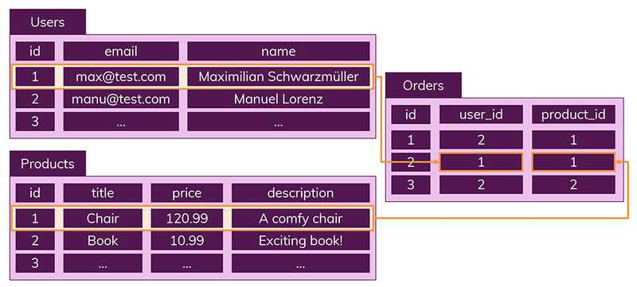

# SQL vs NOSQL

[SQL과 NOSQL의 차이 | 👨🏻‍💻 Tech Interview](https://gyoogle.dev/blog/computer-science/data-base/SQL%20&%20NOSQL.html)

**<목차>**

---

# 데이터베이스의 종류와 개념

## **SQL (관계형 DB)**

<aside>
💡

데이터를 표 형태로 구조화하여 저장하는 관계형 데이터베이스 관리 시스템(RDBMS)의 한 종류

= '구조화 된 쿼리 언어 (Structured Query Language)'의 약자

</aside>

관계형 데이터베이스의 특징

- 엄격한 스키마 : 데이터는 정해진 데이터 스키마에 따라 테이블에 저장됨
      **→ 스키마를 준수하지 않은 레코드는 테이블에 추가 불가능!**
- 관계 : 데이터는 **관계(Relation)를 통해 여러 테이블에 분산**됨
- **ACID 트랜잭션** : 원자성, 일관성, 고립성, 지속성을 보장하여 **데이터의 무결성을 유지**함

데이터는 테이블에 레코드로 저장되며 테이블마다 명확하게 정의된 구조가 있음

= 해당 구조는 필드의 이름과 데이터 유형으로 정의됨

- 데이터의 중복을 피하기 위해 '관계'를 이용

하나의 테이블에서 중복 없이 하나의 데이터만을 관리

→ 다른 테이블에서 부정확한 데이터를 다룰 위험이 없음

## **NoSQL (비관계형 DB)**

<aside>
💡

다양한 데이터 모델(문서, 키-값, 그래프, 컬럼 등)을 지원하는 비관계형 데이터베이스

= SQL(관계형 데이터베이스)와 반대되는 접근방식

</aside>

스키마, 관계 전부 X

NoSQL에서의 레코드 = 문서(documents)

SQL에서 진행한 Orders, Users, Products 테이블로 나눈 것을..

NoSQL은 Orders에 한꺼번에 포함해서 저장 가능!

NoSQL = 여러 테이블에 조인할 필요없이 이미 필요한 모든 것을 갖춘 문서를 작성하는 것

비관계형 데이터베이스의 특징

- **유연한 스키마(Schema-less)** : 사전에 스키마를 정의할 필요 없이 데이터 저장 가능 = 유연성 ⬆️
- **수평적 확장성** : 분산 시스템을 기반으로 하여 손쉽게 수평적 확장 가능
- **다양한 데이터 모델** : 다양한 데이터 구조를 지원하여 특정 애플리케이션의 요구에 맞추기 가능

_조인하고 싶을 때는?_

_컬렉션을 통해 데이터를 복제하여 각 컬렉션 일부분에 속하는 데이터를 정확하게 산출하도록 하자_

# 추가) Scaling 개념

데이터베이스 서버의 확장성

- 수직적 확장 : 단순히 데이터베이스 서버의 성능을 향상시키는 것
  ex) CPU 업그레이드
- 수평적 확장 : 더 많은 서버가 추가되고 데이터베이스가 전체적으로 분산됨을 의미
  (하나의 데이터베이스에서 작동하지만, 여러 호스트에서 작동)

데이터 저장 방식으로 인해 SQL 데이터베이스는 일반적으로 수직적 확장만 지원…

→ 반대로 수평적 확장은 NoSQL 데이터베이스에서만 가능!

# **SQL vs NOSQL 비교**

## SQL의 장점 & 단점

SQL 장점

- 명확하게 정의된 스키마, 데이터 무결성 보장
- 관계는 각 데이터를 중복없이 한번만 저장

SQL 단점

- 덜 유연하며, 데이터 스키마를 사전에 계획하고 알려야 함
      = 나중에 수정하기 힘든 데이터베이스
- 관계를 맺고 있어서 조인문이 많은 복잡한 쿼리가 만들어질 가능성 ⬆️
- 대체로 수직적 확장만 가능함

## **NoSQL**의 장점 & 단점

NoSQL 장점

- 스키마가 없어서 유연함 → 언제든지 저장된 데이터를 조정하고 새로운 필드 추가 가능
- 데이터는 애플리케이션이 필요로 하는 형식으로 저장됨. 데이터 읽어오는 속도 ⬆️
- 수직 및 수평 확장이 가능 → 애플리케이션이 발생시키는 모든 읽기/쓰기 요청 처리 가능

NoSQL 단점

- 유연성으로 인해 데이터 구조 결정을 미루게 될 가능성 ⬆️
- 데이터 중복을 계속 업데이트 해야 함
- 데이터가 여러 컬렉션에 중복되어 있기 때문에 수정 시 모든 컬렉션에서 수행해야 함
  (SQL에서는 중복 데이터가 없으므로 한번만 수행이 가능)

# 데이터베이스 선택 기준

## **SQL 데이터베이스 사용이 더 좋을 때**

- 관계를 맺고 있는 데이터가 자주 변경되는 애플리케이션의 경우
      = NoSQL에서는 여러 컬렉션을 모두 수정해야 하기 때문에 비효율적
- 변경될 여지가 없고, 명확한 스키마가 사용자와 데이터에게 중요한 경우

## **NoSQL 데이터베이스 사용이 더 좋을 때**

- 정확한 데이터 구조를 알 수 없거나 변경/확장 될 수 있는 경우
- 읽기를 자주 하지만, 데이터 변경은 자주 없는 경우
- 데이터베이스를 수평으로 확장해야 하는 경우 (= 막대한 양의 데이터를 다뤄야 하는 경우)

---

_참고 자료_

[SQL vs NoSQL: 어느 것을 선택해야 할까? | dev-yyh](https://dev-yyh.github.io/DB/2)

[SQL vs NoSQL](https://velog.io/@octo__/SQL-vs-NoSQL)

[SQL vs NoSQL (MySQL vs. MongoDB)](https://siyoon210.tistory.com/130)

[[DataBase] SQL vs NoSQL](https://nathanh.tistory.com/135)
