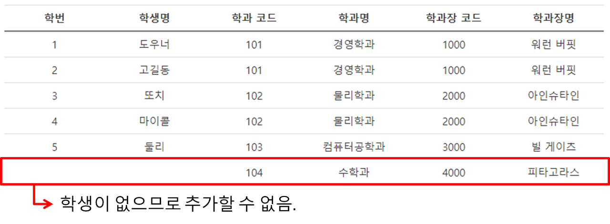

# 이상(Anomaly)

[Anomaly | 👨🏻‍💻 Tech Interview](https://gyoogle.dev/blog/computer-science/data-base/Anomaly.html)

**<목차>**

---

# 이상 현상(Anomaly)

<aside>
💡

데이터베이스 설계 오류로 인해 발생하는 데이터의 삽입, 삭제, 수정 시 생기는 논리적 오류

</aside>

이상 현상(Anomaly) 발생 시 문제점

- 중복이 발생하고 전체적인 무결성이 저하
- 릴레이션에 대한 데이터 삽입, 수정, 삭제 연산을 할 때 발생할 수 있는 부작용
- 현실세계의 실제 값과 데이터베이스에 저장된 값이 일치하지 않는 문제가 발생

위 문제들은 **“정규화(Normalization)”**를 통해 방지 가능

정규화를 하는 이유

= 잘못된 테이블 설계로 인한 이상 현상(Anomaly)을 예방하기 위해!

# 이상 현상의 종류

## **삽입 이상 (Insertion Anomaly)**

> 테이블에 새로운 tuple을 삽입할 때, 특정 속성의 값이 존재하지 않아 불필요하게 null 값을 삽입하면서 발생하는 문제
>
> = 불필요한 데이터를 추가해야지, 삽입할 수 있는 상황

- 신설된 '수학과'에는 학생이 존재하지 않아 테이블에 '수학과' 데이터를 추가할 수 없음
- 정규화를 통해 학생 테이블과 학과 테이블로 분리하면 해결 가능

## **갱신 이상 (Update Anomaly)**

> 어떤 정보를 업데이트할 때, 그에 대응되는 모든 정보를 모두 함께 업데이트해야 하기 때문에 발생하는 문제
>
> = 일부만 변경하여, 데이터가 불일치 하는 모순의 문제

- '워런 버핏' 학과장 명을 변경하려할 때 '경영학과'의 학생이 100명이므로 100개의 데이터를 모두 변경해야 함
- 한 행이라도 변경되지 않는다면 데이터 무결성이 유지되지 않음
- 정규화를 통해 학교 테이블과 학과장 테이블을 분리하면 해결 가능

## **삭제 이상 (Deletion Anomaly)**

> 테이블에서 어떤 값을 삭제하기 위해 튜플을 삭제하게 되면, 해당 튜플 안에 있는 모든 정보가 함께 삭제되면서 발생하는 문제
>
> = 튜플 삭제로 인해 꼭 필요한 데이터까지 함께 삭제되는 문제

- '둘리' 학생의 데이터를 삭제하려면 '컴퓨터공학과'와 관련된 정보도 함께 삭제됨
- 정규화를 통해 학생 테이블과 학과 테이블로 분리하면 해결 가능

---

_참고 자료_

[[데이터베이스] 이상 현상(Anomaly)](https://jeonyeohun.tistory.com/201)

[[DB] 이상 현상(Anomaly) 개념, 종류 — ZU-TECHLOG](https://zu-techlog.tistory.com/141)

[데이터베이스 이상 현상(Anomaly) 개념과 예시 – Jang](https://wkdtjsgur100.github.io/anomaly/)
